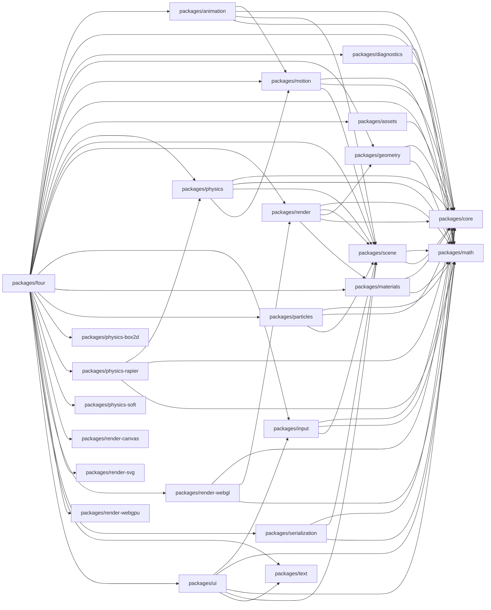

# four.js-monorepo - Dependency Graph

**Version**: 0.0.0 | **Last Updated**: 2026-08-09

This document provides a comprehensive dependency graph of all files, components, imports, functions, and variables in the codebase.

---

## Table of Contents

1. [Overview](#overview)
2. [Package Dependencies](#package-dependencies)
3. [Packages/animation Dependencies](#packages-animation-dependencies)
4. [Packages/assets Dependencies](#packages-assets-dependencies)
5. [Packages/core Dependencies](#packages-core-dependencies)
6. [Packages/diagnostics Dependencies](#packages-diagnostics-dependencies)
7. [Packages/four Dependencies](#packages-four-dependencies)
8. [Packages/geometry Dependencies](#packages-geometry-dependencies)
9. [Packages/input Dependencies](#packages-input-dependencies)
10. [Packages/materials Dependencies](#packages-materials-dependencies)
11. [Packages/math Dependencies](#packages-math-dependencies)
12. [Packages/motion Dependencies](#packages-motion-dependencies)
13. [Packages/particles Dependencies](#packages-particles-dependencies)
14. [Packages/physics Dependencies](#packages-physics-dependencies)
15. [Packages/physics box2d Dependencies](#packages-physics-box2d-dependencies)
16. [Packages/physics rapier Dependencies](#packages-physics-rapier-dependencies)
17. [Packages/physics soft Dependencies](#packages-physics-soft-dependencies)
18. [Packages/render Dependencies](#packages-render-dependencies)
19. [Packages/render canvas Dependencies](#packages-render-canvas-dependencies)
20. [Packages/render svg Dependencies](#packages-render-svg-dependencies)
21. [Packages/render webgl Dependencies](#packages-render-webgl-dependencies)
22. [Packages/render webgpu Dependencies](#packages-render-webgpu-dependencies)
23. [Packages/scene Dependencies](#packages-scene-dependencies)
24. [Packages/serialization Dependencies](#packages-serialization-dependencies)
25. [Packages/text Dependencies](#packages-text-dependencies)
26. [Packages/ui Dependencies](#packages-ui-dependencies)
27. [Dependency Matrix](#dependency-matrix)
28. [Circular Dependency Analysis](#circular-dependency-analysis)
29. [Visual Dependency Graph](#visual-dependency-graph)
30. [Summary Statistics](#summary-statistics)

---

## Overview

The codebase is organized into the following modules:

- **packages/animation**: 11 files
- **packages/assets**: 3 files
- **packages/core**: 11 files
- **packages/diagnostics**: 8 files
- **packages/four**: 26 files
- **packages/geometry**: 9 files
- **packages/input**: 8 files
- **packages/materials**: 7 files
- **packages/math**: 9 files
- **packages/motion**: 15 files
- **packages/particles**: 8 files
- **packages/physics**: 17 files
- **packages/physics-box2d**: 1 file
- **packages/physics-rapier**: 8 files
- **packages/physics-soft**: 1 file
- **packages/render**: 15 files
- **packages/render-canvas**: 1 file
- **packages/render-svg**: 1 file
- **packages/render-webgl**: 11 files
- **packages/render-webgpu**: 1 file
- **packages/scene**: 13 files
- **packages/serialization**: 4 files
- **packages/text**: 4 files
- **packages/ui**: 12 files

---

## Package Dependencies

| Package | Depends On | Files (Active) | Files (Dormant) |
|---------|------------|----------------|-----------------|
| `@four/animation` (`packages/animation/`) | `@four/motion`, `@four/core`, `@four/scene`, `@four/math` | 11 | 0 |
| `@four/assets` (`packages/assets/`) | `@four/core` | 3 | 0 |
| `@four/core` (`packages/core/`) | (none) | 11 | 0 |
| `@four/diagnostics` (`packages/diagnostics/`) | `@four/math`, `@four/core` | 8 | 0 |
| `four` (`packages/four/`) | `@four/animation`, `@four/core`, `@four/diagnostics`, `@four/geometry`, `@four/motion`, `@four/math`, `@four/assets`, `@four/physics`, `@four/scene`, `@four/render`, `@four/input`, `@four/materials`, `@four/particles`, `@four/physics-box2d`, `@four/physics-rapier`, `@four/physics-soft`, `@four/render-canvas`, `@four/render-svg`, `@four/render-webgl`, `@four/render-webgpu`, `@four/serialization`, `@four/text`, `@four/ui` | 26 | 0 |
| `@four/geometry` (`packages/geometry/`) | `@four/core`, `@four/math` | 9 | 0 |
| `@four/input` (`packages/input/`) | `@four/core`, `@four/math`, `@four/scene` | 8 | 0 |
| `@four/materials` (`packages/materials/`) | `@four/core`, `@four/math` | 7 | 0 |
| `@four/math` (`packages/math/`) | (none) | 9 | 0 |
| `@four/motion` (`packages/motion/`) | `@four/math`, `@four/core`, `@four/scene` | 15 | 0 |
| `@four/particles` (`packages/particles/`) | `@four/math`, `@four/core`, `@four/scene` | 8 | 0 |
| `@four/physics` (`packages/physics/`) | `@four/core`, `@four/math`, `@four/scene`, `@four/motion` | 17 | 0 |
| `@four/physics-box2d` (`packages/physics-box2d/`) | (none) | 1 | 0 |
| `@four/physics-rapier` (`packages/physics-rapier/`) | `@four/physics`, `@four/core`, `@four/math` | 8 | 0 |
| `@four/physics-soft` (`packages/physics-soft/`) | (none) | 1 | 0 |
| `@four/render` (`packages/render/`) | `@four/math`, `@four/scene`, `@four/geometry`, `@four/core`, `@four/materials` | 15 | 0 |
| `@four/render-canvas` (`packages/render-canvas/`) | (none) | 1 | 0 |
| `@four/render-svg` (`packages/render-svg/`) | (none) | 1 | 0 |
| `@four/render-webgl` (`packages/render-webgl/`) | `@four/core`, `@four/render`, `@four/math` | 11 | 0 |
| `@four/render-webgpu` (`packages/render-webgpu/`) | (none) | 1 | 0 |
| `@four/scene` (`packages/scene/`) | `@four/math`, `@four/core` | 13 | 0 |
| `@four/serialization` (`packages/serialization/`) | `@four/core`, `@four/scene`, `@four/math` | 4 | 0 |
| `@four/text` (`packages/text/`) | (none) | 4 | 0 |
| `@four/ui` (`packages/ui/`) | `@four/input`, `@four/math`, `@four/core`, `@four/scene`, `@four/text` | 12 | 0 |

### Package Dependency Diagram

---

## Packages/animation Dependencies

### `packages/animation/src/animation-system.ts` - The fixed-step animation system (§39 step 3, plan decision P4-1).

**Workspace Dependencies:**
| Package | Import |
|---------|--------|
| `@four/motion` | `PRIORITY_ANIMATION_TARGETS, FixedUpdateContext, SimulationSystem` |

**Exports:**
- Classes: `AnimationSystem`
- Interfaces: `Advanceable`, `AnimationSystemOptions`
- Types: `AnimationPlaybackState`

---

### `packages/animation/src/binding.ts` - Property bindings (§16).

**Workspace Dependencies:**
| Package | Import |
|---------|--------|
| `@four/core` | `FourError` |

**Internal Dependencies:**
| File | Imports | Type |
|------|---------|------|
| `./values.js` | `detectAdapter, ValueAdapter` | Import |

**Exports:**
- Interfaces: `PropertyBinding`
- Functions: `createBinding`

---

### `packages/animation/src/clip.ts` - Animation clips (§17).

**Workspace Dependencies:**
| Package | Import |
|---------|--------|
| `@four/core` | `FourError` |

**Internal Dependencies:**
| File | Imports | Type |
|------|---------|------|
| `./track.js` | `AnimationTrackLike` | Import (type-only) |

**Exports:**
- Classes: `AnimationClip`
- Interfaces: `AnimationEvent`, `TrackSampleSink`, `AnimationClipOptions`
- Types: `AnimationEventVisitor`

---

### `packages/animation/src/controller.ts` - §18 animation state machines — {@link AnimationController}.

**Workspace Dependencies:**
| Package | Import |
|---------|--------|
| `@four/core` | `FourError` |
| `@four/scene` | `Node, warnAuthorityConflict` |
| `@four/scene` | `TransformAuthority` |

**Internal Dependencies:**
| File | Imports | Type |
|------|---------|------|
| `./animation-system.js` | `Advanceable` | Import (type-only) |
| `./binding.js` | `createBinding, PropertyBinding` | Import |
| `./clip.js` | `AnimationClip` | Import (type-only) |
| `./track.js` | `AnimationTrackLike` | Import (type-only) |
| `./tween.js` | `claimProperty, isTransformOwner, releaseProperty, requireNonNegativeSeconds, PropertyClaim` | Import |
| `./values.js` | `detectAdapter, ValueAdapter` | Import |

**Exports:**
- Classes: `AnimationController`
- Interfaces: `AnimationStateOptions`, `NumericCondition`, `BooleanCondition`, `TriggerCondition`, `AnimationTransition`, `AnimationControllerParameters`, `AnimationControllerOptions`
- Types: `ControllerPlaybackState`, `AnimationStateInput`, `NumericComparison`, `TransitionCondition`, `StateChangeListener`

---

### `packages/animation/src/easing.ts` - Easing functions (§15).

**Workspace Dependencies:**
| Package | Import |
|---------|--------|
| `@four/core` | `FourError` |

**Exports:**
- Types: `EasingFunction`, `EasingName`
- Functions: `resolveEasing`
- Constants: `BACK_OVERSHOOT`, `BACK_OVERSHOOT_IN_OUT`, `BOUNCE_AMPLITUDE`, `BOUNCE_SEGMENT_DIVISOR`, `ELASTIC_AMPLITUDE`, `ELASTIC_PERIOD`, `ELASTIC_PERIOD_IN_OUT`, `SPRING_DAMPING_RATIO`, `SPRING_OSCILLATIONS`, `linear`, `quadraticIn`, `quadraticOut`, `quadraticInOut`, `cubicIn`, `cubicOut`, `cubicInOut`, `quarticIn`, `quarticOut`, `quarticInOut`, `quinticIn`, `quinticOut`, `quinticInOut`, `sineIn`, `sineOut`, `sineInOut`, `exponentialIn`, `exponentialOut`, `exponentialInOut`, `circularIn`, `circularOut`, `circularInOut`, `backIn`, `backOut`, `backInOut`, `bounceOut`, `bounceIn`, `bounceInOut`, `elasticIn`, `elasticOut`, `elasticInOut`, `springOut`, `springIn`, `springInOut`, `EASINGS`, `EASING_NAMES`

---

### `packages/animation/src/index.ts` - `@four/animation` — the public surface of the animation pillar (Part III).

**Internal Dependencies:**
| File | Imports | Type |
|------|---------|------|
| `./animation-system.js` | `AnimationSystem` | Re-export |
| `./binding.js` | `createBinding` | Re-export |
| `./clip.js` | `AnimationClip` | Re-export |
| `./controller.js` | `AnimationController` | Re-export |
| `./easing.js` | `BACK_OVERSHOOT, BACK_OVERSHOOT_IN_OUT, BOUNCE_AMPLITUDE, BOUNCE_SEGMENT_DIVISOR, EASINGS, EASING_NAMES, ELASTIC_AMPLITUDE, ELASTIC_PERIOD, ELASTIC_PERIOD_IN_OUT, SPRING_DAMPING_RATIO, SPRING_OSCILLATIONS, backIn, backInOut, backOut, bounceIn, bounceInOut, bounceOut, circularIn, circularInOut, circularOut, cubicIn, cubicInOut, cubicOut, elasticIn, elasticInOut, elasticOut, exponentialIn, exponentialInOut, exponentialOut, linear, quadraticIn, quadraticInOut, quadraticOut, quarticIn, quarticInOut, quarticOut, quinticIn, quinticInOut, quinticOut, resolveEasing, sineIn, sineInOut, sineOut, springIn, springInOut, springOut` | Re-export |
| `./mixer.js` | `AnimationMixer` | Re-export |
| `./timeline.js` | `Timeline` | Re-export |
| `./track.js` | `AnimationTrack` | Re-export |
| `./tween.js` | `Tween, animate, tween` | Re-export |
| `./values.js` | `booleanAdapter, colorAdapter, detectAdapter, discreteAdapter, discreteAdapterFor, numberAdapter, quaternionAdapter, vector2Adapter, vector3Adapter, vector4Adapter` | Re-export |
| `./animation-system.js` | `Advanceable, AnimationPlaybackState, AnimationSystemOptions` | Re-export (type-only) |
| `./binding.js` | `PropertyBinding` | Re-export (type-only) |
| `./clip.js` | `AnimationClipOptions, AnimationEvent, AnimationEventVisitor, TrackSampleSink` | Re-export (type-only) |
| `./controller.js` | `AnimationControllerOptions, AnimationControllerParameters, AnimationStateInput, AnimationStateOptions, AnimationTransition, BooleanCondition, ControllerPlaybackState, NumericComparison, NumericCondition, StateChangeListener, TransitionCondition, TriggerCondition` | Re-export (type-only) |
| `./easing.js` | `EasingFunction, EasingName` | Re-export (type-only) |
| `./mixer.js` | `AnimationEventListener, MixerPlayOptions, MixerRootMotionOptions, MixerState` | Re-export (type-only) |
| `./timeline.js` | `TimelineChild, TimelineEntry, TimelineMarkerCallback, TimelineMarkerOptions, TimelineState` | Re-export (type-only) |
| `./track.js` | `AnimationTrackLike, AnimationTrackOptions, InterpolationMode` | Re-export (type-only) |
| `./tween.js` | `TweenProperties, TweenState, TweenValue` | Re-export (type-only) |
| `./values.js` | `ColorRGBA, ValueAdapter, ValueKind` | Re-export (type-only) |

**Exports:**
- Constants: `PACKAGE_NAME`
- Re-exports: `AnimationSystem`, `createBinding`, `AnimationClip`, `AnimationController`, `BACK_OVERSHOOT`, `BACK_OVERSHOOT_IN_OUT`, `BOUNCE_AMPLITUDE`, `BOUNCE_SEGMENT_DIVISOR`, `EASINGS`, `EASING_NAMES`, `ELASTIC_AMPLITUDE`, `ELASTIC_PERIOD`, `ELASTIC_PERIOD_IN_OUT`, `SPRING_DAMPING_RATIO`, `SPRING_OSCILLATIONS`, `backIn`, `backInOut`, `backOut`, `bounceIn`, `bounceInOut`, `bounceOut`, `circularIn`, `circularInOut`, `circularOut`, `cubicIn`, `cubicInOut`, `cubicOut`, `elasticIn`, `elasticInOut`, `elasticOut`, `exponentialIn`, `exponentialInOut`, `exponentialOut`, `linear`, `quadraticIn`, `quadraticInOut`, `quadraticOut`, `quarticIn`, `quarticInOut`, `quarticOut`, `quinticIn`, `quinticInOut`, `quinticOut`, `resolveEasing`, `sineIn`, `sineInOut`, `sineOut`, `springIn`, `springInOut`, `springOut`, `AnimationMixer`, `Timeline`, `AnimationTrack`, `Tween`, `animate`, `tween`, `booleanAdapter`, `colorAdapter`, `detectAdapter`, `discreteAdapter`, `discreteAdapterFor`, `numberAdapter`, `quaternionAdapter`, `vector2Adapter`, `vector3Adapter`, `vector4Adapter`, `Advanceable`, `AnimationPlaybackState`, `AnimationSystemOptions`, `PropertyBinding`, `AnimationClipOptions`, `AnimationEvent`, `AnimationEventVisitor`, `TrackSampleSink`, `AnimationControllerOptions`, `AnimationControllerParameters`, `AnimationStateInput`, `AnimationStateOptions`, `AnimationTransition`, `BooleanCondition`, `ControllerPlaybackState`, `NumericComparison`, `NumericCondition`, `StateChangeListener`, `TransitionCondition`, `TriggerCondition`, `EasingFunction`, `EasingName`, `AnimationEventListener`, `MixerPlayOptions`, `MixerRootMotionOptions`, `MixerState`, `TimelineChild`, `TimelineEntry`, `TimelineMarkerCallback`, `TimelineMarkerOptions`, `TimelineState`, `AnimationTrackLike`, `AnimationTrackOptions`, `InterpolationMode`, `TweenProperties`, `TweenState`, `TweenValue`, `ColorRGBA`, `ValueAdapter`, `ValueKind`

---

### `packages/animation/src/mixer.ts` - The clip player (§17 clips, §16 playback semantics, §107 "playback controls").

**Workspace Dependencies:**
| Package | Import |
|---------|--------|
| `@four/core` | `FourError` |
| `@four/math` | `Vector3` |
| `@four/scene` | `Node, warnAuthorityConflict` |
| `@four/scene` | `TransformAuthority` |

**Internal Dependencies:**
| File | Imports | Type |
|------|---------|------|
| `./binding.js` | `createBinding, PropertyBinding` | Import |
| `./clip.js` | `AnimationClip, AnimationEvent, TrackSampleSink` | Import (type-only) |
| `./track.js` | `AnimationTrackLike` | Import (type-only) |
| `./tween.js` | `claimProperty, isTransformOwner, releaseProperty, requireNonNegativeSeconds, PropertyClaim` | Import |
| `./values.js` | `detectAdapter, ValueAdapter` | Import |

**Exports:**
- Classes: `AnimationMixer`
- Interfaces: `MixerRootMotionOptions`, `MixerPlayOptions`
- Types: `MixerState`, `AnimationEventListener`

---

### `packages/animation/src/timeline.ts` - Timelines (§16).

**Workspace Dependencies:**
| Package | Import |
|---------|--------|
| `@four/core` | `FourError` |

**Internal Dependencies:**
| File | Imports | Type |
|------|---------|------|
| `./tween.js` | `requireNonNegativeSeconds` | Import |

**Exports:**
- Classes: `Timeline`
- Interfaces: `TimelineMarkerOptions`, `TimelineChild`
- Types: `TimelineState`, `TimelineMarkerCallback`, `TimelineEntry`

---

### `packages/animation/src/track.ts` - Animation tracks (§17).

**Workspace Dependencies:**
| Package | Import |
|---------|--------|
| `@four/core` | `FourError` |
| `@four/math` | `Vector2, Vector3, Vector4` |

**Internal Dependencies:**
| File | Imports | Type |
|------|---------|------|
| `./values.js` | `ColorRGBA, ValueAdapter, ValueKind` | Import (type-only) |

**Exports:**
- Classes: `AnimationTrack`
- Interfaces: `AnimationTrackOptions`, `AnimationTrackLike`
- Types: `InterpolationMode`

---

### `packages/animation/src/tween.ts` - Tweens (§15).

**Workspace Dependencies:**
| Package | Import |
|---------|--------|
| `@four/core` | `FourError` |
| `@four/math` | `Quaternion, Vector2, Vector3, Vector4` |
| `@four/scene` | `Node, warnAuthorityConflict` |
| `@four/scene` | `TransformAuthority` |

**Internal Dependencies:**
| File | Imports | Type |
|------|---------|------|
| `./binding.js` | `createBinding, PropertyBinding` | Import |
| `./easing.js` | `resolveEasing, EasingFunction, EasingName` | Import |
| `./values.js` | `detectAdapter, ColorRGBA, ValueAdapter` | Import |

**Exports:**
- Classes: `Tween`
- Interfaces: `TweenProperties`, `PropertyClaim`
- Types: `TweenValue`, `TweenState`
- Functions: `claimProperty`, `releaseProperty`, `requireNonNegativeSeconds`, `isTransformOwner`, `animate`, `tween`

---

### `packages/animation/src/values.ts` - Value adapters (§16 property bindings, §17 track value types).

**Workspace Dependencies:**
| Package | Import |
|---------|--------|
| `@four/math` | `Quaternion, Vector2, Vector3, Vector4, ColorRGBA` |
| `@four/math` | `ColorRGBA` |

**Exports:**
- Interfaces: `ValueAdapter`
- Types: `ValueKind`
- Functions: `discreteAdapterFor`, `detectAdapter`
- Constants: `numberAdapter`, `vector2Adapter`, `vector3Adapter`, `vector4Adapter`, `quaternionAdapter`, `colorAdapter`, `booleanAdapter`, `discreteAdapter`
- Re-exports: `ColorRGBA`

---

## Packages/assets Dependencies

### `packages/assets/src/asset-manager.ts` - The asset manager (§76) — one cache, one refcount, one fetch per asset.

**Workspace Dependencies:**
| Package | Import |
|---------|--------|
| `@four/core` | `FourError, isFourError, disposeAll, Disposable` |

**Exports:**
- Classes: `AssetManager`
- Interfaces: `FetchResponse`, `ResponseHeadersLike`, `TimerLike`, `AssetLoader`, `AssetManagerOptions`
- Types: `FetchLike`
- Constants: `DEFAULT_MAXIMUM_BYTES`, `DEFAULT_TIMEOUT_SECONDS`

---

### `packages/assets/src/index.ts` - `@four/assets` — the asset system (§76–78).

**Internal Dependencies:**
| File | Imports | Type |
|------|---------|------|
| `./asset-manager.js` | `AssetManager, DEFAULT_MAXIMUM_BYTES, DEFAULT_TIMEOUT_SECONDS` | Re-export |
| `./loaders.js` | `ImageAsset, binaryLoader, createImageLoader, jsonLoader, textLoader` | Re-export |
| `./asset-manager.js` | `AssetLoader, AssetManagerOptions, FetchLike, FetchResponse, ResponseHeadersLike, TimerLike` | Re-export (type-only) |
| `./loaders.js` | `ImageBitmapLike, ImageDecodeLike` | Re-export (type-only) |

**Exports:**
- Constants: `PACKAGE_NAME`
- Re-exports: `AssetManager`, `DEFAULT_MAXIMUM_BYTES`, `DEFAULT_TIMEOUT_SECONDS`, `ImageAsset`, `binaryLoader`, `createImageLoader`, `jsonLoader`, `textLoader`, `AssetLoader`, `AssetManagerOptions`, `FetchLike`, `FetchResponse`, `ResponseHeadersLike`, `TimerLike`, `ImageBitmapLike`, `ImageDecodeLike`

---

### `packages/assets/src/loaders.ts` - The built-in loaders (§76) — text, JSON, binary, image.

**Internal Dependencies:**
| File | Imports | Type |
|------|---------|------|
| `./asset-manager.js` | `AssetLoader, FetchResponse` | Import (type-only) |

**Exports:**
- Classes: `ImageAsset`
- Interfaces: `ImageBitmapLike`
- Types: `ImageDecodeLike`
- Functions: `createImageLoader`
- Constants: `textLoader`, `jsonLoader`, `binaryLoader`

---

## Packages/core Dependencies

### `packages/core/src/component.ts` - Component model (§6a, plan D2).

**Internal Dependencies:**
| File | Imports | Type |
|------|---------|------|
| `./dev.js` | `DEV, devWarn` | Import |
| `./errors.js` | `FourError` | Import |

**Exports:**
- Classes: `ComponentRegistry`
- Interfaces: `ComponentHost`, `Component`, `ComponentHostBinding`
- Types: `ComponentType`

---

### `packages/core/src/conventions.ts` - Normative default constants shared across pillars (Appendix A, §7a).

**Exports:**
- Constants: `DEFAULT_GRAVITY_Y`

---

### `packages/core/src/dev.ts` - The build-mode flag (§85, A-4, 2026-08-07) — one place that answers "is this

**Internal Dependencies:**
| File | Imports | Type |
|------|---------|------|
| `./errors.js` | `FourError` | Import |
| `./errors.js` | `FourErrorCode` | Import (type-only) |

**Exports:**
- Functions: `devWarn`, `devWarnOnce`, `resetDevWarnings`, `devAssert`
- Constants: `DEV`

---

### `packages/core/src/disposable.ts` - Explicit disposal (§83).

**Exports:**
- Interfaces: `Disposable`
- Functions: `disposeAll`

---

### `packages/core/src/errors.ts` - Error model (§89).

**Exports:**
- Classes: `FourError`
- Interfaces: `FourErrorOptions`
- Types: `FourErrorCode`
- Functions: `isFourError`

---

### `packages/core/src/events.ts` - Typed event emitter (§6b).

**Exports:**
- Classes: `EventEmitter`
- Types: `EventListener`, `Unsubscribe`

---

### `packages/core/src/index.ts` - §85 build mode (A-4, 2026-08-07). `DEV` is the flag every other package

**Internal Dependencies:**
| File | Imports | Type |
|------|---------|------|
| `./conventions.js` | `DEFAULT_GRAVITY_Y` | Re-export |
| `./json.js` | `cloneJsonValue` | Re-export |
| `./random.js` | `SeededRandom` | Re-export |
| `./component.js` | `ComponentRegistry` | Re-export |
| `./disposable.js` | `disposeAll` | Re-export |
| `./dev.js` | `DEV, devAssert, devWarn, devWarnOnce, resetDevWarnings` | Re-export |
| `./errors.js` | `FourError, isFourError` | Re-export |
| `./events.js` | `EventEmitter` | Re-export |
| `./units.js` | `SI_UNITS, angleFromDisplay, angleToDisplay, formatAngle, formatLength, formatMass, formatTime, kilogramsToWorldMass, lengthFromDisplay, lengthToDisplay, massFromDisplay, massToDisplay, metersToWorldLength, resolveUnitSystem, timeFromDisplay, timeToDisplay, unitSymbol, worldLengthToMeters, worldMassToKilograms` | Re-export |
| `./untrusted.js` | `DEFAULT_MAXIMUM_DEPTH, DEFAULT_MAXIMUM_TEXT_LENGTH, parseUntrustedJson` | Re-export |
| `./json.js` | `JsonValue` | Re-export (type-only) |
| `./component.js` | `Component, ComponentHost, ComponentHostBinding, ComponentType` | Re-export (type-only) |
| `./disposable.js` | `Disposable` | Re-export (type-only) |
| `./errors.js` | `FourErrorCode, FourErrorOptions` | Re-export (type-only) |
| `./events.js` | `EventListener, Unsubscribe` | Re-export (type-only) |
| `./units.js` | `AngleUnit, LengthUnit, MassUnit, TimeUnit, UnitQuantity, UnitScale, UnitSystem, UnitSystemInit` | Re-export (type-only) |
| `./untrusted.js` | `UntrustedJsonLimits` | Re-export (type-only) |

**Exports:**
- Constants: `PACKAGE_NAME`
- Re-exports: `DEFAULT_GRAVITY_Y`, `cloneJsonValue`, `SeededRandom`, `ComponentRegistry`, `disposeAll`, `DEV`, `devAssert`, `devWarn`, `devWarnOnce`, `resetDevWarnings`, `FourError`, `isFourError`, `EventEmitter`, `SI_UNITS`, `angleFromDisplay`, `angleToDisplay`, `formatAngle`, `formatLength`, `formatMass`, `formatTime`, `kilogramsToWorldMass`, `lengthFromDisplay`, `lengthToDisplay`, `massFromDisplay`, `massToDisplay`, `metersToWorldLength`, `resolveUnitSystem`, `timeFromDisplay`, `timeToDisplay`, `unitSymbol`, `worldLengthToMeters`, `worldMassToKilograms`, `DEFAULT_MAXIMUM_DEPTH`, `DEFAULT_MAXIMUM_TEXT_LENGTH`, `parseUntrustedJson`, `JsonValue`, `Component`, `ComponentHost`, `ComponentHostBinding`, `ComponentType`, `Disposable`, `FourErrorCode`, `FourErrorOptions`, `EventListener`, `Unsubscribe`, `AngleUnit`, `LengthUnit`, `MassUnit`, `TimeUnit`, `UnitQuantity`, `UnitScale`, `UnitSystem`, `UnitSystemInit`, `UntrustedJsonLimits`

---

### `packages/core/src/json.ts` - JSON value typing and validation shared by every document format (§34, §79).

**Exports:**
- Types: `JsonValue`
- Functions: `cloneJsonValue`

---

### `packages/core/src/random.ts` - Seeded pseudo-random numbers for deterministic engine code (§33, plan P8-3).

**Exports:**
- Classes: `SeededRandom`

---

### `packages/core/src/units.ts` - The §40 unit system — **display and authoring conversion only** (§40, §98).

**Internal Dependencies:**
| File | Imports | Type |
|------|---------|------|
| `./errors.js` | `FourError` | Import |

**Exports:**
- Interfaces: `UnitScale`, `UnitSystem`, `UnitSystemInit`
- Types: `LengthUnit`, `MassUnit`, `TimeUnit`, `AngleUnit`, `UnitQuantity`
- Functions: `resolveUnitSystem`, `angleToDisplay`, `angleFromDisplay`, `timeToDisplay`, `timeFromDisplay`, `lengthToDisplay`, `lengthFromDisplay`, `massToDisplay`, `massFromDisplay`, `worldLengthToMeters`, `metersToWorldLength`, `worldMassToKilograms`, `kilogramsToWorldMass`, `unitSymbol`, `formatLength`, `formatMass`, `formatTime`, `formatAngle`
- Constants: `SI_UNITS`

---

### `packages/core/src/untrusted.ts` - Untrusted-input guards for the document formats (§96).

**Internal Dependencies:**
| File | Imports | Type |
|------|---------|------|
| `./errors.js` | `FourError` | Import |

**Exports:**
- Interfaces: `UntrustedJsonLimits`
- Functions: `parseUntrustedJson`
- Constants: `DEFAULT_MAXIMUM_TEXT_LENGTH`, `DEFAULT_MAXIMUM_DEPTH`

---

## Packages/diagnostics Dependencies

### `packages/diagnostics/src/checksum.ts` - Deterministic checksums over float sequences (§33, plan D6).

**Exports:**
- Interfaces: `Checksum`
- Functions: `createChecksum`, `hashFloats`

---

### `packages/diagnostics/src/debug-draw.ts` - Debug-draw data providers (§113, plan P10-3) — the diagnostic visualization

**Workspace Dependencies:**
| Package | Import |
|---------|--------|
| `@four/math` | `Quaternion, Vector3` |

**Exports:**
- Classes: `DebugDrawBuffer`
- Interfaces: `Vector3Like`, `DebugDrawBufferOptions`, `DebugDrawStreams`, `DebugGeometrySink`, `DebugBodyAccess`, `DebugJointAccess`, `DebugContactPoint`, `DebugCollisionEventLike`, `DebugPhysicsEventLike`, `CollectBodyVelocitiesOptions`, `CollectBodyOriginsOptions`, `DebugCenterOfMassAccess`, `CollectCentersOfMassOptions`, `CollectContactPointsOptions`, `CollectContactImpulsesOptions`, `SolverStatistics`, `SolverJointStatistics`, `StagedVisualization`
- Types: `DebugColor`
- Functions: `debugDrawStreams`, `applyDebugDrawStreams`, `collectBodyVelocities`, `collectBodyOrigins`, `collectCentersOfMass`, `collectContactPoints`, `collectContactImpulses`, `solverJointStatistics`
- Constants: `DEBUG_VERTEX_FLOATS`, `DEBUG_SEGMENT_FLOATS`, `DEBUG_POSITION_FLOATS_PER_SEGMENT`, `DEBUG_COLOR_FLOATS_PER_SEGMENT`, `DEFAULT_DEBUG_BUFFER_CAPACITY`, `DEBUG_DRAW_DEFAULT_COLORS`, `DEBUG_DRAW_STAGED`

---

### `packages/diagnostics/src/index.ts` - --- WP-10.2 (ReplayPlayer) begin -------------------------------------------

**Internal Dependencies:**
| File | Imports | Type |
|------|---------|------|
| `./checksum.js` | `createChecksum, hashFloats` | Re-export |
| `./recorder.js` | `ReplayRecorder` | Re-export |
| `./replay-format.js` | `LATEST_REPLAY_FORMAT_VERSION, MINIMUM_REPLAY_FORMAT_VERSION, REPLAY_FORMAT_VERSION, SUPPORTED_REPLAY_FORMAT_VERSIONS, assertReplayCompatible, cloneJsonValue, decodeBase64, decodeReplayRecording, encodeBase64, encodeReplayRecording, isReplayCompatible, validateReplayRecording` | Re-export |
| `./replay-player.js` | `DEFAULT_REPLAY_MAXIMUM_SUB_STEPS, ReplayPlayer` | Re-export |
| `./debug-draw.js` | `DEBUG_COLOR_FLOATS_PER_SEGMENT, DEBUG_DRAW_DEFAULT_COLORS, DEBUG_DRAW_STAGED, DEBUG_POSITION_FLOATS_PER_SEGMENT, DEBUG_SEGMENT_FLOATS, DEBUG_VERTEX_FLOATS, DEFAULT_DEBUG_BUFFER_CAPACITY, DebugDrawBuffer, applyDebugDrawStreams, collectBodyOrigins, collectBodyVelocities, collectCentersOfMass, collectContactImpulses, collectContactPoints, debugDrawStreams, solverJointStatistics` | Re-export |
| `./resource-audit.js` | `NO_RESOURCE_LEAKS, auditResourceLeaks` | Re-export |
| `./stats.js` | `copyFrameStats, createFrameStats, createMonotonicClock, monotonicNowSeconds, recordRenderStatistics, recordResourceMemory, recordSolverStatistics, resetFrameStats, solverStatistics` | Re-export |
| `./checksum.js` | `Checksum` | Re-export (type-only) |
| `./recorder.js` | `ReplayRecorderOptions, ReplaySnapshot, ReplayTarget` | Re-export (type-only) |
| `./replay-format.js` | `JsonValue, ReplayAdapterIdentity, ReplayFrameRecord, ReplayInputRecord, ReplayRecording, ReplaySnapshotRecord, UntrustedJsonLimits` | Re-export (type-only) |
| `./replay-player.js` | `ReplayPlayerOptions, ReplayStepEvent, ReplayStepListener` | Re-export (type-only) |
| `./debug-draw.js` | `CollectBodyOriginsOptions, CollectBodyVelocitiesOptions, CollectCentersOfMassOptions, CollectContactImpulsesOptions, CollectContactPointsOptions, DebugBodyAccess, DebugCenterOfMassAccess, DebugCollisionEventLike, DebugColor, DebugContactPoint, DebugDrawBufferOptions, DebugDrawStreams, DebugGeometrySink, DebugJointAccess, DebugPhysicsEventLike, SolverJointStatistics, SolverStatistics, StagedVisualization, Vector3Like` | Re-export (type-only) |
| `./resource-audit.js` | `AuditResourceLeaksOptions, LiveResourceCounts, ResourceLeakReport` | Re-export (type-only) |
| `./stats.js` | `ClockSource, FrameStats, RenderStatisticsLike` | Re-export (type-only) |

**Exports:**
- Constants: `PACKAGE_NAME`
- Re-exports: `createChecksum`, `hashFloats`, `ReplayRecorder`, `LATEST_REPLAY_FORMAT_VERSION`, `MINIMUM_REPLAY_FORMAT_VERSION`, `REPLAY_FORMAT_VERSION`, `SUPPORTED_REPLAY_FORMAT_VERSIONS`, `assertReplayCompatible`, `cloneJsonValue`, `decodeBase64`, `decodeReplayRecording`, `encodeBase64`, `encodeReplayRecording`, `isReplayCompatible`, `validateReplayRecording`, `DEFAULT_REPLAY_MAXIMUM_SUB_STEPS`, `ReplayPlayer`, `DEBUG_COLOR_FLOATS_PER_SEGMENT`, `DEBUG_DRAW_DEFAULT_COLORS`, `DEBUG_DRAW_STAGED`, `DEBUG_POSITION_FLOATS_PER_SEGMENT`, `DEBUG_SEGMENT_FLOATS`, `DEBUG_VERTEX_FLOATS`, `DEFAULT_DEBUG_BUFFER_CAPACITY`, `DebugDrawBuffer`, `applyDebugDrawStreams`, `collectBodyOrigins`, `collectBodyVelocities`, `collectCentersOfMass`, `collectContactImpulses`, `collectContactPoints`, `debugDrawStreams`, `solverJointStatistics`, `NO_RESOURCE_LEAKS`, `auditResourceLeaks`, `copyFrameStats`, `createFrameStats`, `createMonotonicClock`, `monotonicNowSeconds`, `recordRenderStatistics`, `recordResourceMemory`, `recordSolverStatistics`, `resetFrameStats`, `solverStatistics`, `Checksum`, `ReplayRecorderOptions`, `ReplaySnapshot`, `ReplayTarget`, `JsonValue`, `ReplayAdapterIdentity`, `ReplayFrameRecord`, `ReplayInputRecord`, `ReplayRecording`, `ReplaySnapshotRecord`, `UntrustedJsonLimits`, `ReplayPlayerOptions`, `ReplayStepEvent`, `ReplayStepListener`, `CollectBodyOriginsOptions`, `CollectBodyVelocitiesOptions`, `CollectCentersOfMassOptions`, `CollectContactImpulsesOptions`, `CollectContactPointsOptions`, `DebugBodyAccess`, `DebugCenterOfMassAccess`, `DebugCollisionEventLike`, `DebugColor`, `DebugContactPoint`, `DebugDrawBufferOptions`, `DebugDrawStreams`, `DebugGeometrySink`, `DebugJointAccess`, `DebugPhysicsEventLike`, `SolverJointStatistics`, `SolverStatistics`, `StagedVisualization`, `Vector3Like`, `AuditResourceLeaksOptions`, `LiveResourceCounts`, `ResourceLeakReport`, `ClockSource`, `FrameStats`, `RenderStatisticsLike`

---

### `packages/diagnostics/src/recorder.ts` - Session recording (§33–34, plan P10-1) — the producing half of the replay

**Workspace Dependencies:**
| Package | Import |
|---------|--------|
| `@four/core` | `FourError` |

**Internal Dependencies:**
| File | Imports | Type |
|------|---------|------|
| `./replay-format.js` | `LATEST_REPLAY_FORMAT_VERSION, JsonValue, ReplayFrameRecord, ReplayInputRecord, ReplayRecording, ReplaySnapshotRecord, cloneJsonValue, encodeBase64, validateReplayRecording` | Import |

**Exports:**
- Classes: `ReplayRecorder`
- Interfaces: `ReplaySnapshot`, `ReplayTarget`, `ReplayRecorderOptions`

---

### `packages/diagnostics/src/replay-format.ts` - The §34 replay document — its types, its JSON encoding, and its validation

**Workspace Dependencies:**
| Package | Import |
|---------|--------|
| `@four/core` | `FourError, cloneJsonValue, parseUntrustedJson, JsonValue, UntrustedJsonLimits` |
| `@four/core` | `cloneJsonValue` |
| `@four/core` | `JsonValue` |
| `@four/core` | `UntrustedJsonLimits` |

**Exports:**
- Interfaces: `ReplayInputRecord`, `ReplayFrameRecord`, `ReplaySnapshotRecord`, `ReplayAdapterIdentity`, `ReplayRecording`
- Functions: `encodeBase64`, `decodeBase64`, `validateReplayRecording`, `encodeReplayRecording`, `decodeReplayRecording`, `assertReplayCompatible`, `isReplayCompatible`
- Constants: `LATEST_REPLAY_FORMAT_VERSION`, `MINIMUM_REPLAY_FORMAT_VERSION`, `REPLAY_FORMAT_VERSION`, `SUPPORTED_REPLAY_FORMAT_VERSIONS`
- Re-exports: `cloneJsonValue`, `JsonValue`, `UntrustedJsonLimits`

---

### `packages/diagnostics/src/replay-player.ts` - Replay playback and inspection (§33–34, §113; plan P10-3) — the consuming

**Workspace Dependencies:**
| Package | Import |
|---------|--------|
| `@four/core` | `FourError` |

**Internal Dependencies:**
| File | Imports | Type |
|------|---------|------|
| `./recorder.js` | `ReplaySnapshot, ReplayTarget` | Import (type-only) |
| `./replay-format.js` | `ReplayRecording, assertReplayCompatible, decodeBase64, validateReplayRecording` | Import |

**Exports:**
- Classes: `ReplayPlayer`
- Interfaces: `ReplayStepEvent`, `ReplayPlayerOptions`
- Types: `ReplayStepListener`
- Constants: `DEFAULT_REPLAY_MAXIMUM_SUB_STEPS`

---

### `packages/diagnostics/src/resource-audit.ts` - §83's first development warning — **leaked textures and buffers** (A-4/A-5,

**Workspace Dependencies:**
| Package | Import |
|---------|--------|
| `@four/core` | `DEV, devWarnOnce` |

**Exports:**
- Interfaces: `LiveResourceCounts`, `ResourceLeakReport`, `AuditResourceLeaksOptions`
- Functions: `auditResourceLeaks`
- Constants: `NO_RESOURCE_LEAKS`

---

### `packages/diagnostics/src/stats.ts` - §84 runtime statistics — the record behind `app.stats` (A-1, 2026-08-07).

**Internal Dependencies:**
| File | Imports | Type |
|------|---------|------|
| `./debug-draw.js` | `DebugBodyAccess, SolverStatistics` | Import (type-only) |

**Exports:**
- Interfaces: `FrameStats`, `RenderStatisticsLike`, `ClockSource`
- Functions: `createFrameStats`, `resetFrameStats`, `copyFrameStats`, `recordRenderStatistics`, `recordResourceMemory`, `solverStatistics`, `recordSolverStatistics`, `createMonotonicClock`
- Constants: `monotonicNowSeconds`

---

## Packages/four Dependencies

### `packages/four/src/animation.ts` - animation module

**Workspace Dependencies:**
| Package | Import |
|---------|--------|
| `@four/animation` | `*` |

**Exports:**
- Re-exports: `* from @four/animation`

---

### `packages/four/src/application.ts` - The `Application` composition root (§45, plan D4).

**Workspace Dependencies:**
| Package | Import |
|---------|--------|
| `@four/core` | `DEV, EventEmitter, FourError` |
| `@four/diagnostics` | `createFrameStats, monotonicNowSeconds, recordRenderStatistics, recordResourceMemory, recordSolverStatistics, resetFrameStats, solverStatistics, FrameStats, SolverStatistics` |
| `@four/geometry` | `geometryMemoryBytes` |
| `@four/motion` | `DEFAULT_FIXED_DELTA_TIME, DEFAULT_MAXIMUM_SUB_STEPS, PRIORITY_PHYSICS_SOLVE, Scheduler, SystemRegistry, Detach, ReadonlyTimeState, SimulationSystem` |
| `@four/math` | `DepthRange` |
| `@four/assets` | `AssetManager` |
| `@four/physics` | `PhysicsWorld` |
| `@four/scene` | `PerspectiveCamera, PoseBuffer, Scene, createSnapshotSystem, resolveWorldTransforms, Viewport, WorldTransformStats` |
| `@four/render` | `RenderStatistics, Renderer, RendererFallbackReport, RendererRegistry, RendererSelection` |
| `@four/render` | `resolveRenderer, textureMemoryBytes` |

**Exports:**
- Classes: `Application`
- Interfaces: `ApplicationEventMap`, `PhysicsWorldContext`, `ApplicationOptions`
- Types: `PhysicsWorldFactory`, `SurfaceResize`, `SurfaceObserver`

---

### `packages/four/src/assets.ts` - assets module

**Workspace Dependencies:**
| Package | Import |
|---------|--------|
| `@four/assets` | `*` |

**Exports:**
- Re-exports: `* from @four/assets`

---

### `packages/four/src/core.ts` - core module

**Workspace Dependencies:**
| Package | Import |
|---------|--------|
| `@four/core` | `*` |

**Exports:**
- Re-exports: `* from @four/core`

---

### `packages/four/src/diagnostics.ts` - diagnostics module

**Workspace Dependencies:**
| Package | Import |
|---------|--------|
| `@four/diagnostics` | `*` |

**Exports:**
- Re-exports: `* from @four/diagnostics`

---

### `packages/four/src/geometry.ts` - geometry module

**Workspace Dependencies:**
| Package | Import |
|---------|--------|
| `@four/geometry` | `*` |

**Exports:**
- Re-exports: `* from @four/geometry`

---

### `packages/four/src/index.ts` - The umbrella package (§98): one namespace per workspace package, plus the

**Internal Dependencies:**
| File | Imports | Type |
|------|---------|------|
| `./application.js` | `Application` | Re-export |
| `./scene-serializers.js` | `BUTTON_NODE_TYPE, CHECKBOX_NODE_TYPE, CIRCLE_NODE_TYPE, DIRECTIONAL_LIGHT_NODE_TYPE, ELLIPSE_NODE_TYPE, IMAGE_NODE_TYPE, LABEL_NODE_TYPE, ORTHOGRAPHIC_CAMERA_NODE_TYPE, PANEL_NODE_TYPE, PATH_SHAPE_NODE_TYPE, PERSPECTIVE_CAMERA_NODE_TYPE, POINT_LIGHT_NODE_TYPE, POLYGON_NODE_TYPE, PROGRESS_NODE_TYPE, RADIO_BUTTON_NODE_TYPE, RECTANGLE_NODE_TYPE, REGULAR_POLYGON_NODE_TYPE, RENDERABLE_NODE_TYPE, RING_NODE_TYPE, SECTOR_NODE_TYPE, SLIDER_NODE_TYPE, SPOT_LIGHT_NODE_TYPE, SPRITE_NODE_TYPE, STAR_NODE_TYPE, TOGGLE_NODE_TYPE, composeSceneNodeTypes, registerPhysicsSerializers, registerRenderSerializers, registerSceneNodeTypes, registerShapeSerializers, registerUISerializers, resourceCatalog, restoreNodeId` | Re-export |
| `./application.js` | `ApplicationEventMap, ApplicationOptions, PhysicsWorldContext, PhysicsWorldFactory, SurfaceObserver, SurfaceResize` | Re-export (type-only) |
| `./scene-serializers.js` | `SceneNodeTypeOptions, SceneNodeTypeSupport, SceneResourceCatalog, SceneSerializationSupport, UnknownResourcePolicy` | Re-export (type-only) |

**Exports:**
- Re-exports: `Application`, `BUTTON_NODE_TYPE`, `CHECKBOX_NODE_TYPE`, `CIRCLE_NODE_TYPE`, `DIRECTIONAL_LIGHT_NODE_TYPE`, `ELLIPSE_NODE_TYPE`, `IMAGE_NODE_TYPE`, `LABEL_NODE_TYPE`, `ORTHOGRAPHIC_CAMERA_NODE_TYPE`, `PANEL_NODE_TYPE`, `PATH_SHAPE_NODE_TYPE`, `PERSPECTIVE_CAMERA_NODE_TYPE`, `POINT_LIGHT_NODE_TYPE`, `POLYGON_NODE_TYPE`, `PROGRESS_NODE_TYPE`, `RADIO_BUTTON_NODE_TYPE`, `RECTANGLE_NODE_TYPE`, `REGULAR_POLYGON_NODE_TYPE`, `RENDERABLE_NODE_TYPE`, `RING_NODE_TYPE`, `SECTOR_NODE_TYPE`, `SLIDER_NODE_TYPE`, `SPOT_LIGHT_NODE_TYPE`, `SPRITE_NODE_TYPE`, `STAR_NODE_TYPE`, `TOGGLE_NODE_TYPE`, `composeSceneNodeTypes`, `registerPhysicsSerializers`, `registerRenderSerializers`, `registerSceneNodeTypes`, `registerShapeSerializers`, `registerUISerializers`, `resourceCatalog`, `restoreNodeId`, `ApplicationEventMap`, `ApplicationOptions`, `PhysicsWorldContext`, `PhysicsWorldFactory`, `SurfaceObserver`, `SurfaceResize`, `SceneNodeTypeOptions`, `SceneNodeTypeSupport`, `SceneResourceCatalog`, `SceneSerializationSupport`, `UnknownResourcePolicy`

---

### `packages/four/src/input.ts` - input module

**Workspace Dependencies:**
| Package | Import |
|---------|--------|
| `@four/input` | `*` |

**Exports:**
- Re-exports: `* from @four/input`

---

### `packages/four/src/materials.ts` - materials module

**Workspace Dependencies:**
| Package | Import |
|---------|--------|
| `@four/materials` | `*` |

**Exports:**
- Re-exports: `* from @four/materials`

---

### `packages/four/src/math.ts` - math module

**Workspace Dependencies:**
| Package | Import |
|---------|--------|
| `@four/math` | `*` |

**Exports:**
- Re-exports: `* from @four/math`

---

### `packages/four/src/motion.ts` - motion module

**Workspace Dependencies:**
| Package | Import |
|---------|--------|
| `@four/motion` | `*` |

**Exports:**
- Re-exports: `* from @four/motion`

---

### `packages/four/src/particles.ts` - particles module

**Workspace Dependencies:**
| Package | Import |
|---------|--------|
| `@four/particles` | `*` |

**Exports:**
- Re-exports: `* from @four/particles`

---

### `packages/four/src/physics-box2d.ts` - physics-box2d module

**Workspace Dependencies:**
| Package | Import |
|---------|--------|
| `@four/physics-box2d` | `*` |

**Exports:**
- Re-exports: `* from @four/physics-box2d`

---

### `packages/four/src/physics-rapier.ts` - physics-rapier module

**Workspace Dependencies:**
| Package | Import |
|---------|--------|
| `@four/physics-rapier` | `*` |

**Exports:**
- Re-exports: `* from @four/physics-rapier`

---

### `packages/four/src/physics-soft.ts` - physics-soft module

**Workspace Dependencies:**
| Package | Import |
|---------|--------|
| `@four/physics-soft` | `*` |

**Exports:**
- Re-exports: `* from @four/physics-soft`

---

### `packages/four/src/physics.ts` - physics module

**Workspace Dependencies:**
| Package | Import |
|---------|--------|
| `@four/physics` | `*` |

**Exports:**
- Re-exports: `* from @four/physics`

---

### `packages/four/src/render-canvas.ts` - render-canvas module

**Workspace Dependencies:**
| Package | Import |
|---------|--------|
| `@four/render-canvas` | `*` |

**Exports:**
- Re-exports: `* from @four/render-canvas`

---

### `packages/four/src/render-svg.ts` - render-svg module

**Workspace Dependencies:**
| Package | Import |
|---------|--------|
| `@four/render-svg` | `*` |

**Exports:**
- Re-exports: `* from @four/render-svg`

---

### `packages/four/src/render-webgl.ts` - render-webgl module

**Workspace Dependencies:**
| Package | Import |
|---------|--------|
| `@four/render-webgl` | `*` |

**Exports:**
- Re-exports: `* from @four/render-webgl`

---

### `packages/four/src/render-webgpu.ts` - render-webgpu module

**Workspace Dependencies:**
| Package | Import |
|---------|--------|
| `@four/render-webgpu` | `*` |

**Exports:**
- Re-exports: `* from @four/render-webgpu`

---

### `packages/four/src/render.ts` - render module

**Workspace Dependencies:**
| Package | Import |
|---------|--------|
| `@four/render` | `*` |

**Exports:**
- Re-exports: `* from @four/render`

---

### `packages/four/src/scene-serializers.ts` - §79 node types and component serializers for the classes the engine itself

**Workspace Dependencies:**
| Package | Import |
|---------|--------|
| `@four/core` | `FourError, JsonValue` |
| `@four/geometry` | `Path, BufferGeometry, Point2D` |
| `@four/materials` | `Material, SpriteMaterial` |
| `@four/motion` | `KINEMATIC_CONTROLLER_SERIALIZER, KinematicController, MOTION_COMPONENT_SERIALIZER, MotionComponent` |
| `@four/physics` | `COLLIDER_SERIALIZER, Collider, RIGID_BODY_SERIALIZER, RigidBody` |
| `@four/render` | `Circle, Ellipse, PathShape, Polygon, Rectangle, RegularPolygon, Renderable, Ring, Sector, Shape2D, Sprite, Star` |
| `@four/scene` | `DirectionalLight, OrthographicCamera, PerspectiveCamera, PointLight, SpotLight, restoreNodeId, Node` |
| `@four/serialization` | `ComponentSerializerRegistry, createDefaultComponentSerializers, InstantiateSceneOptions, SceneNodeDocument, SerializeSceneOptions` |
| `@four/text` | `GlyphAtlas` |
| `@four/ui` | `Button, Checkbox, ImageWidget, Label, Panel, ProgressIndicator, RadioButton, Slider, Toggle, UIWidget, CheckableWidget, UIWidgetOptions, WidgetAccessibility` |

**Exports:**
- Interfaces: `SceneResourceCatalog`, `SceneNodeTypeOptions`, `SceneNodeTypeSupport`, `SceneSerializationSupport`
- Types: `UnknownResourcePolicy`
- Functions: `resourceCatalog`, `registerUISerializers`, `registerRenderSerializers`, `registerShapeSerializers`, `composeSceneNodeTypes`, `registerPhysicsSerializers`, `registerSceneNodeTypes`
- Constants: `PANEL_NODE_TYPE`, `LABEL_NODE_TYPE`, `BUTTON_NODE_TYPE`, `TOGGLE_NODE_TYPE`, `CHECKBOX_NODE_TYPE`, `RADIO_BUTTON_NODE_TYPE`, `SLIDER_NODE_TYPE`, `PROGRESS_NODE_TYPE`, `IMAGE_NODE_TYPE`, `RENDERABLE_NODE_TYPE`, `SPRITE_NODE_TYPE`, `PERSPECTIVE_CAMERA_NODE_TYPE`, `ORTHOGRAPHIC_CAMERA_NODE_TYPE`, `DIRECTIONAL_LIGHT_NODE_TYPE`, `POINT_LIGHT_NODE_TYPE`, `SPOT_LIGHT_NODE_TYPE`, `CIRCLE_NODE_TYPE`, `ELLIPSE_NODE_TYPE`, `RECTANGLE_NODE_TYPE`, `REGULAR_POLYGON_NODE_TYPE`, `POLYGON_NODE_TYPE`, `STAR_NODE_TYPE`, `SECTOR_NODE_TYPE`, `RING_NODE_TYPE`, `PATH_SHAPE_NODE_TYPE`

---

### `packages/four/src/scene.ts` - scene module

**Workspace Dependencies:**
| Package | Import |
|---------|--------|
| `@four/scene` | `*` |

**Exports:**
- Re-exports: `* from @four/scene`

---

### `packages/four/src/serialization.ts` - serialization module

**Workspace Dependencies:**
| Package | Import |
|---------|--------|
| `@four/serialization` | `*` |

**Exports:**
- Re-exports: `* from @four/serialization`

---

### `packages/four/src/text.ts` - text module

**Workspace Dependencies:**
| Package | Import |
|---------|--------|
| `@four/text` | `*` |

**Exports:**
- Re-exports: `* from @four/text`

---

### `packages/four/src/ui.ts` - ui module

**Workspace Dependencies:**
| Package | Import |
|---------|--------|
| `@four/ui` | `*` |

**Exports:**
- Re-exports: `* from @four/ui`

---

## Packages/geometry Dependencies

### `packages/geometry/src/buffer-geometry.ts` - `BufferGeometry` (§53) — CPU-side vertex data, in the one shape the MVP

**Workspace Dependencies:**
| Package | Import |
|---------|--------|
| `@four/core` | `Disposable` |
| `@four/math` | `Vector3` |

**Internal Dependencies:**
| File | Imports | Type |
|------|---------|------|
| `./resource-memory.js` | `noteGeometry` | Import |

**Exports:**
- Classes: `BufferGeometry`
- Interfaces: `GeometryBounds`, `BufferGeometryOptions`
- Types: `GeometryDrawMode`, `GeometryIndexArray`

---

### `packages/geometry/src/index.ts` - Package entry point for @four/geometry (re-exports 56 symbols)

**Internal Dependencies:**
| File | Imports | Type |
|------|---------|------|
| `./buffer-geometry.js` | `BufferGeometry` | Re-export |
| `./primitives-3d.js` | `capsuleGeometry, coneGeometry, cylinderGeometry, extrudeGeometry, heightFieldGeometry, latheGeometry, sphereGeometry, torusGeometry, tubeGeometry` | Re-export |
| `./path.js` | `DEFAULT_FLATTEN_TOLERANCE, MAX_SUBDIVISION_DEPTH, Path` | Re-export |
| `./svg-path.js` | `DEFAULT_MAXIMUM_PATH_DATA_LENGTH, formatSvgPathData, parseSvgPathData` | Re-export |
| `./primitives.js` | `boxGeometry, circleGeometry2D, planeGeometry, polygonGeometry2D` | Re-export |
| `./resource-memory.js` | `geometryMemoryBytes, liveGeometryCount` | Re-export |
| `./tessellation.js` | `earClippingTessellator, triangulatePolygon` | Re-export |
| `./buffer-geometry.js` | `BufferGeometryOptions, GeometryBounds, GeometryDrawMode, GeometryIndexArray` | Re-export (type-only) |
| `./primitives-3d.js` | `CapsuleGeometryOptions, ExtrudeGeometryOptions, HeightFieldGeometryOptions, LatheGeometryOptions, Point3D, SphereGeometryOptions, TaperedGeometryOptions, TorusGeometryOptions, TubeGeometryOptions` | Re-export (type-only) |
| `./path.js` | `FillRule, PathArcCommand, PathClosestPoint, PathCloseCommand, PathCommand, PathCubicCommand, PathFillRings, PathLineCommand, PathMoveCommand, PathOptions, PathQuadraticCommand, PathSegmentCommand` | Re-export (type-only) |
| `./svg-path.js` | `SvgPathParseOptions` | Re-export (type-only) |
| `./primitives.js` | `BoxGeometryOptions, CircleGeometry2DOptions, PlaneGeometryOptions, PolygonGeometry2DOptions` | Re-export (type-only) |
| `./tessellation.js` | `Point2D, PolygonTessellator` | Re-export (type-only) |

**Exports:**
- Constants: `PACKAGE_NAME`
- Re-exports: `BufferGeometry`, `capsuleGeometry`, `coneGeometry`, `cylinderGeometry`, `extrudeGeometry`, `heightFieldGeometry`, `latheGeometry`, `sphereGeometry`, `torusGeometry`, `tubeGeometry`, `DEFAULT_FLATTEN_TOLERANCE`, `MAX_SUBDIVISION_DEPTH`, `Path`, `DEFAULT_MAXIMUM_PATH_DATA_LENGTH`, `formatSvgPathData`, `parseSvgPathData`, `boxGeometry`, `circleGeometry2D`, `planeGeometry`, `polygonGeometry2D`, `geometryMemoryBytes`, `liveGeometryCount`, `earClippingTessellator`, `triangulatePolygon`, `BufferGeometryOptions`, `GeometryBounds`, `GeometryDrawMode`, `GeometryIndexArray`, `CapsuleGeometryOptions`, `ExtrudeGeometryOptions`, `HeightFieldGeometryOptions`, `LatheGeometryOptions`, `Point3D`, `SphereGeometryOptions`, `TaperedGeometryOptions`, `TorusGeometryOptions`, `TubeGeometryOptions`, `FillRule`, `PathArcCommand`, `PathClosestPoint`, `PathCloseCommand`, `PathCommand`, `PathCubicCommand`, `PathFillRings`, `PathLineCommand`, `PathMoveCommand`, `PathOptions`, `PathQuadraticCommand`, `PathSegmentCommand`, `SvgPathParseOptions`, `BoxGeometryOptions`, `CircleGeometry2DOptions`, `PlaneGeometryOptions`, `PolygonGeometry2DOptions`, `Point2D`, `PolygonTessellator`

---

### `packages/geometry/src/path.ts` - The §51 path model — the vector-level source data every 2D shape, stroke,

**Workspace Dependencies:**
| Package | Import |
|---------|--------|
| `@four/math` | `Matrix3` |

**Internal Dependencies:**
| File | Imports | Type |
|------|---------|------|
| `./primitive-support.js` | `requirePositive` | Import |
| `./tessellation.js` | `Point2D` | Import (type-only) |

**Exports:**
- Classes: `Path`
- Interfaces: `PathMoveCommand`, `PathLineCommand`, `PathQuadraticCommand`, `PathCubicCommand`, `PathArcCommand`, `PathCloseCommand`, `PathOptions`, `PathFillRings`, `PathClosestPoint`, `PathCursor`
- Types: `FillRule`, `PathSegmentCommand`, `PathCommand`
- Functions: `arcPoint`, `newCursor`, `advance`
- Constants: `DEFAULT_FLATTEN_TOLERANCE`, `MAX_SUBDIVISION_DEPTH`

---

### `packages/geometry/src/primitive-support.ts` - Shared building blocks of the §53 primitive builders — index allocation,

**Exports:**
- Types: `IndexArray`
- Functions: `createIndices`, `requirePositive`, `requireNonNegative`, `requireSegments`, `gridIndices`, `writeCap`

---

### `packages/geometry/src/primitives-3d.ts` - The nine 3D primitives §53 requires beyond the box and the plane — sphere,

**Internal Dependencies:**
| File | Imports | Type |
|------|---------|------|
| `./buffer-geometry.js` | `BufferGeometry` | Import |
| `./primitive-support.js` | `createIndices, gridIndices, requireNonNegative, requirePositive, requireSegments, writeCap, IndexArray` | Import |
| `./tessellation.js` | `triangulatePolygon, Point2D` | Import |

**Exports:**
- Interfaces: `Point3D`, `SphereGeometryOptions`, `TaperedGeometryOptions`, `CapsuleGeometryOptions`, `TorusGeometryOptions`, `LatheGeometryOptions`, `ExtrudeGeometryOptions`, `TubeGeometryOptions`, `HeightFieldGeometryOptions`
- Functions: `sphereGeometry`, `cylinderGeometry`, `coneGeometry`, `capsuleGeometry`, `torusGeometry`, `latheGeometry`, `extrudeGeometry`, `tubeGeometry`, `heightFieldGeometry`

---

### `packages/geometry/src/primitives.ts` - Primitive geometry builders (§53) — the box, the plane, and the 2D circle.

**Internal Dependencies:**
| File | Imports | Type |
|------|---------|------|
| `./buffer-geometry.js` | `BufferGeometry` | Import |
| `./primitive-support.js` | `createIndices, requirePositive` | Import |
| `./tessellation.js` | `triangulatePolygon, Point2D` | Import |

**Exports:**
- Interfaces: `BoxGeometryOptions`, `PlaneGeometryOptions`, `CircleGeometry2DOptions`, `PolygonGeometry2DOptions`
- Functions: `boxGeometry`, `planeGeometry`, `circleGeometry2D`, `polygonGeometry2D`

---

### `packages/geometry/src/resource-memory.ts` - §83 resource accounting for geometries — how many are live, and how many

**Exports:**
- Functions: `noteGeometry`, `geometryMemoryBytes`, `liveGeometryCount`

---

### `packages/geometry/src/svg-path.ts` - §50's *"SVG import/export compatibility"*, at the **path-data tier**: the

**Workspace Dependencies:**
| Package | Import |
|---------|--------|
| `@four/core` | `FourError` |

**Internal Dependencies:**
| File | Imports | Type |
|------|---------|------|
| `./path.js` | `Path, advance, arcPoint, newCursor, PathArcCommand, PathCursor` | Import |

**Exports:**
- Interfaces: `SvgPathParseOptions`
- Functions: `parseSvgPathData`, `formatSvgPathData`
- Constants: `DEFAULT_MAXIMUM_PATH_DATA_LENGTH`

---

### `packages/geometry/src/tessellation.ts` - Polygon tessellation (§52) — the isolated module that turns a closed 2D

**Internal Dependencies:**
| File | Imports | Type |
|------|---------|------|
| `./buffer-geometry.js` | `GeometryIndexArray` | Import (type-only) |
| `./primitive-support.js` | `createIndices` | Import |

**Exports:**
- Interfaces: `Point2D`, `PolygonTessellator`
- Functions: `triangulatePolygon`
- Constants: `earClippingTessellator`

---

## Packages/input Dependencies

### `packages/input/src/drag.ts` - Dragging (§72, §120): press a node, move the pointer, get world-space deltas.

**Workspace Dependencies:**
| Package | Import |
|---------|--------|
| `@four/core` | `Unsubscribe` |
| `@four/math` | `Vector3, DepthRange` |
| `@four/scene` | `resolveWorldTransform, Camera, Node` |

**Internal Dependencies:**
| File | Imports | Type |
|------|---------|------|
| `./pick.js` | `createPickRay` | Import |
| `./pointer-events.js` | `ScenePointerEvent` | Import (type-only) |
| `./pointer-input.js` | `PointerInput` | Import (type-only) |

**Exports:**
- Classes: `DragManager`
- Interfaces: `DragManagerOptions`
- Types: `DragListener`

---

### `packages/input/src/index.ts` - Package entry point for @four/input (re-exports 34 symbols)

**Internal Dependencies:**
| File | Imports | Type |
|------|---------|------|
| `./drag.js` | `DragManager` | Re-export |
| `./key-events.js` | `SceneKeyEvent, dispatchKeyEvent` | Re-export |
| `./keyboard-input.js` | `KeyboardInput` | Re-export |
| `./pick.js` | `createPickRay, pick` | Re-export |
| `./pointer-events.js` | `CAPTURE_KEY_PREFIX, ScenePointerEvent, dispatchPointerEvent` | Re-export |
| `./pointer-input.js` | `DEFAULT_CLICK_MOVE_THRESHOLD, PointerInput` | Re-export |
| `./propagation.js` | `SceneInputEvent, buildPropagationPath, dispatchThreePhase` | Re-export |
| `./drag.js` | `DragListener, DragManagerOptions` | Re-export (type-only) |
| `./key-events.js` | `KeyDefaultSuppressor, KeyModifiers, SceneKeyEventInit, SceneKeyEventType` | Re-export (type-only) |
| `./keyboard-input.js` | `KeySurface, KeyboardInputOptions, SurfaceKeyEvent, SurfaceKeyListener` | Re-export (type-only) |
| `./pick.js` | `PickHit, Pickable` | Re-export (type-only) |
| `./pointer-events.js` | `PropagatingPointerEventType, ScenePointerEventInit, ScenePointerEventType` | Re-export (type-only) |
| `./pointer-input.js` | `PointerInputOptions, PointerSurface, SurfacePointerEvent, SurfacePointerListener, SurfaceRect` | Re-export (type-only) |

**Exports:**
- Constants: `PACKAGE_NAME`
- Re-exports: `DragManager`, `SceneKeyEvent`, `dispatchKeyEvent`, `KeyboardInput`, `createPickRay`, `pick`, `CAPTURE_KEY_PREFIX`, `ScenePointerEvent`, `dispatchPointerEvent`, `DEFAULT_CLICK_MOVE_THRESHOLD`, `PointerInput`, `SceneInputEvent`, `buildPropagationPath`, `dispatchThreePhase`, `DragListener`, `DragManagerOptions`, `KeyDefaultSuppressor`, `KeyModifiers`, `SceneKeyEventInit`, `SceneKeyEventType`, `KeySurface`, `KeyboardInputOptions`, `SurfaceKeyEvent`, `SurfaceKeyListener`, `PickHit`, `Pickable`, `PropagatingPointerEventType`, `ScenePointerEventInit`, `ScenePointerEventType`, `PointerInputOptions`, `PointerSurface`, `SurfacePointerEvent`, `SurfacePointerListener`, `SurfaceRect`

---

### `packages/input/src/key-events.ts` - Key events and their propagation through the scene graph (§72, §6b,

**Workspace Dependencies:**
| Package | Import |
|---------|--------|
| `@four/scene` | `Node` |

**Internal Dependencies:**
| File | Imports | Type |
|------|---------|------|
| `./propagation.js` | `SceneInputEvent, dispatchThreePhase` | Import |

**Exports:**
- Classes: `SceneKeyEvent`
- Interfaces: `KeyModifiers`, `KeyDefaultSuppressor`, `SceneKeyEventInit`
- Types: `SceneKeyEventType`
- Functions: `dispatchKeyEvent`

---

### `packages/input/src/keyboard-input.ts` - The keyboard source (§72, 2026-08-07, A-10): platform key events in, scene

**Workspace Dependencies:**
| Package | Import |
|---------|--------|
| `@four/scene` | `Node` |

**Internal Dependencies:**
| File | Imports | Type |
|------|---------|------|
| `./key-events.js` | `SceneKeyEvent, dispatchKeyEvent, KeyDefaultSuppressor, SceneKeyEventType` | Import |
| `./propagation.js` | `buildPropagationPath` | Import |

**Exports:**
- Classes: `KeyboardInput`
- Interfaces: `SurfaceKeyEvent`, `KeySurface`, `KeyboardInputOptions`
- Types: `SurfaceKeyListener`

---

### `packages/input/src/pick.ts` - Picking and hit testing (§71) — the bounds tier.

**Workspace Dependencies:**
| Package | Import |
|---------|--------|
| `@four/math` | `Matrix4, Vector3, DepthRange` |
| `@four/scene` | `resolveWorldTransform, Camera, Node` |

**Exports:**
- Interfaces: `Pickable`, `PickHit`
- Functions: `createPickRay`, `pick`

---

### `packages/input/src/pointer-events.ts` - Pointer events and their propagation through the scene graph (§72, §6b).

**Workspace Dependencies:**
| Package | Import |
|---------|--------|
| `@four/math` | `Vector3` |
| `@four/scene` | `Node` |

**Internal Dependencies:**
| File | Imports | Type |
|------|---------|------|
| `./propagation.js` | `SceneInputEvent, dispatchThreePhase` | Import |
| `./propagation.js` | `buildPropagationPath` | Re-export |

**Exports:**
- Classes: `ScenePointerEvent`
- Interfaces: `ScenePointerEventInit`
- Types: `PropagatingPointerEventType`, `ScenePointerEventType`
- Functions: `dispatchPointerEvent`
- Constants: `CAPTURE_KEY_PREFIX`
- Re-exports: `buildPropagationPath`

---

### `packages/input/src/pointer-input.ts` - The pointer source (§72): platform pointer events in, scene pointer events

**Workspace Dependencies:**
| Package | Import |
|---------|--------|
| `@four/math` | `Vector3, DepthRange` |
| `@four/scene` | `Camera, Node` |

**Internal Dependencies:**
| File | Imports | Type |
|------|---------|------|
| `./pick.js` | `pick, PickHit, Pickable` | Import |
| `./pointer-events.js` | `ScenePointerEvent, buildPropagationPath, dispatchPointerEvent, PropagatingPointerEventType, ScenePointerEventType` | Import |

**Exports:**
- Classes: `PointerInput`
- Interfaces: `SurfacePointerEvent`, `SurfaceRect`, `PointerSurface`, `PointerInputOptions`
- Types: `SurfacePointerListener`
- Constants: `DEFAULT_CLICK_MOVE_THRESHOLD`

---

### `packages/input/src/propagation.ts` - The propagation machinery every scene input event shares (§72, §6b) — the

**Workspace Dependencies:**
| Package | Import |
|---------|--------|
| `@four/scene` | `Node, NodeEventMap` |

**Exports:**
- Functions: `buildPropagationPath`, `dispatchThreePhase`

---

## Packages/materials Dependencies

### `packages/materials/src/index.ts` - Package entry point for @four/materials (re-exports 15 symbols)

**Internal Dependencies:**
| File | Imports | Type |
|------|---------|------|
| `./lit-material.js` | `LitMaterial` | Re-export |
| `./material.js` | `Material` | Re-export |
| `./sprite-material.js` | `SpriteMaterial` | Re-export |
| `./standard-material.js` | `StandardMaterial` | Re-export |
| `./unlit-material.js` | `UnlitMaterial` | Re-export |
| `./lit-material.js` | `LitMaterialOptions` | Re-export (type-only) |
| `./material.js` | `BlendMode, MaterialOptions` | Re-export (type-only) |
| `./sprite-material.js` | `SpriteMaterialOptions, SpriteTexture` | Re-export (type-only) |
| `./standard-material.js` | `ColorRGB, StandardMaterialOptions` | Re-export (type-only) |
| `./texture.js` | `MaterialTexture` | Re-export (type-only) |
| `./unlit-material.js` | `ColorRGBA, UnlitMaterialOptions` | Re-export (type-only) |

**Exports:**
- Constants: `PACKAGE_NAME`
- Re-exports: `LitMaterial`, `Material`, `SpriteMaterial`, `StandardMaterial`, `UnlitMaterial`, `LitMaterialOptions`, `BlendMode`, `MaterialOptions`, `SpriteMaterialOptions`, `SpriteTexture`, `ColorRGB`, `StandardMaterialOptions`, `MaterialTexture`, `ColorRGBA`, `UnlitMaterialOptions`

---

### `packages/materials/src/lit-material.ts` - `LitMaterial` (§57, §68, §120) — one RGBA color that responds to lights.

**Internal Dependencies:**
| File | Imports | Type |
|------|---------|------|
| `./material.js` | `Material, MaterialOptions` | Import |
| `./texture.js` | `MaterialTexture` | Import (type-only) |
| `./unlit-material.js` | `ColorRGBA` | Import (type-only) |

**Exports:**
- Classes: `LitMaterial`
- Interfaces: `LitMaterialOptions`

---

### `packages/materials/src/material.ts` - `Material` (§57) — the abstract base every material family member extends,

**Workspace Dependencies:**
| Package | Import |
|---------|--------|
| `@four/core` | `Disposable` |

**Exports:**
- Interfaces: `MaterialOptions`
- Types: `BlendMode`

---

### `packages/materials/src/sprite-material.ts` - `SpriteMaterial` (§55, §57) — one texture, one tint.

**Internal Dependencies:**
| File | Imports | Type |
|------|---------|------|
| `./material.js` | `Material, MaterialOptions` | Import |
| `./texture.js` | `MaterialTexture` | Import (type-only) |
| `./unlit-material.js` | `ColorRGBA` | Import (type-only) |

**Exports:**
- Classes: `SpriteMaterial`
- Interfaces: `SpriteMaterialOptions`
- Types: `SpriteTexture`

---

### `packages/materials/src/standard-material.ts` - `StandardMaterial` (§59) — the metallic-roughness workflow, at the tier this

**Workspace Dependencies:**
| Package | Import |
|---------|--------|
| `@four/math` | `ColorRGB, ColorRGBA` |
| `@four/math` | `ColorRGB` |

**Internal Dependencies:**
| File | Imports | Type |
|------|---------|------|
| `./material.js` | `Material, MaterialOptions` | Import |
| `./texture.js` | `MaterialTexture` | Import (type-only) |

**Exports:**
- Classes: `StandardMaterial`
- Interfaces: `StandardMaterialOptions`
- Re-exports: `ColorRGB`

---

### `packages/materials/src/texture.ts` - The read surface of a texture as a **material** and a rendering backend see

**Workspace Dependencies:**
| Package | Import |
|---------|--------|
| `@four/math` | `ColorSpace` |

**Exports:**
- Interfaces: `MaterialTexture`

---

### `packages/materials/src/unlit-material.ts` - `UnlitMaterial` (§57) — a flat RGBA color, optionally multiplied by a texture

**Workspace Dependencies:**
| Package | Import |
|---------|--------|
| `@four/math` | `ColorRGBA` |
| `@four/math` | `ColorRGBA` |

**Internal Dependencies:**
| File | Imports | Type |
|------|---------|------|
| `./material.js` | `Material, MaterialOptions` | Import |
| `./texture.js` | `MaterialTexture` | Import (type-only) |

**Exports:**
- Classes: `UnlitMaterial`
- Interfaces: `UnlitMaterialOptions`
- Re-exports: `ColorRGBA`

---

## Packages/math Dependencies

### `packages/math/src/alloc-counter.ts` - Allocation instrumentation for the math types (§7b, §83).

**Exports:**
- Functions: `noteConstruction`, `constructionCount`, `resetConstructionCount`

---

### `packages/math/src/color.ts` - Colour value types, the sRGB transfer functions, and CSS colour-string

**Exports:**
- Types: `ColorRGB`, `ColorRGBA`, `ColorSpace`
- Functions: `srgbToLinear`, `linearToSrgb`, `srgbToLinearRGB`, `linearToSrgbRGB`, `srgbToLinearRGBA`, `linearToSrgbRGBA`, `parseColor`, `parseColorRGB`

---

### `packages/math/src/index.ts` - Package entry point for @four/math (re-exports 20 symbols)

**Internal Dependencies:**
| File | Imports | Type |
|------|---------|------|
| `./alloc-counter.js` | `constructionCount, resetConstructionCount` | Re-export |
| `./color.js` | `linearToSrgb, linearToSrgbRGB, linearToSrgbRGBA, parseColor, parseColorRGB, srgbToLinear, srgbToLinearRGB, srgbToLinearRGBA` | Re-export |
| `./matrix3.js` | `Matrix3` | Re-export |
| `./matrix4.js` | `Matrix4` | Re-export |
| `./quaternion.js` | `Quaternion` | Re-export |
| `./vector2.js` | `Vector2` | Re-export |
| `./vector3.js` | `Vector3` | Re-export |
| `./vector4.js` | `Vector4` | Re-export |
| `./color.js` | `ColorRGB, ColorRGBA, ColorSpace` | Re-export (type-only) |
| `./matrix4.js` | `DepthRange` | Re-export (type-only) |

**Exports:**
- Constants: `PACKAGE_NAME`
- Re-exports: `constructionCount`, `resetConstructionCount`, `linearToSrgb`, `linearToSrgbRGB`, `linearToSrgbRGBA`, `parseColor`, `parseColorRGB`, `srgbToLinear`, `srgbToLinearRGB`, `srgbToLinearRGBA`, `Matrix3`, `Matrix4`, `Quaternion`, `Vector2`, `Vector3`, `Vector4`, `ColorRGB`, `ColorRGBA`, `ColorSpace`, `DepthRange`

---

### `packages/math/src/matrix3.ts` - Mutable 3×3 matrix stored **column-major** in a `Float64Array(9)` (§7b).

**Internal Dependencies:**
| File | Imports | Type |
|------|---------|------|
| `./alloc-counter.js` | `noteConstruction` | Import |

**Exports:**
- Classes: `Matrix3`

---

### `packages/math/src/matrix4.ts` - Clip-space depth convention of a projection matrix (plan D8).

**Internal Dependencies:**
| File | Imports | Type |
|------|---------|------|
| `./alloc-counter.js` | `noteConstruction` | Import |
| `./quaternion.js` | `Quaternion` | Import (type-only) |
| `./vector3.js` | `Vector3` | Import (type-only) |

**Exports:**
- Classes: `Matrix4`
- Types: `DepthRange`

---

### `packages/math/src/quaternion.ts` - Above this dot product the two ends of a {@link Quaternion.slerp} are treated

**Internal Dependencies:**
| File | Imports | Type |
|------|---------|------|
| `./alloc-counter.js` | `noteConstruction` | Import |
| `./vector3.js` | `Vector3` | Import (type-only) |

**Exports:**
- Classes: `Quaternion`

---

### `packages/math/src/vector2.ts` - Default tolerance for {@link Vector2.equalsApprox}. Chosen to sit a little

**Internal Dependencies:**
| File | Imports | Type |
|------|---------|------|
| `./alloc-counter.js` | `noteConstruction` | Import |

**Exports:**
- Classes: `Vector2`

---

### `packages/math/src/vector3.ts` - Default tolerance for {@link Vector3.equalsApprox}. See `vector2.ts` for the

**Internal Dependencies:**
| File | Imports | Type |
|------|---------|------|
| `./alloc-counter.js` | `noteConstruction` | Import |

**Exports:**
- Classes: `Vector3`

---

### `packages/math/src/vector4.ts` - Default tolerance for {@link Vector4.equalsApprox}. See `vector2.ts` for the

**Internal Dependencies:**
| File | Imports | Type |
|------|---------|------|
| `./alloc-counter.js` | `noteConstruction` | Import |

**Exports:**
- Classes: `Vector4`

---

## Packages/motion Dependencies

### `packages/motion/src/clock.ts` - Clock and time domains (§9).

**Exports:**
- Interfaces: `TimeState`, `TimeStateOptions`
- Types: `ReadonlyTimeState`
- Functions: `createTimeState`, `copyTimeState`, `assertFixedDeltaTime`, `assertTimeScale`
- Constants: `DEFAULT_FIXED_DELTA_TIME`, `DEFAULT_MAXIMUM_SUB_STEPS`

---

### `packages/motion/src/ik.ts` - Analytic two-bone inverse kinematics (§111 "inverse kinematics"; plan P8-1).

**Workspace Dependencies:**
| Package | Import |
|---------|--------|
| `@four/math` | `Vector3` |

**Exports:**
- Interfaces: `TwoBoneIKSolution`
- Functions: `createTwoBoneIKSolution`, `solveTwoBoneIK`

---

### `packages/motion/src/index.ts` - Package entry point for @four/motion (re-exports 112 symbols)

**Internal Dependencies:**
| File | Imports | Type |
|------|---------|------|
| `./clock.js` | `DEFAULT_FIXED_DELTA_TIME, DEFAULT_MAXIMUM_SUB_STEPS, assertFixedDeltaTime, assertTimeScale, copyTimeState, createTimeState` | Re-export |
| `./ik.js` | `createTwoBoneIKSolution, solveTwoBoneIK` | Re-export |
| `./integrators.js` | `DEFAULT_INTEGRATOR, INTEGRATORS, explicitEuler, rk2, rk4, semiImplicitEuler, velocityVerlet` | Re-export |
| `./kinematic-controller.js` | `KINEMATIC_COMPLETION_TOLERANCE, KinematicController, KinematicSystem` | Re-export |
| `./motion-component.js` | `MotionComponent, MotionSystem` | Re-export |
| `./serializers.js` | `KINEMATIC_CONTROLLER_SERIALIZER, MOTION_COMPONENT_SERIALIZER` | Re-export |
| `./pid.js` | `DEFAULT_PID_OUTPUT_LIMITS, PIDController` | Re-export |
| `./prediction.js` | `ballisticApexHeight, ballisticTimeOfFlightToPlane, ballisticTimeToApex, interceptPoint, interceptTime, predictBallistic, predictLinear` | Re-export |
| `./random.js` | `SeededRandom` | Re-export |
| `./scheduler.js` | `Scheduler` | Re-export |
| `./spring-damper.js` | `SpringDamper` | Re-export |
| `./steering.js` | `SteeringAgent, WanderState, alignment, arrive, cohesion, evade, flee, pursue, seek, separation, truncate, wander` | Re-export |
| `./systems.js` | `PRIORITY_ANIMATION_TARGETS, PRIORITY_COMMANDS, PRIORITY_CONSTRAINTS, PRIORITY_EVENT_DISPATCH, PRIORITY_FORCES, PRIORITY_INPUT, PRIORITY_KINEMATICS, PRIORITY_PHYSICS_SOLVE, PRIORITY_RENDER_INTERPOLATION, PRIORITY_SENSOR_UPDATE, PRIORITY_SNAPSHOT, SystemRegistry` | Re-export |
| `./trajectories.js` | `BallisticTrajectory, CENTRAL_DIFFERENCE_STEP, CatmullRomTrajectory, CircularTrajectory, CubicBezierTrajectory, DEFAULT_BALLISTIC_ACCELERATION_Y, DampedSpringTrajectory, EllipticalTrajectory, LinearTrajectory, ParabolicTrajectory, ParametricTrajectory` | Re-export |
| `./clock.js` | `ReadonlyTimeState, TimeState, TimeStateOptions` | Re-export (type-only) |
| `./ik.js` | `TwoBoneIKSolution` | Re-export (type-only) |
| `./integrators.js` | `AccelerationFn, Integrator, IntegratorFn, IntegratorState` | Re-export (type-only) |
| `./kinematic-controller.js` | `KinematicSystemOptions, MoveOptions, PathFollowOptions, RotateOptions` | Re-export (type-only) |
| `./motion-component.js` | `MotionComponentOptions, MotionSystemOptions` | Re-export (type-only) |
| `./serializers.js` | `ComponentSerializerShape` | Re-export (type-only) |
| `./pid.js` | `PIDControllerOptions, PIDDerivativeSource` | Re-export (type-only) |
| `./scheduler.js` | `SchedulerCallback, SchedulerOptions` | Re-export (type-only) |
| `./spring-damper.js` | `SpringDamperCoefficientOptions, SpringDamperFrequencyOptions, SpringDamperOptions, SpringDamperResult, SpringDamperVector3Result` | Re-export (type-only) |
| `./steering.js` | `SteeringAgentOptions, SteeringContext, SteeringNeighbor, WanderStateOptions` | Re-export (type-only) |
| `./systems.js` | `Detach, FixedUpdateContext, SimulationContext, SimulationSystem, Unregister` | Re-export (type-only) |
| `./trajectories.js` | `BallisticTrajectoryOptions, CatmullRomTrajectoryOptions, CircularTrajectoryOptions, CubicBezierTrajectoryOptions, DampedSpringTrajectoryOptions, EllipticalTrajectoryOptions, LinearTrajectoryOptions, ParabolicTrajectoryOptions, ParametricTrajectoryOptions, Trajectory` | Re-export (type-only) |

**Exports:**
- Constants: `PACKAGE_NAME`
- Re-exports: `DEFAULT_FIXED_DELTA_TIME`, `DEFAULT_MAXIMUM_SUB_STEPS`, `assertFixedDeltaTime`, `assertTimeScale`, `copyTimeState`, `createTimeState`, `createTwoBoneIKSolution`, `solveTwoBoneIK`, `DEFAULT_INTEGRATOR`, `INTEGRATORS`, `explicitEuler`, `rk2`, `rk4`, `semiImplicitEuler`, `velocityVerlet`, `KINEMATIC_COMPLETION_TOLERANCE`, `KinematicController`, `KinematicSystem`, `MotionComponent`, `MotionSystem`, `KINEMATIC_CONTROLLER_SERIALIZER`, `MOTION_COMPONENT_SERIALIZER`, `DEFAULT_PID_OUTPUT_LIMITS`, `PIDController`, `ballisticApexHeight`, `ballisticTimeOfFlightToPlane`, `ballisticTimeToApex`, `interceptPoint`, `interceptTime`, `predictBallistic`, `predictLinear`, `SeededRandom`, `Scheduler`, `SpringDamper`, `SteeringAgent`, `WanderState`, `alignment`, `arrive`, `cohesion`, `evade`, `flee`, `pursue`, `seek`, `separation`, `truncate`, `wander`, `PRIORITY_ANIMATION_TARGETS`, `PRIORITY_COMMANDS`, `PRIORITY_CONSTRAINTS`, `PRIORITY_EVENT_DISPATCH`, `PRIORITY_FORCES`, `PRIORITY_INPUT`, `PRIORITY_KINEMATICS`, `PRIORITY_PHYSICS_SOLVE`, `PRIORITY_RENDER_INTERPOLATION`, `PRIORITY_SENSOR_UPDATE`, `PRIORITY_SNAPSHOT`, `SystemRegistry`, `BallisticTrajectory`, `CENTRAL_DIFFERENCE_STEP`, `CatmullRomTrajectory`, `CircularTrajectory`, `CubicBezierTrajectory`, `DEFAULT_BALLISTIC_ACCELERATION_Y`, `DampedSpringTrajectory`, `EllipticalTrajectory`, `LinearTrajectory`, `ParabolicTrajectory`, `ParametricTrajectory`, `ReadonlyTimeState`, `TimeState`, `TimeStateOptions`, `TwoBoneIKSolution`, `AccelerationFn`, `Integrator`, `IntegratorFn`, `IntegratorState`, `KinematicSystemOptions`, `MoveOptions`, `PathFollowOptions`, `RotateOptions`, `MotionComponentOptions`, `MotionSystemOptions`, `ComponentSerializerShape`, `PIDControllerOptions`, `PIDDerivativeSource`, `SchedulerCallback`, `SchedulerOptions`, `SpringDamperCoefficientOptions`, `SpringDamperFrequencyOptions`, `SpringDamperOptions`, `SpringDamperResult`, `SpringDamperVector3Result`, `SteeringAgentOptions`, `SteeringContext`, `SteeringNeighbor`, `WanderStateOptions`, `Detach`, `FixedUpdateContext`, `SimulationContext`, `SimulationSystem`, `Unregister`, `BallisticTrajectoryOptions`, `CatmullRomTrajectoryOptions`, `CircularTrajectoryOptions`, `CubicBezierTrajectoryOptions`, `DampedSpringTrajectoryOptions`, `EllipticalTrajectoryOptions`, `LinearTrajectoryOptions`, `ParabolicTrajectoryOptions`, `ParametricTrajectoryOptions`, `Trajectory`

---

### `packages/motion/src/integrators.ts` - Numerical integrators (§38).

**Workspace Dependencies:**
| Package | Import |
|---------|--------|
| `@four/math` | `Vector3` |

**Exports:**
- Types: `Integrator`, `IntegratorState`, `AccelerationFn`, `IntegratorFn`
- Constants: `explicitEuler`, `semiImplicitEuler`, `velocityVerlet`, `rk2`, `rk4`, `INTEGRATORS`, `DEFAULT_INTEGRATOR`

---

### `packages/motion/src/kinematic-controller.ts` - Kinematic motion (§12) — the {@link KinematicController} component and the

**Workspace Dependencies:**
| Package | Import |
|---------|--------|
| `@four/core` | `Component, ComponentHost` |
| `@four/math` | `Quaternion, Vector3` |
| `@four/scene` | `warnAuthorityConflict, Node, Transform` |

**Internal Dependencies:**
| File | Imports | Type |
|------|---------|------|
| `./systems.js` | `PRIORITY_KINEMATICS, FixedUpdateContext, SimulationSystem` | Import |
| `./trajectories.js` | `Trajectory` | Import (type-only) |

**Exports:**
- Classes: `KinematicController`, `KinematicSystem`
- Interfaces: `MoveOptions`, `RotateOptions`, `PathFollowOptions`, `KinematicSystemOptions`
- Constants: `KINEMATIC_COMPLETION_TOLERANCE`

---

### `packages/motion/src/motion-component.ts` - `MotionComponent` (§11) and the system that advances it (§39 step 4).

**Workspace Dependencies:**
| Package | Import |
|---------|--------|
| `@four/core` | `Component, ComponentHost` |
| `@four/math` | `Quaternion, Vector3` |
| `@four/scene` | `warnAuthorityConflict, Node` |

**Internal Dependencies:**
| File | Imports | Type |
|------|---------|------|
| `./systems.js` | `PRIORITY_KINEMATICS, FixedUpdateContext, SimulationSystem` | Import |

**Exports:**
- Classes: `MotionComponent`, `MotionSystem`
- Interfaces: `MotionComponentOptions`, `MotionSystemOptions`

---

### `packages/motion/src/pid.ts` - PID controller utility (§111).

**Exports:**
- Classes: `PIDController`
- Interfaces: `PIDControllerOptions`
- Types: `PIDDerivativeSource`
- Constants: `DEFAULT_PID_OUTPUT_LIMITS`

---

### `packages/motion/src/prediction.ts` - Trajectory prediction (§111 "trajectory prediction"; plan P8-1).

**Workspace Dependencies:**
| Package | Import |
|---------|--------|
| `@four/math` | `Vector3` |

**Exports:**
- Functions: `predictBallistic`, `predictLinear`, `ballisticTimeToApex`, `ballisticApexHeight`, `ballisticTimeOfFlightToPlane`, `interceptTime`, `interceptPoint`

---

### `packages/motion/src/random.ts` - `SeededRandom`'s original home (WP-8.2), now a re-export of `@four/core`.

**Workspace Dependencies:**
| Package | Import |
|---------|--------|
| `@four/core` | `SeededRandom` |

**Exports:**
- Re-exports: `SeededRandom`

---

### `packages/motion/src/scheduler.ts` - Fixed-step scheduler (§10).

**Internal Dependencies:**
| File | Imports | Type |
|------|---------|------|
| `./clock.js` | `DEFAULT_FIXED_DELTA_TIME, DEFAULT_MAXIMUM_SUB_STEPS, assertFixedDeltaTime, assertTimeScale, createTimeState, ReadonlyTimeState, TimeState` | Import |

**Exports:**
- Classes: `Scheduler`
- Interfaces: `SchedulerOptions`
- Types: `SchedulerCallback`

---

### `packages/motion/src/serializers.ts` - The §79 serializers for this package's two components (PH-17, 2026-08-06;

**Workspace Dependencies:**
| Package | Import |
|---------|--------|
| `@four/core` | `JsonValue` |
| `@four/math` | `Vector3` |

**Internal Dependencies:**
| File | Imports | Type |
|------|---------|------|
| `./kinematic-controller.js` | `KinematicController` | Import |
| `./motion-component.js` | `MotionComponent` | Import |

**Exports:**
- Interfaces: `ComponentSerializerShape`
- Constants: `MOTION_COMPONENT_SERIALIZER`, `KINEMATIC_CONTROLLER_SERIALIZER`

---

### `packages/motion/src/spring-damper.ts` - Spring-damper controller (§111), the game-smoothing primitive.

**Workspace Dependencies:**
| Package | Import |
|---------|--------|
| `@four/math` | `Vector3` |

**Exports:**
- Classes: `SpringDamper`
- Interfaces: `SpringDamperCoefficientOptions`, `SpringDamperFrequencyOptions`, `SpringDamperResult`, `SpringDamperVector3Result`
- Types: `SpringDamperOptions`

---

### `packages/motion/src/steering.ts` - Steering behaviours and flocking (§12 "steering behaviours", §111), plan

**Workspace Dependencies:**
| Package | Import |
|---------|--------|
| `@four/math` | `Vector3` |

**Internal Dependencies:**
| File | Imports | Type |
|------|---------|------|
| `./random.js` | `SeededRandom` | Import (type-only) |

**Exports:**
- Classes: `WanderState`, `SteeringAgent`
- Interfaces: `SteeringNeighbor`, `SteeringContext`, `WanderStateOptions`, `SteeringAgentOptions`
- Functions: `truncate`, `seek`, `flee`, `arrive`, `pursue`, `evade`, `wander`, `separation`, `cohesion`, `alignment`

---

### `packages/motion/src/systems.ts` - Simulation systems and the priority registry (§39).

**Internal Dependencies:**
| File | Imports | Type |
|------|---------|------|
| `./clock.js` | `ReadonlyTimeState` | Import (type-only) |
| `./scheduler.js` | `Scheduler, SchedulerCallback` | Import (type-only) |

**Exports:**
- Classes: `SystemRegistry`
- Interfaces: `SimulationContext`, `FixedUpdateContext`, `SimulationSystem`
- Types: `Unregister`, `Detach`
- Constants: `PRIORITY_INPUT`, `PRIORITY_COMMANDS`, `PRIORITY_ANIMATION_TARGETS`, `PRIORITY_KINEMATICS`, `PRIORITY_FORCES`, `PRIORITY_PHYSICS_SOLVE`, `PRIORITY_CONSTRAINTS`, `PRIORITY_SENSOR_UPDATE`, `PRIORITY_EVENT_DISPATCH`, `PRIORITY_SNAPSHOT`, `PRIORITY_RENDER_INTERPOLATION`

---

### `packages/motion/src/trajectories.ts` - Trajectory system (§13).

**Workspace Dependencies:**
| Package | Import |
|---------|--------|
| `@four/math` | `Vector3` |

**Exports:**
- Classes: `LinearTrajectory`, `ParabolicTrajectory`, `BallisticTrajectory`, `CircularTrajectory`, `EllipticalTrajectory`, `CubicBezierTrajectory`, `CatmullRomTrajectory`, `DampedSpringTrajectory`, `ParametricTrajectory`
- Interfaces: `Trajectory`, `LinearTrajectoryOptions`, `ParabolicTrajectoryOptions`, `BallisticTrajectoryOptions`, `CircularTrajectoryOptions`, `EllipticalTrajectoryOptions`, `CubicBezierTrajectoryOptions`, `CatmullRomTrajectoryOptions`, `DampedSpringTrajectoryOptions`, `ParametricTrajectoryOptions`
- Constants: `CENTRAL_DIFFERENCE_STEP`, `DEFAULT_BALLISTIC_ACCELERATION_Y`

---

## Packages/particles Dependencies

### `packages/particles/src/emitter.ts` - `ParticleEmitter` — the CPU particle simulation (§36, plan P9-1, WP-9.1).

**Workspace Dependencies:**
| Package | Import |
|---------|--------|
| `@four/math` | `Vector3` |

**Internal Dependencies:**
| File | Imports | Type |
|------|---------|------|
| `./pool.js` | `ParticlePool` | Import |
| `./random.js` | `SeededRandom` | Import |
| `./types.js` | `ParticleBurst, ParticleColor, ParticleForceField, ParticleLifetimeRamp, ParticleRange` | Import (type-only) |

**Exports:**
- Classes: `ParticleEmitter`
- Interfaces: `ParticleEmitterOptions`
- Constants: `PARTICLE_DRAWS_PER_SPAWN`, `DEFAULT_PARTICLE_SEED`, `DEFAULT_PARTICLE_LIFETIME_SECONDS`, `DEFAULT_PARTICLE_SIZE`, `DEFAULT_PARTICLE_RESTITUTION`

---

### `packages/particles/src/fields.ts` - The §27 built-in force fields, MVP tier (plan P9-2, WP-9.2).

**Workspace Dependencies:**
| Package | Import |
|---------|--------|
| `@four/core` | `DEFAULT_GRAVITY_Y` |
| `@four/math` | `Vector3` |
| `@four/core` | `DEFAULT_GRAVITY_Y` |

**Internal Dependencies:**
| File | Imports | Type |
|------|---------|------|
| `./random.js` | `SeededRandom` | Import |
| `./types.js` | `ParticleForceField` | Import (type-only) |

**Exports:**
- Interfaces: `RadialFieldOptions`, `VortexFieldOptions`, `TurbulenceFieldOptions`, `SphereFieldVolume`, `BoxFieldVolume`
- Types: `FieldVolume`
- Functions: `uniformGravityField`, `dragField`, `windField`, `radialField`, `vortexField`, `turbulenceField`, `volumeField`
- Constants: `DEFAULT_RADIAL_MIN_DISTANCE`, `DEFAULT_VORTEX_MIN_DISTANCE`, `DEFAULT_TURBULENCE_FREQUENCY`, `DEFAULT_TURBULENCE_AMPLITUDE`, `TURBULENCE_DIFFERENCE_CELLS`
- Re-exports: `DEFAULT_GRAVITY_Y`

---

### `packages/particles/src/index.ts` - --- WP-9.2: §27 force fields (begin) ---

**Internal Dependencies:**
| File | Imports | Type |
|------|---------|------|
| `./emitter.js` | `DEFAULT_PARTICLE_LIFETIME_SECONDS, DEFAULT_PARTICLE_RESTITUTION, DEFAULT_PARTICLE_SEED, DEFAULT_PARTICLE_SIZE, PARTICLE_DRAWS_PER_SPAWN, ParticleEmitter` | Re-export |
| `./pool.js` | `ParticlePool` | Re-export |
| `./fields.js` | `DEFAULT_GRAVITY_Y, DEFAULT_RADIAL_MIN_DISTANCE, DEFAULT_TURBULENCE_AMPLITUDE, DEFAULT_TURBULENCE_FREQUENCY, DEFAULT_VORTEX_MIN_DISTANCE, TURBULENCE_DIFFERENCE_CELLS, dragField, radialField, turbulenceField, uniformGravityField, volumeField, vortexField, windField` | Re-export |
| `./particle-renderable.js` | `PARTICLE_INSTANCE_FLOATS, ParticleRenderable` | Re-export |
| `./particle-system.js` | `PRIORITY_PARTICLES, ParticleSystem` | Re-export |
| `./random.js` | `SeededRandom` | Re-export |
| `./emitter.js` | `ParticleEmitterOptions` | Re-export (type-only) |
| `./fields.js` | `BoxFieldVolume, FieldVolume, RadialFieldOptions, SphereFieldVolume, TurbulenceFieldOptions, VortexFieldOptions` | Re-export (type-only) |
| `./particle-renderable.js` | `ParticleRenderableOptions` | Re-export (type-only) |
| `./particle-system.js` | `ParticleFixedUpdateContext, ParticleStepTime, ParticleSystemOptions, SteppableEmitter` | Re-export (type-only) |
| `./types.js` | `ParticleBurst, ParticleColor, ParticleForceField, ParticleLifetimeRamp, ParticleRange` | Re-export (type-only) |

**Exports:**
- Constants: `PACKAGE_NAME`
- Re-exports: `DEFAULT_PARTICLE_LIFETIME_SECONDS`, `DEFAULT_PARTICLE_RESTITUTION`, `DEFAULT_PARTICLE_SEED`, `DEFAULT_PARTICLE_SIZE`, `PARTICLE_DRAWS_PER_SPAWN`, `ParticleEmitter`, `ParticlePool`, `DEFAULT_GRAVITY_Y`, `DEFAULT_RADIAL_MIN_DISTANCE`, `DEFAULT_TURBULENCE_AMPLITUDE`, `DEFAULT_TURBULENCE_FREQUENCY`, `DEFAULT_VORTEX_MIN_DISTANCE`, `TURBULENCE_DIFFERENCE_CELLS`, `dragField`, `radialField`, `turbulenceField`, `uniformGravityField`, `volumeField`, `vortexField`, `windField`, `PARTICLE_INSTANCE_FLOATS`, `ParticleRenderable`, `PRIORITY_PARTICLES`, `ParticleSystem`, `SeededRandom`, `ParticleEmitterOptions`, `BoxFieldVolume`, `FieldVolume`, `RadialFieldOptions`, `SphereFieldVolume`, `TurbulenceFieldOptions`, `VortexFieldOptions`, `ParticleRenderableOptions`, `ParticleFixedUpdateContext`, `ParticleStepTime`, `ParticleSystemOptions`, `SteppableEmitter`, `ParticleBurst`, `ParticleColor`, `ParticleForceField`, `ParticleLifetimeRamp`, `ParticleRange`

---

### `packages/particles/src/particle-renderable.ts` - `ParticleRenderable` (§36, §49, plan P9-3) — the scene node that puts a

**Workspace Dependencies:**
| Package | Import |
|---------|--------|
| `@four/math` | `Vector3` |
| `@four/scene` | `Node` |

**Internal Dependencies:**
| File | Imports | Type |
|------|---------|------|
| `./emitter.js` | `ParticleEmitter` | Import (type-only) |

**Exports:**
- Classes: `ParticleRenderable`
- Interfaces: `ParticleRenderableOptions`
- Constants: `PARTICLE_INSTANCE_FLOATS`

---

### `packages/particles/src/particle-system.ts` - `ParticleSystem` (§39, §36, plan WP-9.4) — the fixed-step driver that steps

**Exports:**
- Classes: `ParticleSystem`
- Interfaces: `ParticleStepTime`, `ParticleFixedUpdateContext`, `SteppableEmitter`, `ParticleSystemOptions`
- Constants: `PRIORITY_PARTICLES`

---

### `packages/particles/src/pool.ts` - The particle pool (§36, plan P9-1) — a fixed-capacity, structure-of-arrays

**Workspace Dependencies:**
| Package | Import |
|---------|--------|
| `@four/math` | `Vector3, Vector4` |

**Exports:**
- Classes: `ParticlePool`

---

### `packages/particles/src/random.ts` - `SeededRandom` for particles — a re-export of `@four/core`.

**Workspace Dependencies:**
| Package | Import |
|---------|--------|
| `@four/core` | `SeededRandom` |

**Exports:**
- Re-exports: `SeededRandom`

---

### `packages/particles/src/types.ts` - Shared particle types (§27, §36) — the vocabulary WP-9.1's pool and emitter

**Workspace Dependencies:**
| Package | Import |
|---------|--------|
| `@four/math` | `Vector3` |

**Exports:**
- Interfaces: `ParticleForceField`, `ParticleRange`, `ParticleLifetimeRamp`, `ParticleColor`, `ParticleBurst`

---

## Packages/physics Dependencies

### `packages/physics/src/adapter.ts` - The solver adapter contract (§37) — the seam every physics backend

**Workspace Dependencies:**
| Package | Import |
|---------|--------|
| `@four/core` | `Disposable` |

**Internal Dependencies:**
| File | Imports | Type |
|------|---------|------|
| `./descriptors.js` | `ColliderDescriptor, JointDescriptor, PhysicsWorldOptions, RigidBodyDescriptor` | Import (type-only) |
| `./events.js` | `PhysicsEvent` | Import (type-only) |
| `./queries.js` | `OverlapHit, OverlapQuery, PointHit, PointQuery, RaycastHit, RaycastQuery, ShapeCastHit, ShapeCastQuery` | Import (type-only) |
| `./types.js` | `CCDMode, DeterminismLevel, PhysicsBodyHandle, PhysicsColliderHandle, PhysicsDimension, PhysicsJointHandle` | Import (type-only) |

**Exports:**
- Interfaces: `PhysicsQueryCapabilities`, `PhysicsTuningCapabilities`, `PhysicsCapabilities`, `PhysicsSolverAdapter`
- Functions: `resolveTuningCapabilities`
- Constants: `NO_TUNING_CAPABILITIES`

---

### `packages/physics/src/body-access.ts` - Per-handle access to a solver's bodies — the seam §37's two `sync*` methods

**Workspace Dependencies:**
| Package | Import |
|---------|--------|
| `@four/math` | `Matrix3, Quaternion, Vector3` |

**Internal Dependencies:**
| File | Imports | Type |
|------|---------|------|
| `./types.js` | `AngularVelocityInput, BodyType, CCDMode, PhysicsBodyHandle, PhysicsColliderHandle, PhysicsJointHandle, RotationInput, Vector3Input` | Import (type-only) |

**Exports:**
- Interfaces: `SolverBodyAccess`, `SolverBodyTuningAccess`, `SolverJointMotor`, `SolverJointAccess`
- Functions: `supportsSolverJointAccess`, `missingSolverJointAccess`, `supportsSolverBodyTuning`, `missingSolverBodyTuning`

---

### `packages/physics/src/collider.ts` - The `Collider` component (§6a, §24) and its §25 effective-material

**Workspace Dependencies:**
| Package | Import |
|---------|--------|
| `@four/core` | `EventEmitter, FourError, Component, ComponentHost` |
| `@four/scene` | `Node, Transform` |

**Internal Dependencies:**
| File | Imports | Type |
|------|---------|------|
| `./descriptors.js` | `ColliderDescriptor` | Import (type-only) |
| `./events.js` | `CollisionEvent, TriggerEvent` | Import (type-only) |
| `./material.js` | `PhysicsMaterial` | Import (type-only) |
| `./material.js` | `DEFAULT_FRICTION, DEFAULT_RESTITUTION, resolveDensity` | Import |
| `./queries.js` | `ALL_COLLISION_GROUPS` | Import |
| `./rigid-body.js` | `RigidBody` | Import |
| `./shapes.js` | `CollisionShape` | Import (type-only) |
| `./shapes.js` | `shapeSupportsDimension, validateCollisionShape` | Import |
| `./types.js` | `PhysicsBodyHandle, PhysicsDimension` | Import (type-only) |
| `./validation.js` | `validateColliderDescriptor` | Import |

**Exports:**
- Classes: `Collider`
- Interfaces: `ColliderEventMap`
- Types: `ColliderOptions`, `ColliderTriggerEvent`, `RigidBodyCollisionEvent`

---

### `packages/physics/src/descriptors.ts` - The descriptors an adapter is built from (§37) and the §21 widening helpers

**Workspace Dependencies:**
| Package | Import |
|---------|--------|
| `@four/core` | `DEFAULT_GRAVITY_Y, FourError` |
| `@four/math` | `Quaternion, Vector3` |
| `@four/math` | `Matrix3` |
| `@four/scene` | `Transform` |
| `@four/core` | `DEFAULT_GRAVITY_Y` |

**Internal Dependencies:**
| File | Imports | Type |
|------|---------|------|
| `./material.js` | `PhysicsMaterial` | Import (type-only) |
| `./shapes.js` | `CollisionShape` | Import (type-only) |
| `./types.js` | `AngularVelocityInput, BodyType, CCDMode, DeterminismLevel, PhysicsBodyHandle, PhysicsDimension, RotationInput, SleepingConfig, Vector3Input` | Import (type-only) |
| `./types.js` | `DEFAULT_SLEEPING_CONFIG` | Import |

**Exports:**
- Interfaces: `RigidBodyDescriptor`, `ColliderDescriptor`, `JointLimits`, `AngularJointMotor`, `LinearJointMotor`, `SphericalJointLimits`, `JointDescriptorBase`, `FixedJointDescriptor`, `RevoluteJointDescriptor`, `PrismaticJointDescriptor`, `RopeJointDescriptor`, `SpringJointDescriptor`, `SphericalJointDescriptor`, `PhysicsWorldOptions`
- Types: `JointType`, `ShippedJointType`, `StagedJointType`, `JointDescriptor`
- Functions: `jointTypeSupportsDimension`, `widenToVector3`, `resolveGravity`, `resolveRotation`, `resolveAngularVelocity`, `resolveSleepingConfig`
- Constants: `JOINT_TYPES`, `SHIPPED_JOINT_TYPES`, `SHIPPED_JOINT_TYPES_2D`, `SHIPPED_JOINT_TYPES_3D`, `STAGED_JOINT_TYPES`
- Re-exports: `DEFAULT_GRAVITY_Y`

---

### `packages/physics/src/events.ts` - Collision, trigger, and sleep event payloads (§29, §32, §37).

**Workspace Dependencies:**
| Package | Import |
|---------|--------|
| `@four/math` | `Vector3` |

**Internal Dependencies:**
| File | Imports | Type |
|------|---------|------|
| `./types.js` | `PhysicsBodyHandle, PhysicsColliderHandle, PhysicsJointHandle` | Import (type-only) |

**Exports:**
- Interfaces: `ContactPoint`, `CollisionEvent`, `TriggerEvent`, `SleepEvent`, `JointBreakEvent`
- Types: `CollisionPhase`, `TriggerPhase`, `SleepPhase`, `JointPhase`, `PhysicsEventType`, `PhysicsEvent`

---

### `packages/physics/src/index.ts` - `@four/physics` — the stable, solver-independent physics API (§101, Part IV).

**Internal Dependencies:**
| File | Imports | Type |
|------|---------|------|
| `./adapter.js` | `NO_TUNING_CAPABILITIES, resolveTuningCapabilities` | Re-export |
| `./body-access.js` | `missingSolverBodyTuning, missingSolverJointAccess, supportsSolverBodyTuning, supportsSolverJointAccess` | Re-export |
| `./collider.js` | `Collider` | Re-export |
| `./descriptors.js` | `DEFAULT_GRAVITY_Y, JOINT_TYPES, SHIPPED_JOINT_TYPES, SHIPPED_JOINT_TYPES_2D, SHIPPED_JOINT_TYPES_3D, STAGED_JOINT_TYPES, jointTypeSupportsDimension, resolveAngularVelocity, resolveGravity, resolveRotation, resolveSleepingConfig, widenToVector3` | Re-export |
| `./joints.js` | `BallJoint, FixedJoint, HingeJoint, Joint, PrismaticJoint, RevoluteJoint, RopeJoint, SliderJoint, SphericalJoint, SpringJoint, worldAnchorToLocal, worldAxisToLocal` | Re-export |
| `./physics-system.js` | `PhysicsSystem` | Re-export |
| `./material.js` | `DEFAULT_DENSITY, DEFAULT_FRICTION, DEFAULT_FRICTION_COMBINE_MODE, DEFAULT_RESTITUTION, DEFAULT_RESTITUTION_COMBINE_MODE, PhysicsMaterial, combineFriction, combineRestitution, combineValues, resolveDensity` | Re-export |
| `./queries.js` | `ALL_COLLISION_GROUPS, passesQueryFilter, resolveQueryOptions, sortHitsByDistance` | Re-export |
| `./serializers.js` | `COLLIDER_SERIALIZER, RIGID_BODY_SERIALIZER, deserializeCollisionShape, serializeCollisionShape` | Re-export |
| `./rigid-body.js` | `RigidBody` | Re-export |
| `./solver-registry.js` | `SolverRegistry, clearRegisteredSolvers, registerSolver, registeredSolvers, resolveSolver` | Re-export |
| `./shapes.js` | `COLLISION_SHAPE_TYPES_2D, COLLISION_SHAPE_TYPES_3D, COMPOSITE_COLLISION_SHAPE_TYPES, shapeIsConvex, shapeMaximumExtent, shapeSupportsDimension, validateCollisionShape, validateQueryShape` | Re-export |
| `./types.js` | `BODY_TYPES, CCD_MODES, COMBINE_MODES, DEFAULT_CCD_MODE, DEFAULT_DETERMINISM_LEVEL, DEFAULT_ENABLED_CCD_MODE, DEFAULT_SLEEPING_CONFIG, DETERMINISM_LEVELS, PHYSICS_DIMENSIONS` | Re-export |
| `./validation.js` | `validateAngularJointMotor, validateColliderDescriptor, validateInertiaTensor, validateJointBreakThreshold, validateJointDescriptor, validateJointLimits, validateLinearJointMotor, validateMass, validatePhysicsWorldOptions, validateRigidBodyDescriptor, validateSphericalJointLimits` | Re-export |
| `./world.js` | `POSE_TARGET_CAPTURE_PRIORITY, PhysicsWorld, createPoseTargetCaptureSystem` | Re-export |
| `./adapter.js` | `PhysicsCapabilities, PhysicsQueryCapabilities, PhysicsSolverAdapter, PhysicsTuningCapabilities` | Re-export (type-only) |
| `./body-access.js` | `SolverBodyAccess, SolverBodyTuningAccess, SolverJointAccess, SolverJointMotor` | Re-export (type-only) |
| `./collider.js` | `ColliderEventMap, ColliderOptions, ColliderTriggerEvent, RigidBodyCollisionEvent` | Re-export (type-only) |
| `./descriptors.js` | `AngularJointMotor, ColliderDescriptor, FixedJointDescriptor, JointDescriptor, JointDescriptorBase, JointLimits, JointType, LinearJointMotor, PhysicsWorldOptions, PrismaticJointDescriptor, RevoluteJointDescriptor, RigidBodyDescriptor, RopeJointDescriptor, ShippedJointType, SphericalJointDescriptor, SphericalJointLimits, SpringJointDescriptor, StagedJointType` | Re-export (type-only) |
| `./events.js` | `CollisionEvent, CollisionPhase, ContactPoint, JointBreakEvent, JointPhase, PhysicsEvent, PhysicsEventType, SleepEvent, SleepPhase, TriggerEvent, TriggerPhase` | Re-export (type-only) |
| `./joints.js` | `HingeJointOptions, JointBinding, JointBreakPayload, JointCommands, JointEventMap, JointOptions, RopeJointOptions, SliderJointOptions, SphericalJointOptions, SpringJointOptions` | Re-export (type-only) |
| `./material.js` | `PhysicsMaterialOptions` | Re-export (type-only) |
| `./physics-system.js` | `PhysicsSystemOptions` | Re-export (type-only) |
| `./queries.js` | `OverlapHit, OverlapQuery, PointHit, PointQuery, QueryCandidate, QueryFilter, QueryHit, QueryHitMode, QueryOptions, RaycastHit, RaycastQuery, ResolvedQueryOptions, ShapeCastHit, ShapeCastQuery` | Re-export (type-only) |
| `./serializers.js` | `ColliderDocument, PhysicsMaterialDocument, RigidBodyDocument` | Re-export (type-only) |
| `./rigid-body.js` | `BlendWeights, PointLoad, RigidBodyCommands, RigidBodyEventMap, RigidBodySleepEvent, SleepCommand, TorqueInput` | Re-export (type-only) |
| `./solver-registry.js` | `SolverName, SolverRegistration, SolverRejectionReason, SolverRejectionReport, SolverResolveOptions, SolverSelection` | Re-export (type-only) |
| `./shapes.js` | `BoxShape, CapsuleShape, ChainShape, CircleShape, CollisionShape, CollisionShape2D, CollisionShape3D, CollisionShapeType, ConeShape, ConvexHullShape, CylinderShape, HeightFieldShape, PolygonShape, PolylineShape, RectangleShape, SphereShape, TriangleMeshShape` | Re-export (type-only) |
| `./types.js` | `AngularVelocityInput, BodyType, CCDMode, CombineMode, DeterminismLevel, PhysicsBodyHandle, PhysicsColliderHandle, PhysicsDimension, PhysicsHandle, PhysicsJointHandle, RotationInput, SleepingConfig, Vector3Input` | Re-export (type-only) |
| `./world.js` | `BodyControlModeOptions, PhysicsSnapshot, PhysicsSnapshotConfiguration, PhysicsWorldAdapter, PhysicsWorldInit, PoseTargetCaptureSystemOptions, WorldOverlapHit, WorldPhysicsEvent, WorldPointHit, WorldQueryHit, WorldRaycastHit, WorldShapeCastHit` | Re-export (type-only) |

**Exports:**
- Constants: `PACKAGE_NAME`
- Re-exports: `NO_TUNING_CAPABILITIES`, `resolveTuningCapabilities`, `missingSolverBodyTuning`, `missingSolverJointAccess`, `supportsSolverBodyTuning`, `supportsSolverJointAccess`, `Collider`, `DEFAULT_GRAVITY_Y`, `JOINT_TYPES`, `SHIPPED_JOINT_TYPES`, `SHIPPED_JOINT_TYPES_2D`, `SHIPPED_JOINT_TYPES_3D`, `STAGED_JOINT_TYPES`, `jointTypeSupportsDimension`, `resolveAngularVelocity`, `resolveGravity`, `resolveRotation`, `resolveSleepingConfig`, `widenToVector3`, `BallJoint`, `FixedJoint`, `HingeJoint`, `Joint`, `PrismaticJoint`, `RevoluteJoint`, `RopeJoint`, `SliderJoint`, `SphericalJoint`, `SpringJoint`, `worldAnchorToLocal`, `worldAxisToLocal`, `PhysicsSystem`, `DEFAULT_DENSITY`, `DEFAULT_FRICTION`, `DEFAULT_FRICTION_COMBINE_MODE`, `DEFAULT_RESTITUTION`, `DEFAULT_RESTITUTION_COMBINE_MODE`, `PhysicsMaterial`, `combineFriction`, `combineRestitution`, `combineValues`, `resolveDensity`, `ALL_COLLISION_GROUPS`, `passesQueryFilter`, `resolveQueryOptions`, `sortHitsByDistance`, `COLLIDER_SERIALIZER`, `RIGID_BODY_SERIALIZER`, `deserializeCollisionShape`, `serializeCollisionShape`, `RigidBody`, `SolverRegistry`, `clearRegisteredSolvers`, `registerSolver`, `registeredSolvers`, `resolveSolver`, `COLLISION_SHAPE_TYPES_2D`, `COLLISION_SHAPE_TYPES_3D`, `COMPOSITE_COLLISION_SHAPE_TYPES`, `shapeIsConvex`, `shapeMaximumExtent`, `shapeSupportsDimension`, `validateCollisionShape`, `validateQueryShape`, `BODY_TYPES`, `CCD_MODES`, `COMBINE_MODES`, `DEFAULT_CCD_MODE`, `DEFAULT_DETERMINISM_LEVEL`, `DEFAULT_ENABLED_CCD_MODE`, `DEFAULT_SLEEPING_CONFIG`, `DETERMINISM_LEVELS`, `PHYSICS_DIMENSIONS`, `validateAngularJointMotor`, `validateColliderDescriptor`, `validateInertiaTensor`, `validateJointBreakThreshold`, `validateJointDescriptor`, `validateJointLimits`, `validateLinearJointMotor`, `validateMass`, `validatePhysicsWorldOptions`, `validateRigidBodyDescriptor`, `validateSphericalJointLimits`, `POSE_TARGET_CAPTURE_PRIORITY`, `PhysicsWorld`, `createPoseTargetCaptureSystem`, `PhysicsCapabilities`, `PhysicsQueryCapabilities`, `PhysicsSolverAdapter`, `PhysicsTuningCapabilities`, `SolverBodyAccess`, `SolverBodyTuningAccess`, `SolverJointAccess`, `SolverJointMotor`, `ColliderEventMap`, `ColliderOptions`, `ColliderTriggerEvent`, `RigidBodyCollisionEvent`, `AngularJointMotor`, `ColliderDescriptor`, `FixedJointDescriptor`, `JointDescriptor`, `JointDescriptorBase`, `JointLimits`, `JointType`, `LinearJointMotor`, `PhysicsWorldOptions`, `PrismaticJointDescriptor`, `RevoluteJointDescriptor`, `RigidBodyDescriptor`, `RopeJointDescriptor`, `ShippedJointType`, `SphericalJointDescriptor`, `SphericalJointLimits`, `SpringJointDescriptor`, `StagedJointType`, `CollisionEvent`, `CollisionPhase`, `ContactPoint`, `JointBreakEvent`, `JointPhase`, `PhysicsEvent`, `PhysicsEventType`, `SleepEvent`, `SleepPhase`, `TriggerEvent`, `TriggerPhase`, `HingeJointOptions`, `JointBinding`, `JointBreakPayload`, `JointCommands`, `JointEventMap`, `JointOptions`, `RopeJointOptions`, `SliderJointOptions`, `SphericalJointOptions`, `SpringJointOptions`, `PhysicsMaterialOptions`, `PhysicsSystemOptions`, `OverlapHit`, `OverlapQuery`, `PointHit`, `PointQuery`, `QueryCandidate`, `QueryFilter`, `QueryHit`, `QueryHitMode`, `QueryOptions`, `RaycastHit`, `RaycastQuery`, `ResolvedQueryOptions`, `ShapeCastHit`, `ShapeCastQuery`, `ColliderDocument`, `PhysicsMaterialDocument`, `RigidBodyDocument`, `BlendWeights`, `PointLoad`, `RigidBodyCommands`, `RigidBodyEventMap`, `RigidBodySleepEvent`, `SleepCommand`, `TorqueInput`, `SolverName`, `SolverRegistration`, `SolverRejectionReason`, `SolverRejectionReport`, `SolverResolveOptions`, `SolverSelection`, `BoxShape`, `CapsuleShape`, `ChainShape`, `CircleShape`, `CollisionShape`, `CollisionShape2D`, `CollisionShape3D`, `CollisionShapeType`, `ConeShape`, `ConvexHullShape`, `CylinderShape`, `HeightFieldShape`, `PolygonShape`, `PolylineShape`, `RectangleShape`, `SphereShape`, `TriangleMeshShape`, `AngularVelocityInput`, `BodyType`, `CCDMode`, `CombineMode`, `DeterminismLevel`, `PhysicsBodyHandle`, `PhysicsColliderHandle`, `PhysicsDimension`, `PhysicsHandle`, `PhysicsJointHandle`, `RotationInput`, `SleepingConfig`, `Vector3Input`, `BodyControlModeOptions`, `PhysicsSnapshot`, `PhysicsSnapshotConfiguration`, `PhysicsWorldAdapter`, `PhysicsWorldInit`, `PoseTargetCaptureSystemOptions`, `WorldOverlapHit`, `WorldPhysicsEvent`, `WorldPointHit`, `WorldQueryHit`, `WorldRaycastHit`, `WorldShapeCastHit`

---

### `packages/physics/src/joints.ts` - The §28 joint classes — `FixedJoint`, `HingeJoint`, `SliderJoint`,

**Workspace Dependencies:**
| Package | Import |
|---------|--------|
| `@four/core` | `EventEmitter, FourError` |
| `@four/math` | `Quaternion, Vector3` |

**Internal Dependencies:**
| File | Imports | Type |
|------|---------|------|
| `./body-access.js` | `SolverJointMotor` | Import (type-only) |
| `./descriptors.js` | `AngularJointMotor, FixedJointDescriptor, JointDescriptor, JointDescriptorBase, JointLimits, LinearJointMotor, PrismaticJointDescriptor, RevoluteJointDescriptor, RopeJointDescriptor, ShippedJointType, SphericalJointDescriptor, SphericalJointLimits, SpringJointDescriptor` | Import (type-only) |
| `./descriptors.js` | `widenToVector3` | Import |
| `./events.js` | `JointBreakEvent` | Import (type-only) |
| `./rigid-body.js` | `RigidBody` | Import (type-only) |
| `./types.js` | `PhysicsBodyHandle, PhysicsDimension, Vector3Input` | Import (type-only) |
| `./validation.js` | `validateAngularJointMotor, validateJointBreakThreshold, validateJointLimits, validateLinearJointMotor, validateSphericalJointLimits` | Import |

**Exports:**
- Classes: `FixedJoint`, `HingeJoint`, `SliderJoint`, `RopeJoint`, `SpringJoint`, `SphericalJoint`
- Interfaces: `JointEventMap`, `JointBinding`, `JointCommands`, `JointOptions`, `HingeJointOptions`, `SliderJointOptions`, `RopeJointOptions`, `SpringJointOptions`, `SphericalJointOptions`
- Types: `JointBreakPayload`, `RevoluteJoint`, `PrismaticJoint`, `BallJoint`
- Functions: `worldAnchorToLocal`, `worldAxisToLocal`, `bindJoint`, `unbindJoint`, `setJointBroken`, `clearJointCommands`, `readJointLimits`, `readJointMotor`
- Constants: `RevoluteJoint`, `PrismaticJoint`, `BallJoint`

---

### `packages/physics/src/material.ts` - Physics materials and the §25 combination rules.

**Workspace Dependencies:**
| Package | Import |
|---------|--------|
| `@four/core` | `FourError` |

**Internal Dependencies:**
| File | Imports | Type |
|------|---------|------|
| `./types.js` | `CombineMode` | Import (type-only) |

**Exports:**
- Classes: `PhysicsMaterial`
- Interfaces: `PhysicsMaterialOptions`
- Functions: `combineValues`, `combineFriction`, `combineRestitution`, `resolveDensity`
- Constants: `DEFAULT_FRICTION`, `DEFAULT_RESTITUTION`, `DEFAULT_DENSITY`, `DEFAULT_FRICTION_COMBINE_MODE`, `DEFAULT_RESTITUTION_COMBINE_MODE`

---

### `packages/physics/src/physics-system.ts` - `PhysicsSystem` (§39 step 6, plan P5-2) — the `SimulationSystem` that steps

**Workspace Dependencies:**
| Package | Import |
|---------|--------|
| `@four/core` | `FourError` |
| `@four/motion` | `PRIORITY_PHYSICS_SOLVE, FixedUpdateContext, SimulationSystem` |

**Internal Dependencies:**
| File | Imports | Type |
|------|---------|------|
| `./world.js` | `PhysicsWorld` | Import (type-only) |

**Exports:**
- Classes: `PhysicsSystem`
- Interfaces: `PhysicsSystemOptions`

---

### `packages/physics/src/queries.ts` - Spatial queries (§30) — options, filter semantics, and result shapes.

**Workspace Dependencies:**
| Package | Import |
|---------|--------|
| `@four/math` | `Vector3` |

**Internal Dependencies:**
| File | Imports | Type |
|------|---------|------|
| `./shapes.js` | `CollisionShape` | Import (type-only) |
| `./types.js` | `PhysicsBodyHandle, PhysicsColliderHandle, RotationInput, Vector3Input` | Import (type-only) |

**Exports:**
- Interfaces: `QueryFilter`, `QueryOptions`, `ResolvedQueryOptions`, `QueryCandidate`, `RaycastQuery`, `ShapeCastQuery`, `OverlapQuery`, `PointQuery`, `QueryHit`, `RaycastHit`, `ShapeCastHit`, `PointHit`
- Types: `QueryHitMode`, `OverlapHit`
- Functions: `resolveQueryOptions`, `passesQueryFilter`, `sortHitsByDistance`
- Constants: `ALL_COLLISION_GROUPS`

---

### `packages/physics/src/rigid-body.ts` - The `RigidBody` component (§6a, §23) and its §26 force/impulse command

**Workspace Dependencies:**
| Package | Import |
|---------|--------|
| `@four/core` | `EventEmitter, FourError, Component, ComponentHost` |
| `@four/math` | `Matrix3, Quaternion, Vector3` |

**Internal Dependencies:**
| File | Imports | Type |
|------|---------|------|
| `./descriptors.js` | `RigidBodyDescriptor` | Import (type-only) |
| `./descriptors.js` | `resolveAngularVelocity, resolveRotation, widenToVector3` | Import |
| `./events.js` | `SleepEvent` | Import (type-only) |
| `./types.js` | `BodyType, CCDMode, PhysicsDimension, Vector3Input` | Import (type-only) |
| `./types.js` | `DEFAULT_CCD_MODE, DEFAULT_ENABLED_CCD_MODE` | Import |
| `./validation.js` | `validateMass, validateRigidBodyDescriptor` | Import |

**Exports:**
- Classes: `RigidBody`
- Interfaces: `BlendWeights`, `PointLoad`, `RigidBodyCommands`, `RigidBodyEventMap`
- Types: `TorqueInput`, `SleepCommand`, `RigidBodySleepEvent`
- Functions: `clearRigidBodyCommands`, `setRigidBodyRegistered`, `drainRigidBodySolverWrites`, `setRigidBodyType`, `setRigidBodyDerivedMass`, `setRigidBodySleeping`
- Constants: `RIGID_BODY_MASS_PROPERTIES_DIRTY`, `RIGID_BODY_DAMPING_DIRTY`, `RIGID_BODY_GRAVITY_SCALE_DIRTY`, `RIGID_BODY_CCD_DIRTY`

---

### `packages/physics/src/serializers.ts` - The §79 serializers for this package's two components — `RigidBody` (§23) and

**Workspace Dependencies:**
| Package | Import |
|---------|--------|
| `@four/core` | `FourError, JsonValue` |
| `@four/math` | `Matrix3, Quaternion, Vector2, Vector3` |
| `@four/motion` | `ComponentSerializerShape` |
| `@four/scene` | `Transform` |

**Internal Dependencies:**
| File | Imports | Type |
|------|---------|------|
| `./collider.js` | `Collider, ColliderOptions` | Import |
| `./descriptors.js` | `RigidBodyDescriptor` | Import (type-only) |
| `./material.js` | `DEFAULT_DENSITY, DEFAULT_FRICTION, DEFAULT_RESTITUTION, PhysicsMaterial, PhysicsMaterialOptions` | Import |
| `./queries.js` | `ALL_COLLISION_GROUPS` | Import |
| `./rigid-body.js` | `RigidBody` | Import |
| `./shapes.js` | `CollisionShape` | Import (type-only) |
| `./types.js` | `BODY_TYPES, CCD_MODES, DEFAULT_CCD_MODE` | Import |
| `./types.js` | `BodyType, CCDMode` | Import (type-only) |

**Exports:**
- Interfaces: `RigidBodyDocument`, `PhysicsMaterialDocument`, `ColliderDocument`
- Functions: `serializeCollisionShape`, `deserializeCollisionShape`
- Constants: `RIGID_BODY_SERIALIZER`, `COLLIDER_SERIALIZER`

---

### `packages/physics/src/shapes.ts` - Collision shapes (§24) and their §85 parameter validation.

**Workspace Dependencies:**
| Package | Import |
|---------|--------|
| `@four/core` | `FourError` |
| `@four/math` | `Vector2, Vector3` |

**Internal Dependencies:**
| File | Imports | Type |
|------|---------|------|
| `./types.js` | `PhysicsDimension` | Import (type-only) |

**Exports:**
- Interfaces: `CircleShape`, `RectangleShape`, `CapsuleShape`, `PolygonShape`, `PolylineShape`, `ChainShape`, `SphereShape`, `BoxShape`, `CylinderShape`, `ConeShape`, `ConvexHullShape`, `TriangleMeshShape`, `HeightFieldShape`
- Types: `CollisionShape2D`, `CollisionShape3D`, `CollisionShape`, `CollisionShapeType`
- Functions: `shapeIsConvex`, `shapeSupportsDimension`, `shapeMaximumExtent`, `validateQueryShape`, `validateCollisionShape`
- Constants: `COLLISION_SHAPE_TYPES_2D`, `COLLISION_SHAPE_TYPES_3D`, `COMPOSITE_COLLISION_SHAPE_TYPES`

---

### `packages/physics/src/solver-registry.ts` - The §37 solver registry — how `solver: "auto"` becomes an adapter without

**Workspace Dependencies:**
| Package | Import |
|---------|--------|
| `@four/core` | `FourError` |

**Internal Dependencies:**
| File | Imports | Type |
|------|---------|------|
| `./adapter.js` | `PhysicsSolverAdapter` | Import (type-only) |
| `./descriptors.js` | `PhysicsWorldOptions` | Import (type-only) |
| `./types.js` | `DeterminismLevel` | Import (type-only) |
| `./types.js` | `DEFAULT_DETERMINISM_LEVEL, DETERMINISM_LEVELS` | Import |
| `./world.js` | `PhysicsWorldAdapter` | Import (type-only) |

**Exports:**
- Classes: `SolverRegistry`
- Interfaces: `SolverRegistration`, `SolverRejectionReport`, `SolverResolveOptions`
- Types: `SolverName`, `SolverSelection`, `SolverRejectionReason`
- Functions: `registerSolver`, `registeredSolvers`, `clearRegisteredSolvers`, `resolveSolver`

---

### `packages/physics/src/types.ts` - The physics vocabulary (§21, §22, §25, §31, §32, §33) and the opaque solver

**Workspace Dependencies:**
| Package | Import |
|---------|--------|
| `@four/math` | `Quaternion, Vector2, Vector3` |

**Exports:**
- Interfaces: `SleepingConfig`, `PhysicsBodyHandle`, `PhysicsColliderHandle`, `PhysicsJointHandle`
- Types: `PhysicsDimension`, `BodyType`, `CCDMode`, `DeterminismLevel`, `CombineMode`, `Vector3Input`, `RotationInput`, `AngularVelocityInput`, `PhysicsHandle`
- Constants: `PHYSICS_DIMENSIONS`, `BODY_TYPES`, `CCD_MODES`, `DEFAULT_CCD_MODE`, `DEFAULT_ENABLED_CCD_MODE`, `DETERMINISM_LEVELS`, `DEFAULT_DETERMINISM_LEVEL`, `COMBINE_MODES`, `DEFAULT_SLEEPING_CONFIG`

---

### `packages/physics/src/validation.ts` - Descriptor validation (§85), for the physics half of the checklist.

**Workspace Dependencies:**
| Package | Import |
|---------|--------|
| `@four/core` | `FourError` |
| `@four/math` | `Matrix3` |

**Internal Dependencies:**
| File | Imports | Type |
|------|---------|------|
| `./descriptors.js` | `AngularJointMotor, ColliderDescriptor, JointDescriptor, JointLimits, LinearJointMotor, PhysicsWorldOptions, RigidBodyDescriptor, ShippedJointType, SphericalJointLimits` | Import (type-only) |
| `./descriptors.js` | `JOINT_TYPES, SHIPPED_JOINT_TYPES, STAGED_JOINT_TYPES, jointTypeSupportsDimension, resolveGravity, resolveRotation` | Import |
| `./shapes.js` | `validateCollisionShape` | Import |
| `./types.js` | `BodyType, PhysicsDimension, Vector3Input` | Import (type-only) |
| `./types.js` | `BODY_TYPES, CCD_MODES, DEFAULT_ENABLED_CCD_MODE, DETERMINISM_LEVELS, PHYSICS_DIMENSIONS` | Import |

**Exports:**
- Functions: `validateMass`, `validateInertiaTensor`, `validateRigidBodyDescriptor`, `validateColliderDescriptor`, `validateJointLimits`, `validateSphericalJointLimits`, `validateAngularJointMotor`, `validateLinearJointMotor`, `validateJointBreakThreshold`, `validateJointDescriptor`, `validatePhysicsWorldOptions`

---

### `packages/physics/src/world.ts` - `PhysicsWorld` (§20, §30, §32, §33, §34, §37, §39, §42, §43) — the object an

**Workspace Dependencies:**
| Package | Import |
|---------|--------|
| `@four/core` | `FourError` |
| `@four/math` | `Quaternion, Vector2, Vector3` |
| `@four/motion` | `PRIORITY_ANIMATION_TARGETS, SimulationSystem` |
| `@four/scene` | `PoseTarget, warnAuthorityConflict, Node, PoseBuffer, TransformAuthority` |

**Internal Dependencies:**
| File | Imports | Type |
|------|---------|------|
| `./adapter.js` | `PhysicsSolverAdapter, PhysicsTuningCapabilities` | Import (type-only) |
| `./adapter.js` | `resolveTuningCapabilities` | Import |
| `./body-access.js` | `SolverBodyAccess, SolverBodyTuningAccess, SolverJointAccess` | Import (type-only) |
| `./body-access.js` | `missingSolverJointAccess, supportsSolverBodyTuning, supportsSolverJointAccess` | Import |
| `./collider.js` | `Collider` | Import |
| `./collider.js` | `ColliderTriggerEvent, RigidBodyCollisionEvent` | Import (type-only) |
| `./descriptors.js` | `PhysicsWorldOptions` | Import (type-only) |
| `./descriptors.js` | `resolveGravity, resolveSleepingConfig` | Import |
| `./events.js` | `JointBreakEvent, PhysicsEvent` | Import (type-only) |
| `./joints.js` | `Joint, JointBinding, JointBreakPayload` | Import (type-only) |
| `./joints.js` | `bindJoint, clearJointCommands, readJointLimits, readJointMotor, setJointBroken, unbindJoint, worldAnchorToLocal, worldAxisToLocal` | Import |
| `./queries.js` | `OverlapQuery, PointQuery, QueryOptions, RaycastQuery, ShapeCastQuery` | Import (type-only) |
| `./rigid-body.js` | `BlendWeights, RigidBodySleepEvent` | Import (type-only) |
| `./rigid-body.js` | `RIGID_BODY_CCD_DIRTY, RIGID_BODY_DAMPING_DIRTY, RIGID_BODY_GRAVITY_SCALE_DIRTY, RIGID_BODY_MASS_PROPERTIES_DIRTY, RigidBody, clearRigidBodyCommands, drainRigidBodySolverWrites, setRigidBodyDerivedMass, setRigidBodyRegistered, setRigidBodySleeping, setRigidBodyType` | Import |
| `./shapes.js` | `CollisionShape` | Import (type-only) |
| `./shapes.js` | `shapeMaximumExtent` | Import |
| `./solver-registry.js` | `SolverRegistry, SolverRejectionReport, SolverSelection` | Import (type-only) |
| `./solver-registry.js` | `resolveSolver` | Import |
| `./types.js` | `BodyType, DeterminismLevel, PhysicsBodyHandle, PhysicsColliderHandle, PhysicsDimension, PhysicsJointHandle, RotationInput, SleepingConfig, Vector3Input` | Import (type-only) |
| `./types.js` | `DEFAULT_DETERMINISM_LEVEL, DEFAULT_SLEEPING_CONFIG, DETERMINISM_LEVELS` | Import |
| `./validation.js` | `validateJointDescriptor, validateMass, validatePhysicsWorldOptions` | Import |

**Exports:**
- Classes: `PhysicsWorld`
- Interfaces: `PhysicsWorldInit`, `WorldQueryHit`, `WorldRaycastHit`, `WorldShapeCastHit`, `WorldPointHit`, `PhysicsSnapshot`, `PhysicsSnapshotConfiguration`, `BodyControlModeOptions`, `PoseTargetCaptureSystemOptions`
- Types: `PhysicsWorldAdapter`, `WorldOverlapHit`, `WorldPhysicsEvent`
- Functions: `createPoseTargetCaptureSystem`
- Constants: `POSE_TARGET_CAPTURE_PRIORITY`

---

## Packages/physics box2d Dependencies

### `packages/physics-box2d/src/index.ts` - Entry point exporting 1 symbols

**Exports:**
- Constants: `PACKAGE_NAME`

---

## Packages/physics rapier Dependencies

### `packages/physics-rapier/src/ccd.ts` - The §31 CCD-mode resolution both Rapier adapters share.

**Workspace Dependencies:**
| Package | Import |
|---------|--------|
| `@four/physics` | `DEFAULT_ENABLED_CCD_MODE` |
| `@four/physics` | `CCDMode, RigidBodyDescriptor` |

**Exports:**
- Functions: `resolveCcdMode`

---

### `packages/physics-rapier/src/conversions2d.ts` - The §21/P5-3 mapping between the engine's 3D-typed physics API and Rapier's

**Workspace Dependencies:**
| Package | Import |
|---------|--------|
| `@four/core` | `FourError` |
| `@four/math` | `Quaternion, Vector3` |
| `@four/physics` | `ALL_COLLISION_GROUPS, resolveAngularVelocity, resolveRotation` |
| `@four/physics` | `AngularVelocityInput, BodyType, CollisionShape, RotationInput, Vector3Input` |

**Internal Dependencies:**
| File | Imports | Type |
|------|---------|------|
| `./init.js` | `RAPIER_2D` | Import |
| `./init.js` | `RapierColliderDesc, RapierShape, RapierVector` | Import (type-only) |

**Exports:**
- Types: `RapierVector2`
- Functions: `createRapierVector2`, `toRapierVector2`, `fromRapierVector2`, `toRapierAngle`, `quaternionToAngleZ`, `fromRapierAngle`, `toRapierAngularScalar`, `toRapierBodyType`, `revoluteAxisSignZ`, `toRapierJointAxis2d`, `packInteractionGroups`, `createRapierShape`, `createRapierColliderDesc`, `requireHullDesc`

---

### `packages/physics-rapier/src/conversions3d.ts` - The §21/P5-3 mapping between the engine's 3D-typed physics API and Rapier's

**Workspace Dependencies:**
| Package | Import |
|---------|--------|
| `@four/core` | `FourError` |
| `@four/math` | `Matrix3, Quaternion, Vector3` |
| `@four/physics` | `ALL_COLLISION_GROUPS, resolveAngularVelocity, resolveRotation` |
| `@four/physics` | `AngularVelocityInput, BodyType, CollisionShape, RotationInput, Vector3Input` |

**Internal Dependencies:**
| File | Imports | Type |
|------|---------|------|
| `./init.js` | `RAPIER_3D` | Import |
| `./init.js` | `RapierColliderDesc3d, RapierRotation3, RapierShape3d, RapierVector3` | Import (type-only) |
| `./init.js` | `RapierRotation3, RapierVector3` | Re-export (type-only) |

**Exports:**
- Functions: `createRapierVector3`, `createRapierRotation3`, `toRapierVector3`, `fromRapierVector3`, `toRapierRotation3`, `fromRapierRotation3`, `toRapierAngularVector3`, `toRapierBodyType3d`, `toPrincipalInertia3d`, `packInteractionGroups3d`, `createRapierShape3d`, `createRapierColliderDesc3d`, `requireHullDesc3d`, `rotateVectorByRotation3`
- Re-exports: `RapierRotation3`, `RapierVector3`

---

### `packages/physics-rapier/src/index.ts` - `@four/physics-rapier` — the Rapier solver adapters (§37, §102, §108).

**Internal Dependencies:**
| File | Imports | Type |
|------|---------|------|
| `./conversions2d.js` | `createRapierColliderDesc, createRapierShape, createRapierVector2, fromRapierAngle, fromRapierVector2, packInteractionGroups, quaternionToAngleZ, revoluteAxisSignZ, toRapierAngle, toRapierAngularScalar, toRapierBodyType, toRapierJointAxis2d, toRapierVector2` | Re-export |
| `./conversions3d.js` | `createRapierColliderDesc3d, createRapierRotation3, createRapierShape3d, createRapierVector3, fromRapierRotation3, fromRapierVector3, packInteractionGroups3d, rotateVectorByRotation3, toPrincipalInertia3d, toRapierAngularVector3, toRapierBodyType3d, toRapierRotation3, toRapierVector3` | Re-export |
| `./init.js` | `initializeRapier2d, rapier2dModule, rapier2dVersion` | Re-export |
| `./init.js` | `initializeRapier3d, rapier3dModule, rapier3dVersion` | Re-export |
| `./register.js` | `createRapierAdapter, isRapierSupported, registerRapierSolver` | Re-export |
| `./rapier2d-adapter.js` | `Rapier2dAdapter` | Re-export |
| `./rapier3d-adapter.js` | `Rapier3dAdapter` | Re-export |
| `./conversions2d.js` | `RapierVector2` | Re-export (type-only) |
| `./conversions3d.js` | `RapierRotation3, RapierVector3` | Re-export (type-only) |
| `./init.js` | `Rapier2dModule, Rapier3dModule` | Re-export (type-only) |
| `./rapier2d-adapter.js` | `RapierBodyAccess` | Re-export (type-only) |

**Exports:**
- Constants: `PACKAGE_NAME`
- Re-exports: `createRapierColliderDesc`, `createRapierShape`, `createRapierVector2`, `fromRapierAngle`, `fromRapierVector2`, `packInteractionGroups`, `quaternionToAngleZ`, `revoluteAxisSignZ`, `toRapierAngle`, `toRapierAngularScalar`, `toRapierBodyType`, `toRapierJointAxis2d`, `toRapierVector2`, `createRapierColliderDesc3d`, `createRapierRotation3`, `createRapierShape3d`, `createRapierVector3`, `fromRapierRotation3`, `fromRapierVector3`, `packInteractionGroups3d`, `rotateVectorByRotation3`, `toPrincipalInertia3d`, `toRapierAngularVector3`, `toRapierBodyType3d`, `toRapierRotation3`, `toRapierVector3`, `initializeRapier2d`, `rapier2dModule`, `rapier2dVersion`, `initializeRapier3d`, `rapier3dModule`, `rapier3dVersion`, `createRapierAdapter`, `isRapierSupported`, `registerRapierSolver`, `Rapier2dAdapter`, `Rapier3dAdapter`, `RapierVector2`, `RapierRotation3`, `RapierVector3`, `Rapier2dModule`, `Rapier3dModule`, `RapierBodyAccess`

---

### `packages/physics-rapier/src/init.ts` - Shared loading of the Rapier WebAssembly modules, and the typed view of them

**External Dependencies:**
| Package | Import |
|---------|--------|
| `@dimforge/rapier2d-compat` | `* as RAPIER2D_UNTYPED` |
| `@dimforge/rapier3d-compat` | `* as RAPIER3D_UNTYPED` |

**Exports:**
- Interfaces: `RapierVector`, `RapierRigidBody`, `RapierRigidBodyDesc`, `RapierCollider`, `RapierColliderDesc`, `RapierImpulseJoint`, `RapierUnitImpulseJoint`, `RapierEventQueue`, `RapierWorld`, `Rapier2dModule`, `RapierVector3`, `RapierRotation3`, `RapierRigidBody3d`, `RapierRigidBodyDesc3d`, `RapierCollider3d`, `RapierColliderDesc3d`, `RapierEventQueue3d`, `RapierWorld3d`, `Rapier3dModule`
- Types: `RapierShape`, `RapierJointData`, `RapierShape3d`
- Functions: `initializeRapier2d`, `rapier2dModule`, `rapier2dVersion`, `initializeRapier3d`, `rapier3dModule`, `rapier3dVersion`
- Constants: `RAPIER_2D`, `RAPIER_3D`

---

### `packages/physics-rapier/src/rapier2d-adapter.ts` - The Rapier 2D solver adapter (§37, §102, plan WP-5.4).

**Workspace Dependencies:**
| Package | Import |
|---------|--------|
| `@four/core` | `FourError` |
| `@four/math` | `Quaternion, Vector3` |
| `@four/math` | `Matrix3` |
| `@four/physics` | `ALL_COLLISION_GROUPS, DEFAULT_FRICTION, DEFAULT_RESTITUTION, DETERMINISM_LEVELS, passesQueryFilter, resolveDensity, resolveGravity, resolveQueryOptions, resolveSleepingConfig, sortHitsByDistance, validateColliderDescriptor, validateJointDescriptor, validatePhysicsWorldOptions, validateQueryShape, validateRigidBodyDescriptor` |
| `@four/physics` | `AngularVelocityInput, BodyType, CCDMode, ColliderDescriptor, ContactPoint, JointDescriptor, ShippedJointType, SolverBodyTuningAccess, SolverJointAccess, SolverJointMotor, OverlapHit, OverlapQuery, PhysicsBodyHandle, PhysicsCapabilities, PhysicsColliderHandle, PhysicsDimension, PhysicsEvent, PhysicsJointHandle, PhysicsSolverAdapter, PhysicsWorldOptions, PointHit, PointQuery, QueryCandidate, RaycastHit, RaycastQuery, ResolvedQueryOptions, RigidBodyDescriptor, RotationInput, ShapeCastHit, ShapeCastQuery, SleepingConfig, Vector3Input` |

**Internal Dependencies:**
| File | Imports | Type |
|------|---------|------|
| `./ccd.js` | `resolveCcdMode` | Import |
| `./conversions2d.js` | `createRapierColliderDesc, createRapierShape, createRapierVector2, fromRapierAngle, fromRapierVector2, packInteractionGroups, revoluteAxisSignZ, toRapierAngle, toRapierAngularScalar, toRapierBodyType, toRapierJointAxis2d, toRapierVector2` | Import |
| `./conversions2d.js` | `RapierVector2` | Import (type-only) |
| `./init.js` | `initializeRapier2d` | Import |
| `./init.js` | `Rapier2dModule, RapierCollider, RapierColliderDesc, RapierEventQueue, RapierImpulseJoint, RapierJointData, RapierRigidBody, RapierRigidBodyDesc, RapierUnitImpulseJoint, RapierWorld` | Import (type-only) |

**Exports:**
- Classes: `Rapier2dAdapter`
- Interfaces: `RapierBodyAccess`

---

### `packages/physics-rapier/src/rapier3d-adapter.ts` - The Rapier 3D solver adapter (§37, §102, plan WP-5.5).

**Workspace Dependencies:**
| Package | Import |
|---------|--------|
| `@four/core` | `FourError` |
| `@four/math` | `Quaternion, Vector3` |
| `@four/math` | `Matrix3` |
| `@four/physics` | `ALL_COLLISION_GROUPS, DEFAULT_FRICTION, DEFAULT_RESTITUTION, DETERMINISM_LEVELS, passesQueryFilter, resolveDensity, resolveGravity, resolveQueryOptions, resolveSleepingConfig, sortHitsByDistance, validateColliderDescriptor, validateJointDescriptor, validatePhysicsWorldOptions, validateQueryShape, validateRigidBodyDescriptor` |
| `@four/physics` | `AngularVelocityInput, BodyType, CCDMode, ColliderDescriptor, ContactPoint, JointDescriptor, OverlapHit, OverlapQuery, PhysicsBodyHandle, PhysicsCapabilities, PhysicsColliderHandle, PhysicsDimension, PhysicsEvent, PhysicsJointHandle, PhysicsSolverAdapter, PhysicsWorldOptions, PointHit, PointQuery, QueryCandidate, RaycastHit, RaycastQuery, ResolvedQueryOptions, RigidBodyDescriptor, RotationInput, ShapeCastHit, ShapeCastQuery, ShippedJointType, SleepingConfig, SolverBodyTuningAccess, SolverJointAccess, SolverJointMotor, Vector3Input` |

**Internal Dependencies:**
| File | Imports | Type |
|------|---------|------|
| `./ccd.js` | `resolveCcdMode` | Import |
| `./conversions3d.js` | `createRapierColliderDesc3d, createRapierRotation3, createRapierShape3d, createRapierVector3, fromRapierRotation3, fromRapierVector3, packInteractionGroups3d, rotateVectorByRotation3, toPrincipalInertia3d, toRapierAngularVector3, toRapierBodyType3d, toRapierRotation3, toRapierVector3` | Import |
| `./init.js` | `initializeRapier3d` | Import |
| `./init.js` | `Rapier3dModule, RapierCollider3d, RapierColliderDesc3d, RapierEventQueue3d, RapierRigidBody3d, RapierRigidBodyDesc3d, RapierRotation3, RapierVector3, RapierWorld3d` | Import (type-only) |
| `./rapier2d-adapter.js` | `RapierBodyAccess` | Import (type-only) |

**Exports:**
- Classes: `Rapier3dAdapter`

---

### `packages/physics-rapier/src/register.ts` - This package's opt-in to §37's solver registry (PH-19).

**Workspace Dependencies:**
| Package | Import |
|---------|--------|
| `@four/physics` | `registerSolver, PhysicsWorldAdapter, PhysicsWorldOptions, SolverRegistry` |

**Internal Dependencies:**
| File | Imports | Type |
|------|---------|------|
| `./rapier2d-adapter.js` | `Rapier2dAdapter` | Import |
| `./rapier3d-adapter.js` | `Rapier3dAdapter` | Import |

**Exports:**
- Functions: `isRapierSupported`, `createRapierAdapter`, `registerRapierSolver`

---

## Packages/physics soft Dependencies

### `packages/physics-soft/src/index.ts` - Entry point exporting 1 symbols

**Exports:**
- Constants: `PACKAGE_NAME`

---

## Packages/render Dependencies

### `packages/render/src/effect-pass.ts` - §70's post-processing at the **full-screen effect tier** (R-6, 2026-08-07):

**Internal Dependencies:**
| File | Imports | Type |
|------|---------|------|
| `./render-target.js` | `RenderTarget, RenderTargetTexture` | Import (type-only) |
| `./render-target.js` | `isRenderTargetTexture` | Import |

**Exports:**
- Interfaces: `CopyEffect`, `ColorGradeEffect`, `OutputTransformEffect`, `EffectRenderPass`, `ScreenEffectRenderer`
- Types: `ScreenEffect`, `ScreenEffectKind`
- Functions: `supportsScreenEffects`, `validateEffectRenderPass`
- Constants: `OUTPUT_TRANSFORM_EFFECT`, `COLOR_GRADE_DEFAULTS`, `COPY_EFFECT`

---

### `packages/render/src/index.ts` - Package entry point for @four/render (re-exports 117 symbols)

**Internal Dependencies:**
| File | Imports | Type |
|------|---------|------|
| `./effect-pass.js` | `COLOR_GRADE_DEFAULTS, COPY_EFFECT, OUTPUT_TRANSFORM_EFFECT, supportsScreenEffects, validateEffectRenderPass` | Re-export |
| `./lights.js` | `MAX_PUNCTUAL_LIGHTS, collectSceneLights, createSceneLights, isDirectionalLightSource, isPunctualLightSource` | Re-export |
| `./particles.js` | `PARTICLE_COLOR_OFFSET, PARTICLE_INSTANCE_FLOATS, PARTICLE_POSITION_OFFSET, PARTICLE_SIZE_OFFSET, isParticleDrawable, particleQuadGeometry` | Re-export |
| `./render-list.js` | `buildInterpolatedRenderList, buildRenderList, isLitItem, isParticlesItem, isSpriteItem, isStandardItem, isUnlitItem, viewLayerMask` | Re-export |
| `./render-graph.js` | `RenderGraph` | Re-export |
| `./render-target.js` | `RenderTarget, isRenderTargetTexture` | Re-export |
| `./renderable.js` | `Renderable` | Re-export |
| `./renderer-registry.js` | `AUTO_RENDERER_ORDER, RendererRegistry, clearRegisteredRenderers, registerRenderer, registeredRenderers, resolveRenderer` | Re-export |
| `./renderer.js` | `NullRenderer` | Re-export |
| `./resource-memory.js` | `liveRenderTargetCount, liveTextureCount, textureMemoryBytes` | Re-export |
| `./statistics.js` | `createRenderStatistics, resetRenderStatistics, supportsRenderStatistics` | Re-export |
| `./shape.js` | `Circle, Ellipse, PathShape, Polygon, Rectangle, RegularPolygon, Ring, Sector, Shape2D, Star` | Re-export |
| `./sprite.js` | `Sprite` | Re-export |
| `./texture.js` | `Texture` | Re-export |
| `./effect-pass.js` | `ColorGradeEffect, CopyEffect, EffectRenderPass, OutputTransformEffect, ScreenEffect, ScreenEffectKind, ScreenEffectRenderer` | Re-export (type-only) |
| `./lights.js` | `AmbientLightSource, DirectionalLightSource, DirectionalShadowSource, PointLightSource, PunctualLightSource, PunctualLightSourceBase, SceneLights, SpotLightSource` | Re-export (type-only) |
| `./particles.js` | `ParticleDrawable` | Re-export (type-only) |
| `./render-list.js` | `LitRenderItem, ParticleRenderItem, RenderItem, RenderItemKind, SpriteRenderItem, StandardRenderItem, UnlitRenderItem` | Re-export (type-only) |
| `./render-graph.js` | `AddPassOptions, CustomRenderPass, RenderGraphIssue, RenderGraphIssueCode, RenderGraphIssueSeverity, RenderGraphPass, RenderPass, RenderPassContext, SceneRenderPass` | Re-export (type-only) |
| `./render-target.js` | `RenderTargetFormat, RenderTargetOptions, RenderTargetTexture` | Re-export (type-only) |
| `./renderable.js` | `RenderableOptions, SurfaceMaterial` | Re-export (type-only) |
| `./renderer-registry.js` | `RendererFallbackReason, RendererFallbackReport, RendererRegistration, RendererResolveOptions, RendererSelection` | Re-export (type-only) |
| `./renderer.js` | `RenderInterpolation, Renderer, RendererBackend, RendererCapabilities, RendererEventMap, RendererOptions, ResizeRecord` | Re-export (type-only) |
| `./statistics.js` | `RenderStatistics, RenderStatisticsReporter` | Re-export (type-only) |
| `./shape.js` | `CircleOptions, EllipseOptions, PathShapeOptions, PolygonOptions, RectangleOptions, RegularPolygonOptions, RingOptions, SectorOptions, Shape2DOptions, StarOptions` | Re-export (type-only) |
| `./sprite.js` | `SpriteFrame, SpriteOptions` | Re-export (type-only) |
| `./texture.js` | `TextureSource` | Re-export (type-only) |

**Exports:**
- Constants: `PACKAGE_NAME`
- Re-exports: `COLOR_GRADE_DEFAULTS`, `COPY_EFFECT`, `OUTPUT_TRANSFORM_EFFECT`, `supportsScreenEffects`, `validateEffectRenderPass`, `MAX_PUNCTUAL_LIGHTS`, `collectSceneLights`, `createSceneLights`, `isDirectionalLightSource`, `isPunctualLightSource`, `PARTICLE_COLOR_OFFSET`, `PARTICLE_INSTANCE_FLOATS`, `PARTICLE_POSITION_OFFSET`, `PARTICLE_SIZE_OFFSET`, `isParticleDrawable`, `particleQuadGeometry`, `buildInterpolatedRenderList`, `buildRenderList`, `isLitItem`, `isParticlesItem`, `isSpriteItem`, `isStandardItem`, `isUnlitItem`, `viewLayerMask`, `RenderGraph`, `RenderTarget`, `isRenderTargetTexture`, `Renderable`, `AUTO_RENDERER_ORDER`, `RendererRegistry`, `clearRegisteredRenderers`, `registerRenderer`, `registeredRenderers`, `resolveRenderer`, `NullRenderer`, `liveRenderTargetCount`, `liveTextureCount`, `textureMemoryBytes`, `createRenderStatistics`, `resetRenderStatistics`, `supportsRenderStatistics`, `Circle`, `Ellipse`, `PathShape`, `Polygon`, `Rectangle`, `RegularPolygon`, `Ring`, `Sector`, `Shape2D`, `Star`, `Sprite`, `Texture`, `ColorGradeEffect`, `CopyEffect`, `EffectRenderPass`, `OutputTransformEffect`, `ScreenEffect`, `ScreenEffectKind`, `ScreenEffectRenderer`, `AmbientLightSource`, `DirectionalLightSource`, `DirectionalShadowSource`, `PointLightSource`, `PunctualLightSource`, `PunctualLightSourceBase`, `SceneLights`, `SpotLightSource`, `ParticleDrawable`, `LitRenderItem`, `ParticleRenderItem`, `RenderItem`, `RenderItemKind`, `SpriteRenderItem`, `StandardRenderItem`, `UnlitRenderItem`, `AddPassOptions`, `CustomRenderPass`, `RenderGraphIssue`, `RenderGraphIssueCode`, `RenderGraphIssueSeverity`, `RenderGraphPass`, `RenderPass`, `RenderPassContext`, `SceneRenderPass`, `RenderTargetFormat`, `RenderTargetOptions`, `RenderTargetTexture`, `RenderableOptions`, `SurfaceMaterial`, `RendererFallbackReason`, `RendererFallbackReport`, `RendererRegistration`, `RendererResolveOptions`, `RendererSelection`, `RenderInterpolation`, `Renderer`, `RendererBackend`, `RendererCapabilities`, `RendererEventMap`, `RendererOptions`, `ResizeRecord`, `RenderStatistics`, `RenderStatisticsReporter`, `CircleOptions`, `EllipseOptions`, `PathShapeOptions`, `PolygonOptions`, `RectangleOptions`, `RegularPolygonOptions`, `RingOptions`, `SectorOptions`, `Shape2DOptions`, `StarOptions`, `SpriteFrame`, `SpriteOptions`, `TextureSource`

---

### `packages/render/src/lights.ts` - Light collection (§68, §64) — scene graph in, one flat light state out.

**Workspace Dependencies:**
| Package | Import |
|---------|--------|
| `@four/math` | `Matrix4, Vector3` |
| `@four/scene` | `Node` |

**Exports:**
- Interfaces: `DirectionalLightSource`, `DirectionalShadowSource`, `PunctualLightSourceBase`, `PointLightSource`, `SpotLightSource`, `AmbientLightSource`, `SceneLights`
- Types: `PunctualLightSource`
- Functions: `isDirectionalLightSource`, `isPunctualLightSource`, `createSceneLights`, `collectSceneLights`
- Constants: `MAX_PUNCTUAL_LIGHTS`

---

### `packages/render/src/particles.ts` - The particle drawing contract (§36, §49, plan P9-3) — one batched render item

**Workspace Dependencies:**
| Package | Import |
|---------|--------|
| `@four/geometry` | `BufferGeometry` |

**Exports:**
- Interfaces: `ParticleDrawable`
- Functions: `isParticleDrawable`, `particleQuadGeometry`
- Constants: `PARTICLE_INSTANCE_FLOATS`, `PARTICLE_POSITION_OFFSET`, `PARTICLE_SIZE_OFFSET`, `PARTICLE_COLOR_OFFSET`

---

### `packages/render/src/render-graph.ts` - `RenderGraph` (§63) — an ordered list of passes, executed by one call, with

**Workspace Dependencies:**
| Package | Import |
|---------|--------|
| `@four/core` | `FourError` |
| `@four/scene` | `Node, Viewport` |

**Internal Dependencies:**
| File | Imports | Type |
|------|---------|------|
| `./effect-pass.js` | `supportsScreenEffects, validateEffectRenderPass, EffectRenderPass` | Import |
| `./render-list.js` | `buildRenderList, RenderItem` | Import |
| `./render-target.js` | `isRenderTargetTexture, RenderTarget` | Import |
| `./renderer.js` | `RenderInterpolation, Renderer` | Import (type-only) |

**Exports:**
- Classes: `RenderGraph`
- Interfaces: `RenderPassContext`, `SceneRenderPass`, `CustomRenderPass`, `AddPassOptions`, `RenderGraphPass`, `RenderGraphIssue`
- Types: `RenderPass`, `RenderGraphIssueCode`, `RenderGraphIssueSeverity`

---

### `packages/render/src/render-list.ts` - Render-list construction (§64) — scene graph in, flat sorted draw list out.

**Workspace Dependencies:**
| Package | Import |
|---------|--------|
| `@four/core` | `DEV` |
| `@four/geometry` | `BufferGeometry` |
| `@four/math` | `Matrix4, Quaternion, Vector3` |
| `@four/materials` | `LitMaterial, Material, SpriteMaterial, StandardMaterial, UnlitMaterial` |
| `@four/scene` | `ALL_LAYERS, DEFAULT_LAYER_MASK, assertLayerMask, isLayerMask, layersMatch, LayerMask, Node, PoseBuffer, Viewport` |

**Internal Dependencies:**
| File | Imports | Type |
|------|---------|------|
| `./particles.js` | `isParticleDrawable, particleQuadGeometry` | Import |
| `./renderable.js` | `Renderable` | Import |
| `./sprite.js` | `SpriteFrame` | Import (type-only) |

**Exports:**
- Interfaces: `UnlitRenderItem`, `LitRenderItem`, `StandardRenderItem`, `SpriteRenderItem`, `ParticleRenderItem`
- Types: `RenderItemKind`, `RenderItem`
- Functions: `isSpriteItem`, `isUnlitItem`, `isLitItem`, `isStandardItem`, `isParticlesItem`, `viewLayerMask`, `buildRenderList`, `buildInterpolatedRenderList`

---

### `packages/render/src/render-target.ts` - `RenderTarget` (§61, §48, §63, §77) — an off-screen surface a frame can be

**Workspace Dependencies:**
| Package | Import |
|---------|--------|
| `@four/core` | `Disposable` |
| `@four/materials` | `MaterialTexture` |
| `@four/math` | `ColorSpace` |

**Internal Dependencies:**
| File | Imports | Type |
|------|---------|------|
| `./resource-memory.js` | `noteRenderTarget` | Import |

**Exports:**
- Classes: `RenderTarget`
- Interfaces: `RenderTargetOptions`, `RenderTargetTexture`
- Types: `RenderTargetFormat`
- Functions: `isRenderTargetTexture`, `validateColorSpace`

---

### `packages/render/src/renderable.ts` - `Renderable` (§49) — the node that draws something.

**Workspace Dependencies:**
| Package | Import |
|---------|--------|
| `@four/geometry` | `BufferGeometry` |
| `@four/materials` | `LitMaterial, Material, UnlitMaterial` |
| `@four/scene` | `Node` |

**Exports:**
- Classes: `Renderable`
- Interfaces: `RenderableOptions`
- Types: `SurfaceMaterial`

---

### `packages/render/src/renderer-registry.ts` - The §62 backend registry — how a name becomes a renderer without this

**Workspace Dependencies:**
| Package | Import |
|---------|--------|
| `@four/core` | `FourError` |

**Internal Dependencies:**
| File | Imports | Type |
|------|---------|------|
| `./renderer.js` | `Renderer, RendererBackend, RendererOptions` | Import (type-only) |

**Exports:**
- Classes: `RendererRegistry`
- Interfaces: `RendererRegistration`, `RendererFallbackReport`, `RendererResolveOptions`
- Types: `RendererSelection`, `RendererFallbackReason`
- Functions: `registerRenderer`, `registeredRenderers`, `clearRegisteredRenderers`, `resolveRenderer`
- Constants: `AUTO_RENDERER_ORDER`

---

### `packages/render/src/renderer.ts` - The renderer interface (§61) — the seam every backend implements.

**Workspace Dependencies:**
| Package | Import |
|---------|--------|
| `@four/core` | `Disposable` |
| `@four/core` | `EventEmitter, FourError` |
| `@four/scene` | `Node, PoseBuffer, Viewport` |

**Internal Dependencies:**
| File | Imports | Type |
|------|---------|------|
| `./effect-pass.js` | `EffectRenderPass` | Import (type-only) |
| `./render-target.js` | `RenderTarget` | Import (type-only) |
| `./statistics.js` | `RenderStatistics` | Import (type-only) |

**Exports:**
- Classes: `NullRenderer`
- Interfaces: `RendererCapabilities`, `RendererOptions`, `RendererEventMap`, `RenderInterpolation`, `Renderer`, `ResizeRecord`
- Types: `RendererBackend`

---

### `packages/render/src/resource-memory.ts` - §83 resource accounting for textures and render targets — how many are live,

**Exports:**
- Functions: `noteTexture`, `noteRenderTarget`, `textureMemoryBytes`, `liveTextureCount`, `liveRenderTargetCount`

---

### `packages/render/src/shape.ts` - §50's native 2D shape system — the node tier (R-23, 2026-08-09).

**Workspace Dependencies:**
| Package | Import |
|---------|--------|
| `@four/core` | `Disposable` |
| `@four/geometry` | `BufferGeometry, DEFAULT_FLATTEN_TOLERANCE, Path, triangulatePolygon, GeometryIndexArray, PathFillRings, Point2D` |
| `@four/materials` | `Material` |

**Internal Dependencies:**
| File | Imports | Type |
|------|---------|------|
| `./renderable.js` | `Renderable, RenderableOptions, SurfaceMaterial` | Import |

**Exports:**
- Classes: `Circle`, `Ellipse`, `Rectangle`, `RegularPolygon`, `Star`, `Sector`, `Ring`, `Polygon`, `PathShape`
- Interfaces: `Shape2DOptions`, `CircleOptions`, `EllipseOptions`, `RectangleOptions`, `RegularPolygonOptions`, `StarOptions`, `SectorOptions`, `RingOptions`, `PolygonOptions`, `PathShapeOptions`

---

### `packages/render/src/sprite.ts` - `Sprite` (§55) — a textured, tinted quad in the scene graph.

**Workspace Dependencies:**
| Package | Import |
|---------|--------|
| `@four/core` | `Disposable` |
| `@four/geometry` | `BufferGeometry` |
| `@four/math` | `Vector2` |
| `@four/materials` | `SpriteMaterial` |

**Internal Dependencies:**
| File | Imports | Type |
|------|---------|------|
| `./renderable.js` | `Renderable` | Import |

**Exports:**
- Classes: `Sprite`
- Interfaces: `SpriteFrame`, `SpriteOptions`

---

### `packages/render/src/statistics.ts` - Per-frame render counters (§84's `drawCalls`/`triangles`/`instances`) — the

**Exports:**
- Interfaces: `RenderStatistics`, `RenderStatisticsReporter`
- Functions: `createRenderStatistics`, `resetRenderStatistics`, `supportsRenderStatistics`

---

### `packages/render/src/texture.ts` - `Texture` (§77, §55, §61) — CPU-side texel data with a stable identity and a

**Workspace Dependencies:**
| Package | Import |
|---------|--------|
| `@four/core` | `Disposable` |
| `@four/materials` | `SpriteTexture` |
| `@four/math` | `ColorSpace` |

**Internal Dependencies:**
| File | Imports | Type |
|------|---------|------|
| `./render-target.js` | `validateColorSpace` | Import |
| `./resource-memory.js` | `noteTexture` | Import |

**Exports:**
- Classes: `Texture`
- Interfaces: `TextureSource`

---

## Packages/render canvas Dependencies

### `packages/render-canvas/src/index.ts` - Entry point exporting 1 symbols

**Exports:**
- Constants: `PACKAGE_NAME`

---

## Packages/render svg Dependencies

### `packages/render-svg/src/index.ts` - Entry point exporting 1 symbols

**Exports:**
- Constants: `PACKAGE_NAME`

---

## Packages/render webgl Dependencies

### `packages/render-webgl/src/gl-effect.ts` - The full-screen effect pipeline for the WebGL 2 backend — §70's blit, colour

**Workspace Dependencies:**
| Package | Import |
|---------|--------|
| `@four/core` | `Disposable` |

**Internal Dependencies:**
| File | Imports | Type |
|------|---------|------|
| `./gl-program.js` | `createLinkedProgram, requireUniform, GlProgramHandle, GlUniformLocation, WebglContext` | Import |

**Exports:**
- Classes: `EffectProgram`
- Constants: `EFFECT_TEXTURE_UNIT`, `EFFECT_VERTEX_COUNT`

---

### `packages/render-webgl/src/gl-geometry.ts` - GPU-side geometry for the WebGL 2 backend: one vertex array per

**Workspace Dependencies:**
| Package | Import |
|---------|--------|
| `@four/render` | `RenderItem` |

**Internal Dependencies:**
| File | Imports | Type |
|------|---------|------|
| `./gl-program.js` | `COLOR_ATTRIBUTE_LOCATION, GL, NORMAL_ATTRIBUTE_LOCATION, POSITION_ATTRIBUTE_LOCATION, UV_ATTRIBUTE_LOCATION, WebglContext` | Import |
| `./gl-program.js` | `GlBuffer, GlVertexArray` | Import (type-only) |

**Exports:**
- Classes: `GeometryCache`
- Interfaces: `GeometryRecord`
- Types: `CacheableGeometry`

---

### `packages/render-webgl/src/gl-particles.ts` - The batched particle pipeline for the WebGL 2 backend (§36, §64 stage 6,

**Workspace Dependencies:**
| Package | Import |
|---------|--------|
| `@four/core` | `Disposable` |
| `@four/math` | `Matrix4` |
| `@four/render` | `PARTICLE_COLOR_OFFSET, PARTICLE_INSTANCE_FLOATS, PARTICLE_POSITION_OFFSET, PARTICLE_SIZE_OFFSET, ParticleRenderItem` |

**Internal Dependencies:**
| File | Imports | Type |
|------|---------|------|
| `./gl-program.js` | `GL, POSITION_ATTRIBUTE_LOCATION, createLinkedProgram, matrixScratch, requireUniform, GlBuffer, GlProgramHandle, GlUniformLocation, GlVertexArray, WebglContext` | Import |

**Exports:**
- Classes: `ParticleProgram`, `ParticleBatchCache`
- Interfaces: `ParticleGlContext`, `ParticleBatchRecord`
- Constants: `PARTICLE_GL`, `PARTICLE_ATTRIBUTE_LOCATIONS`

---

### `packages/render-webgl/src/gl-program.ts` - The WebGL 2 surface this backend uses, and the pipelines it draws with

**Workspace Dependencies:**
| Package | Import |
|---------|--------|
| `@four/core` | `FourError, Disposable` |
| `@four/math` | `Matrix4, Vector3` |
| `@four/render` | `MAX_PUNCTUAL_LIGHTS, SceneLights` |

**Exports:**
- Classes: `PunctualLightUniforms`, `ShadowUniforms`, `UnlitProgram`, `SpriteProgram`, `LitProgram`
- Interfaces: `WebglContext`
- Types: `GlShader`, `GlProgramHandle`, `GlBuffer`, `GlVertexArray`, `GlUniformLocation`, `GlTexture`, `GlFramebuffer`, `GlRenderbuffer`
- Functions: `createLinkedProgram`, `requireUniform`
- Constants: `GL`, `POSITION_ATTRIBUTE_LOCATION`, `NORMAL_ATTRIBUTE_LOCATION`, `UV_ATTRIBUTE_LOCATION`, `COLOR_ATTRIBUTE_LOCATION`, `MAP_TEXTURE_UNIT`, `SHADOW_TEXTURE_UNIT`, `PUNCTUAL_LIGHT_GLSL`, `SHADOW_GLSL`, `matrixScratch`

---

### `packages/render-webgl/src/gl-render-target.ts` - GPU-side render targets for the WebGL 2 backend: one framebuffer object per

**Workspace Dependencies:**
| Package | Import |
|---------|--------|
| `@four/render` | `RenderTarget` |

**Internal Dependencies:**
| File | Imports | Type |
|------|---------|------|
| `./gl-program.js` | `GL, GlFramebuffer, GlRenderbuffer, GlTexture, WebglContext` | Import |

**Exports:**
- Classes: `RenderTargetCache`
- Interfaces: `RenderTargetRecord`
- Types: `CacheableRenderTarget`

---

### `packages/render-webgl/src/gl-shadow.ts` - The depth-only caster pipeline (§69) — this backend's seventh program (R-18,

**Workspace Dependencies:**
| Package | Import |
|---------|--------|
| `@four/core` | `Disposable` |
| `@four/math` | `Matrix4` |

**Internal Dependencies:**
| File | Imports | Type |
|------|---------|------|
| `./gl-program.js` | `createLinkedProgram, matrixScratch, requireUniform, GlProgramHandle, GlUniformLocation, WebglContext` | Import |

**Exports:**
- Classes: `ShadowProgram`

---

### `packages/render-webgl/src/gl-standard.ts` - The metallic-roughness pipeline (§59, §68) — this backend's sixth program,

**Workspace Dependencies:**
| Package | Import |
|---------|--------|
| `@four/core` | `Disposable` |
| `@four/math` | `Matrix4, Vector3` |
| `@four/render` | `SceneLights` |

**Internal Dependencies:**
| File | Imports | Type |
|------|---------|------|
| `./gl-program.js` | `MAP_TEXTURE_UNIT, PUNCTUAL_LIGHT_GLSL, PunctualLightUniforms, SHADOW_GLSL, ShadowUniforms, createLinkedProgram, matrixScratch, requireUniform, GlProgramHandle, GlUniformLocation, WebglContext` | Import |

**Exports:**
- Classes: `StandardProgram`

---

### `packages/render-webgl/src/gl-texture.ts` - GPU-side textures for the WebGL 2 backend: one `WebGLTexture` per

**Workspace Dependencies:**
| Package | Import |
|---------|--------|
| `@four/render` | `SpriteRenderItem` |

**Internal Dependencies:**
| File | Imports | Type |
|------|---------|------|
| `./gl-program.js` | `GL, GlTexture, WebglContext` | Import |

**Exports:**
- Classes: `TextureCache`
- Interfaces: `TextureRecord`
- Types: `CacheableTexture`

---

### `packages/render-webgl/src/index.ts` - `@four/render-webgl` — the WebGL 2 backend (§62 backend 2, §120's MVP tier).

**Internal Dependencies:**
| File | Imports | Type |
|------|---------|------|
| `./gl-effect.js` | `EFFECT_TEXTURE_UNIT, EFFECT_VERTEX_COUNT, EffectProgram` | Re-export |
| `./gl-geometry.js` | `GeometryCache` | Re-export |
| `./gl-particles.js` | `PARTICLE_ATTRIBUTE_LOCATIONS, PARTICLE_GL, ParticleBatchCache, ParticleProgram` | Re-export |
| `./gl-program.js` | `COLOR_ATTRIBUTE_LOCATION, GL, LitProgram, MAP_TEXTURE_UNIT, NORMAL_ATTRIBUTE_LOCATION, POSITION_ATTRIBUTE_LOCATION, PUNCTUAL_LIGHT_GLSL, PunctualLightUniforms, SHADOW_GLSL, SHADOW_TEXTURE_UNIT, ShadowUniforms, SpriteProgram, UV_ATTRIBUTE_LOCATION, UnlitProgram` | Re-export |
| `./gl-render-target.js` | `RenderTargetCache` | Re-export |
| `./gl-shadow.js` | `ShadowProgram` | Re-export |
| `./gl-standard.js` | `StandardProgram` | Re-export |
| `./gl-texture.js` | `TextureCache` | Re-export |
| `./register.js` | `isWebgl2Supported, registerWebglRenderer` | Re-export |
| `./webgl-renderer.js` | `WebglRenderer` | Re-export |
| `./gl-geometry.js` | `CacheableGeometry, GeometryRecord` | Re-export (type-only) |
| `./gl-particles.js` | `ParticleBatchRecord, ParticleGlContext` | Re-export (type-only) |
| `./gl-program.js` | `GlBuffer, GlProgramHandle, GlShader, GlTexture, GlUniformLocation, GlVertexArray, WebglContext` | Re-export (type-only) |
| `./gl-program.js` | `GlFramebuffer, GlRenderbuffer` | Re-export (type-only) |
| `./gl-render-target.js` | `CacheableRenderTarget, RenderTargetRecord` | Re-export (type-only) |
| `./gl-texture.js` | `CacheableTexture, TextureRecord` | Re-export (type-only) |
| `./webgl-renderer.js` | `WebglCanvas, WebglContextAttributes, WebglContextEventLike` | Re-export (type-only) |

**Exports:**
- Constants: `PACKAGE_NAME`
- Re-exports: `EFFECT_TEXTURE_UNIT`, `EFFECT_VERTEX_COUNT`, `EffectProgram`, `GeometryCache`, `PARTICLE_ATTRIBUTE_LOCATIONS`, `PARTICLE_GL`, `ParticleBatchCache`, `ParticleProgram`, `COLOR_ATTRIBUTE_LOCATION`, `GL`, `LitProgram`, `MAP_TEXTURE_UNIT`, `NORMAL_ATTRIBUTE_LOCATION`, `POSITION_ATTRIBUTE_LOCATION`, `PUNCTUAL_LIGHT_GLSL`, `PunctualLightUniforms`, `SHADOW_GLSL`, `SHADOW_TEXTURE_UNIT`, `ShadowUniforms`, `SpriteProgram`, `UV_ATTRIBUTE_LOCATION`, `UnlitProgram`, `RenderTargetCache`, `ShadowProgram`, `StandardProgram`, `TextureCache`, `isWebgl2Supported`, `registerWebglRenderer`, `WebglRenderer`, `CacheableGeometry`, `GeometryRecord`, `ParticleBatchRecord`, `ParticleGlContext`, `GlBuffer`, `GlProgramHandle`, `GlShader`, `GlTexture`, `GlUniformLocation`, `GlVertexArray`, `WebglContext`, `GlFramebuffer`, `GlRenderbuffer`, `CacheableRenderTarget`, `RenderTargetRecord`, `CacheableTexture`, `TextureRecord`, `WebglCanvas`, `WebglContextAttributes`, `WebglContextEventLike`

---

### `packages/render-webgl/src/register.ts` - This backend's opt-in to §62's renderer registry (R-2, A-8).

**Workspace Dependencies:**
| Package | Import |
|---------|--------|
| `@four/render` | `registerRenderer, RendererOptions, RendererRegistry` |

**Internal Dependencies:**
| File | Imports | Type |
|------|---------|------|
| `./webgl-renderer.js` | `WebglRenderer` | Import |

**Exports:**
- Functions: `isWebgl2Supported`, `registerWebglRenderer`

---

### `packages/render-webgl/src/webgl-renderer.ts` - The WebGL 2 backend (§61, §62, §120) — the MVP's only renderer.

**Workspace Dependencies:**
| Package | Import |
|---------|--------|
| `@four/core` | `EventEmitter, FourError` |
| `@four/math` | `Matrix4` |
| `@four/render` | `RenderTarget, buildInterpolatedRenderList, buildRenderList, collectSceneLights, createSceneLights, isLitItem, isParticlesItem, isRenderTargetTexture, isSpriteItem, isStandardItem, viewLayerMask, COLOR_GRADE_DEFAULTS, EffectRenderPass, RenderItem, RenderItemKind, RenderStatistics, Renderer, RendererCapabilities, RendererEventMap, RendererOptions, ScreenEffectRenderer` |

**Internal Dependencies:**
| File | Imports | Type |
|------|---------|------|
| `./gl-effect.js` | `EFFECT_TEXTURE_UNIT, EFFECT_VERTEX_COUNT, EffectProgram` | Import |
| `./gl-geometry.js` | `GeometryCache` | Import |
| `./gl-particles.js` | `ParticleBatchCache, ParticleProgram, ParticleGlContext` | Import |
| `./gl-program.js` | `GL, LitProgram, MAP_TEXTURE_UNIT, SHADOW_TEXTURE_UNIT, SpriteProgram, UnlitProgram, GlTexture` | Import |
| `./gl-render-target.js` | `RenderTargetCache, RenderTargetRecord` | Import |
| `./gl-shadow.js` | `ShadowProgram` | Import |
| `./gl-standard.js` | `StandardProgram` | Import |
| `./gl-texture.js` | `TextureCache, CacheableTexture` | Import |

**Exports:**
- Classes: `WebglRenderer`
- Interfaces: `WebglContextEventLike`, `WebglCanvas`, `WebglContextAttributes`

---

## Packages/render webgpu Dependencies

### `packages/render-webgpu/src/index.ts` - Entry point exporting 1 symbols

**Exports:**
- Constants: `PACKAGE_NAME`

---

## Packages/scene Dependencies

### `packages/scene/src/authority.ts` - Transform authority (§42).

**Exports:**
- Interfaces: `AuthorityNode`
- Types: `TransformAuthority`
- Functions: `warnAuthorityConflict`
- Constants: `TRANSFORM_AUTHORITIES`, `DEFAULT_TRANSFORM_AUTHORITY`

---

### `packages/scene/src/camera.ts` - Cameras (§47).

**Workspace Dependencies:**
| Package | Import |
|---------|--------|
| `@four/math` | `Matrix4, DepthRange` |

**Internal Dependencies:**
| File | Imports | Type |
|------|---------|------|
| `./layers.js` | `ALL_LAYERS, LayerMask` | Import |
| `./node.js` | `Node` | Import |
| `./world-transforms.js` | `resolveWorldTransform` | Import |

**Exports:**
- Classes: `PerspectiveCamera`, `OrthographicCamera`
- Interfaces: `PerspectiveCameraOptions`, `OrthographicCameraOptions`

---

### `packages/scene/src/group.ts` - `Group` (§6, §104) — a concrete {@link Node} with no behavior of its own.

**Internal Dependencies:**
| File | Imports | Type |
|------|---------|------|
| `./node.js` | `Node` | Import |

**Exports:**
- Classes: `Group`

---

### `packages/scene/src/index.ts` - Package entry point for @four/scene (re-exports 59 symbols)

**Internal Dependencies:**
| File | Imports | Type |
|------|---------|------|
| `./authority.js` | `DEFAULT_TRANSFORM_AUTHORITY, TRANSFORM_AUTHORITIES, warnAuthorityConflict` | Re-export |
| `./camera.js` | `Camera, OrthographicCamera, PerspectiveCamera` | Re-export |
| `./group.js` | `Group` | Re-export |
| `./layers.js` | `ALL_LAYERS, DEFAULT_LAYER, DEFAULT_LAYER_MASK, DEFAULT_LAYER_NAME, LAYER_COUNT, NO_LAYERS, applyLayers, assertLayerMask, defineLayer, isLayerMask, layerIndex, layerMask, layerMaskNames, layerName, layerNames, layersMatch, resetLayers` | Re-export |
| `./light.js` | `DirectionalLight, DirectionalLightShadow, PointLight, PunctualLight, SpotLight` | Re-export |
| `./interpolation.js` | `POSE_SNAPSHOT_PRIORITY, PoseBuffer, createSnapshotSystem` | Re-export |
| `./node.js` | `Node, restoreNodeId` | Re-export |
| `./pose-target.js` | `PoseTarget` | Re-export |
| `./scene.js` | `Scene` | Re-export |
| `./transform.js` | `Transform` | Re-export |
| `./viewport.js` | `createFullscreenViewport` | Re-export |
| `./world-transforms.js` | `resolveWorldTransform, resolveWorldTransforms` | Re-export |
| `./authority.js` | `AuthorityNode, TransformAuthority` | Re-export (type-only) |
| `./camera.js` | `OrthographicCameraOptions, PerspectiveCameraOptions` | Re-export (type-only) |
| `./layers.js` | `LayerMask, LayeredNode` | Re-export (type-only) |
| `./light.js` | `ColorRGB, DirectionalLightOptions, DirectionalLightShadowOptions, PunctualLightOptions, SpotLightOptions` | Re-export (type-only) |
| `./interpolation.js` | `PoseSnapshotSystem, SnapshotSystemOptions` | Re-export (type-only) |
| `./node.js` | `NodeEventMap, NodeHierarchyEvent, NodeOptions, NodeType` | Re-export (type-only) |
| `./viewport.js` | `Viewport` | Re-export (type-only) |
| `./world-transforms.js` | `WorldTransformStats` | Re-export (type-only) |

**Exports:**
- Constants: `PACKAGE_NAME`
- Re-exports: `DEFAULT_TRANSFORM_AUTHORITY`, `TRANSFORM_AUTHORITIES`, `warnAuthorityConflict`, `Camera`, `OrthographicCamera`, `PerspectiveCamera`, `Group`, `ALL_LAYERS`, `DEFAULT_LAYER`, `DEFAULT_LAYER_MASK`, `DEFAULT_LAYER_NAME`, `LAYER_COUNT`, `NO_LAYERS`, `applyLayers`, `assertLayerMask`, `defineLayer`, `isLayerMask`, `layerIndex`, `layerMask`, `layerMaskNames`, `layerName`, `layerNames`, `layersMatch`, `resetLayers`, `DirectionalLight`, `DirectionalLightShadow`, `PointLight`, `PunctualLight`, `SpotLight`, `POSE_SNAPSHOT_PRIORITY`, `PoseBuffer`, `createSnapshotSystem`, `Node`, `restoreNodeId`, `PoseTarget`, `Scene`, `Transform`, `createFullscreenViewport`, `resolveWorldTransform`, `resolveWorldTransforms`, `AuthorityNode`, `TransformAuthority`, `OrthographicCameraOptions`, `PerspectiveCameraOptions`, `LayerMask`, `LayeredNode`, `ColorRGB`, `DirectionalLightOptions`, `DirectionalLightShadowOptions`, `PunctualLightOptions`, `SpotLightOptions`, `PoseSnapshotSystem`, `SnapshotSystemOptions`, `NodeEventMap`, `NodeHierarchyEvent`, `NodeOptions`, `NodeType`, `Viewport`, `WorldTransformStats`

---

### `packages/scene/src/interpolation.ts` - Previous/current pose storage and render interpolation (§43).

**Workspace Dependencies:**
| Package | Import |
|---------|--------|
| `@four/math` | `Quaternion, Vector3` |

**Internal Dependencies:**
| File | Imports | Type |
|------|---------|------|
| `./node.js` | `Node` | Import (type-only) |

**Exports:**
- Classes: `PoseBuffer`
- Interfaces: `SnapshotSystemOptions`, `PoseSnapshotSystem`
- Functions: `createSnapshotSystem`
- Constants: `POSE_SNAPSHOT_PRIORITY`

---

### `packages/scene/src/layers.ts` - Symbolic layers and their compiled masks (§46).

**Workspace Dependencies:**
| Package | Import |
|---------|--------|
| `@four/core` | `FourError` |

**Exports:**
- Interfaces: `LayeredNode`
- Types: `LayerMask`
- Functions: `defineLayer`, `layerIndex`, `layerName`, `layerNames`, `layerMask`, `layerMaskNames`, `layersMatch`, `isLayerMask`, `assertLayerMask`, `applyLayers`, `resetLayers`
- Constants: `LAYER_COUNT`, `DEFAULT_LAYER_NAME`, `DEFAULT_LAYER`, `DEFAULT_LAYER_MASK`, `ALL_LAYERS`, `NO_LAYERS`

---

### `packages/scene/src/light.ts` - Lights (§68) — the multi-light tier: directional, point, and spot nodes.

**Workspace Dependencies:**
| Package | Import |
|---------|--------|
| `@four/math` | `Matrix4, Vector3` |
| `@four/math` | `ColorRGB` |
| `@four/math` | `ColorRGB` |

**Internal Dependencies:**
| File | Imports | Type |
|------|---------|------|
| `./node.js` | `Node` | Import |
| `./world-transforms.js` | `resolveWorldTransform` | Import |

**Exports:**
- Classes: `DirectionalLightShadow`, `DirectionalLight`, `PointLight`, `SpotLight`
- Interfaces: `DirectionalLightShadowOptions`, `DirectionalLightOptions`, `PunctualLightOptions`, `SpotLightOptions`
- Re-exports: `ColorRGB`

---

### `packages/scene/src/node.ts` - The unified node model (§6), its component delegation (§6a), and its event

**Workspace Dependencies:**
| Package | Import |
|---------|--------|
| `@four/core` | `ComponentRegistry, EventEmitter, FourError, Component, ComponentHost, ComponentType` |
| `@four/math` | `Quaternion, Vector3` |

**Internal Dependencies:**
| File | Imports | Type |
|------|---------|------|
| `./authority.js` | `DEFAULT_TRANSFORM_AUTHORITY, TransformAuthority` | Import |
| `./layers.js` | `DEFAULT_LAYER_MASK, LayerMask` | Import |
| `./transform.js` | `Transform` | Import |

**Exports:**
- Interfaces: `NodeHierarchyEvent`, `NodeEventMap`, `NodeOptions`
- Types: `NodeType`
- Functions: `restoreNodeId`

---

### `packages/scene/src/pose-target.ts` - The `PoseTarget` component (§6a, §19, §42) — the pose animation *asks* for,

**Workspace Dependencies:**
| Package | Import |
|---------|--------|
| `@four/core` | `Component, ComponentHost` |
| `@four/math` | `Quaternion, Vector3` |

**Internal Dependencies:**
| File | Imports | Type |
|------|---------|------|
| `./transform.js` | `Transform` | Import (type-only) |

**Exports:**
- Classes: `PoseTarget`

---

### `packages/scene/src/scene.ts` - `Scene` (§6, §46, §104) — the root node, plus the indexed lookups of §46.

**Workspace Dependencies:**
| Package | Import |
|---------|--------|
| `@four/core` | `Component, ComponentType` |

**Internal Dependencies:**
| File | Imports | Type |
|------|---------|------|
| `./light.js` | `ColorRGB` | Import (type-only) |
| `./node.js` | `Node, NodeType` | Import |

**Exports:**
- Classes: `Scene`

---

### `packages/scene/src/transform.ts` - Local/world transform of a scene node (§7).

**Workspace Dependencies:**
| Package | Import |
|---------|--------|
| `@four/math` | `Matrix4, Quaternion, Vector3` |

**Exports:**
- Classes: `Transform`

---

### `packages/scene/src/viewport.ts` - Viewports (§48).

**Internal Dependencies:**
| File | Imports | Type |
|------|---------|------|
| `./camera.js` | `Camera` | Import (type-only) |
| `./layers.js` | `LayerMask` | Import (type-only) |

**Exports:**
- Interfaces: `Viewport`
- Functions: `createFullscreenViewport`

---

### `packages/scene/src/world-transforms.ts` - World-transform resolution (§7) — the single writer of every

**Workspace Dependencies:**
| Package | Import |
|---------|--------|
| `@four/math` | `Matrix4` |

**Internal Dependencies:**
| File | Imports | Type |
|------|---------|------|
| `./node.js` | `Node` | Import (type-only) |
| `./transform.js` | `Transform` | Import (type-only) |

**Exports:**
- Interfaces: `WorldTransformStats`
- Functions: `resolveWorldTransforms`, `resolveWorldTransform`

---

## Packages/serialization Dependencies

### `packages/serialization/src/format.ts` - The §79 scene document — its types, its JSON encoding, and its canonical

**Workspace Dependencies:**
| Package | Import |
|---------|--------|
| `@four/core` | `FourError, cloneJsonValue, parseUntrustedJson, JsonValue, UntrustedJsonLimits` |
| `@four/scene` | `DEFAULT_TRANSFORM_AUTHORITY, TRANSFORM_AUTHORITIES, TransformAuthority` |
| `@four/core` | `cloneJsonValue` |
| `@four/core` | `JsonValue` |
| `@four/core` | `UntrustedJsonLimits` |

**Exports:**
- Interfaces: `Vector3Document`, `QuaternionDocument`, `TransformDocument`, `ComponentDocument`, `SceneNodeDocument`, `SceneDocument`
- Types: `JsonObject`
- Functions: `validateVector3Document`, `validateQuaternionDocument`, `isJsonArray`, `isJsonObject`, `asJsonObject`, `validateSceneDocument`, `encodeSceneDocument`, `decodeSceneDocument`
- Constants: `SCENE_FORMAT_VERSION`
- Re-exports: `cloneJsonValue`, `JsonValue`, `UntrustedJsonLimits`

---

### `packages/serialization/src/index.ts` - `@four/serialization` — the §79 scene document and its §80 migrations.

**Internal Dependencies:**
| File | Imports | Type |
|------|---------|------|
| `./format.js` | `SCENE_FORMAT_VERSION, asJsonObject, cloneJsonValue, decodeSceneDocument, encodeSceneDocument, isJsonArray, isJsonObject, validateQuaternionDocument, validateSceneDocument, validateVector3Document` | Re-export |
| `./migration.js` | `SceneMigrationRegistry, migrateSceneDocument, runSceneMigrations` | Re-export |
| `./serializer.js` | `ComponentSerializerRegistry, GROUP_NODE_TYPE, POSE_TARGET_SERIALIZER, SCENE_NODE_TYPE, applyTransformDocument, createDefaultComponentSerializers, instantiateScene, instantiateSceneNodes, serializeScene` | Re-export |
| `./format.js` | `ComponentDocument, JsonObject, JsonValue, QuaternionDocument, SceneDocument, SceneNodeDocument, TransformDocument, UntrustedJsonLimits, Vector3Document` | Re-export (type-only) |
| `./migration.js` | `MigrateSceneDocumentOptions, SceneMigration, SceneMigrationContext, SceneMigrationWarning` | Re-export (type-only) |
| `./serializer.js` | `ComponentSerializer, InstantiateSceneOptions, SerializeSceneOptions, UnknownComponentPolicy` | Re-export (type-only) |

**Exports:**
- Constants: `PACKAGE_NAME`
- Re-exports: `SCENE_FORMAT_VERSION`, `asJsonObject`, `cloneJsonValue`, `decodeSceneDocument`, `encodeSceneDocument`, `isJsonArray`, `isJsonObject`, `validateQuaternionDocument`, `validateSceneDocument`, `validateVector3Document`, `SceneMigrationRegistry`, `migrateSceneDocument`, `runSceneMigrations`, `ComponentSerializerRegistry`, `GROUP_NODE_TYPE`, `POSE_TARGET_SERIALIZER`, `SCENE_NODE_TYPE`, `applyTransformDocument`, `createDefaultComponentSerializers`, `instantiateScene`, `instantiateSceneNodes`, `serializeScene`, `ComponentDocument`, `JsonObject`, `JsonValue`, `QuaternionDocument`, `SceneDocument`, `SceneNodeDocument`, `TransformDocument`, `UntrustedJsonLimits`, `Vector3Document`, `MigrateSceneDocumentOptions`, `SceneMigration`, `SceneMigrationContext`, `SceneMigrationWarning`, `ComponentSerializer`, `InstantiateSceneOptions`, `SerializeSceneOptions`, `UnknownComponentPolicy`

---

### `packages/serialization/src/migration.ts` - Scene migration (§80) — the registry of upgrade steps and the chain runner

**Workspace Dependencies:**
| Package | Import |
|---------|--------|
| `@four/core` | `FourError` |

**Internal Dependencies:**
| File | Imports | Type |
|------|---------|------|
| `./format.js` | `SCENE_FORMAT_VERSION, asJsonObject, validateSceneDocument, JsonObject, SceneDocument` | Import |

**Exports:**
- Classes: `SceneMigrationRegistry`
- Interfaces: `SceneMigrationContext`, `SceneMigrationWarning`, `MigrateSceneDocumentOptions`
- Types: `SceneMigration`
- Functions: `runSceneMigrations`, `migrateSceneDocument`

---

### `packages/serialization/src/serializer.ts` - Scene ⇄ document (§79) — the component-serializer registry, the writer, and

**Workspace Dependencies:**
| Package | Import |
|---------|--------|
| `@four/core` | `FourError, Component, ComponentType` |
| `@four/math` | `Quaternion, Vector3` |
| `@four/scene` | `Group, Node, PoseTarget, Scene, restoreNodeId, Transform` |

**Internal Dependencies:**
| File | Imports | Type |
|------|---------|------|
| `./format.js` | `SCENE_FORMAT_VERSION, asJsonObject, isJsonArray, isJsonObject, validateQuaternionDocument, validateSceneDocument, validateVector3Document, ComponentDocument, JsonObject, JsonValue, SceneDocument, SceneNodeDocument, TransformDocument` | Import |

**Exports:**
- Classes: `ComponentSerializerRegistry`
- Interfaces: `ComponentSerializer`, `SerializeSceneOptions`, `InstantiateSceneOptions`
- Types: `UnknownComponentPolicy`
- Functions: `createDefaultComponentSerializers`, `applyTransformDocument`, `serializeScene`, `instantiateSceneNodes`, `instantiateScene`
- Constants: `SCENE_NODE_TYPE`, `GROUP_NODE_TYPE`, `POSE_TARGET_SERIALIZER`

---

## Packages/text Dependencies

### `packages/text/src/bitmap-font.ts` - A built-in, dependency-free monospace bitmap font (§56 MVP tier).

**Exports:**
- Interfaces: `BitmapGlyph`, `BitmapFont`, `BitmapFontOptions`
- Functions: `createBitmapFont`, `glyphFor`, `glyphPixel`, `glyphToAscii`
- Constants: `BUILTIN_FONT`

---

### `packages/text/src/glyph-atlas.ts` - `buildGlyphAtlas` (§56 MVP tier) — every glyph of a {@link BitmapFont} packed

**Internal Dependencies:**
| File | Imports | Type |
|------|---------|------|
| `./bitmap-font.js` | `BitmapFont, BitmapGlyph` | Import (type-only) |
| `./bitmap-font.js` | `BUILTIN_FONT, glyphPixel` | Import |

**Exports:**
- Interfaces: `GlyphAtlasEntry`, `GlyphAtlas`, `GlyphAtlasOptions`
- Functions: `buildGlyphAtlas`

---

### `packages/text/src/index.ts` - `@four/text` — bitmap text at §56's MVP tier.

**Internal Dependencies:**
| File | Imports | Type |
|------|---------|------|
| `./bitmap-font.js` | `BUILTIN_FONT, createBitmapFont, glyphFor, glyphPixel, glyphToAscii` | Re-export |
| `./glyph-atlas.js` | `buildGlyphAtlas` | Re-export |
| `./text-layout.js` | `layoutText` | Re-export |
| `./bitmap-font.js` | `BitmapFont, BitmapFontOptions, BitmapGlyph` | Re-export (type-only) |
| `./glyph-atlas.js` | `GlyphAtlas, GlyphAtlasEntry, GlyphAtlasOptions` | Re-export (type-only) |
| `./text-layout.js` | `TextLayout, TextLayoutOptions, TextQuad` | Re-export (type-only) |

**Exports:**
- Constants: `PACKAGE_NAME`
- Re-exports: `BUILTIN_FONT`, `createBitmapFont`, `glyphFor`, `glyphPixel`, `glyphToAscii`, `buildGlyphAtlas`, `layoutText`, `BitmapFont`, `BitmapFontOptions`, `BitmapGlyph`, `GlyphAtlas`, `GlyphAtlasEntry`, `GlyphAtlasOptions`, `TextLayout`, `TextLayoutOptions`, `TextQuad`

---

### `packages/text/src/text-layout.ts` - `layoutText` (§56 MVP tier) — a string plus a {@link GlyphAtlas} becomes a

**Internal Dependencies:**
| File | Imports | Type |
|------|---------|------|
| `./glyph-atlas.js` | `GlyphAtlas, GlyphAtlasEntry` | Import (type-only) |

**Exports:**
- Interfaces: `TextQuad`, `TextLayoutOptions`, `TextLayout`
- Functions: `layoutText`

---

## Packages/ui Dependencies

### `packages/ui/src/button.ts` - `Button` (§73) — the one control in this MVP that *does* something: a §72

**Workspace Dependencies:**
| Package | Import |
|---------|--------|
| `@four/input` | `ScenePointerEvent, SceneKeyEvent` |

**Internal Dependencies:**
| File | Imports | Type |
|------|---------|------|
| `./panel.js` | `Panel, PanelOptions` | Import |
| `./widget.js` | `WidgetActivationSource` | Import (type-only) |

**Exports:**
- Classes: `Button`
- Types: `ButtonOptions`

---

### `packages/ui/src/checkable.ts` - `Toggle` and `Checkbox` (§73), over the checkable base they share

**Internal Dependencies:**
| File | Imports | Type |
|------|---------|------|
| `./button.js` | `Button, ButtonOptions` | Import |

**Exports:**
- Classes: `Toggle`, `Checkbox`
- Interfaces: `CheckableWidgetOptions`
- Types: `ToggleOptions`, `CheckboxOptions`

---

### `packages/ui/src/image.ts` - `ImageWidget` (§73's "image") — a box, a source key, and an intrinsic size

**Workspace Dependencies:**
| Package | Import |
|---------|--------|
| `@four/math` | `Vector2` |

**Internal Dependencies:**
| File | Imports | Type |
|------|---------|------|
| `./numbers.js` | `requireNonNegative` | Import |
| `./widget.js` | `UIWidget, UIWidgetOptions` | Import |

**Exports:**
- Classes: `ImageWidget`
- Interfaces: `ImageWidgetOptions`

---

### `packages/ui/src/index.ts` - `@four/ui` — retained-mode UI at §113a's MVP tier (§73–§75).

**Internal Dependencies:**
| File | Imports | Type |
|------|---------|------|
| `./button.js` | `Button` | Re-export |
| `./checkable.js` | `CheckableWidget, Checkbox, Toggle` | Re-export |
| `./image.js` | `ImageWidget` | Re-export |
| `./keyboard.js` | `collectFocusOrder, installKeyboardTraversal, keyboardFocusTarget` | Re-export |
| `./label.js` | `Label` | Re-export |
| `./panel.js` | `Panel` | Re-export |
| `./progress.js` | `ProgressIndicator` | Re-export |
| `./radio.js` | `RadioButton, checkedRadio, collectRadioGroup` | Re-export |
| `./slider.js` | `Slider` | Re-export |
| `./widget.js` | `Insets, UIWidget, UI_LAYOUT_AUTHORITY, UI_STAGED, applyInsets, collectPickables, focusedWidget, isUIWidget` | Re-export |
| `./button.js` | `ButtonOptions` | Re-export (type-only) |
| `./checkable.js` | `CheckableWidgetOptions, CheckboxOptions, ToggleOptions` | Re-export (type-only) |
| `./image.js` | `ImageWidgetOptions` | Re-export (type-only) |
| `./keyboard.js` | `KeyboardTraversalOptions` | Re-export (type-only) |
| `./label.js` | `LabelOptions` | Re-export (type-only) |
| `./panel.js` | `LayoutAlign, LayoutDirection, LayoutJustify, LayoutType, PanelLayout, PanelOptions` | Re-export (type-only) |
| `./progress.js` | `ProgressIndicatorOptions` | Re-export (type-only) |
| `./radio.js` | `RadioButtonOptions` | Re-export (type-only) |
| `./slider.js` | `SliderOptions, SliderOrientation` | Re-export (type-only) |
| `./widget.js` | `InsetsInit, UIFocusEvent, UIWidgetOptions, WidgetAccessibility, WidgetActivateEvent, WidgetActivationSource, WidgetSkin, WidgetStateChangeEvent, WidgetStateSnapshot, WidgetValueChangeEvent` | Re-export (type-only) |

**Exports:**
- Constants: `PACKAGE_NAME`
- Re-exports: `Button`, `CheckableWidget`, `Checkbox`, `Toggle`, `ImageWidget`, `collectFocusOrder`, `installKeyboardTraversal`, `keyboardFocusTarget`, `Label`, `Panel`, `ProgressIndicator`, `RadioButton`, `checkedRadio`, `collectRadioGroup`, `Slider`, `Insets`, `UIWidget`, `UI_LAYOUT_AUTHORITY`, `UI_STAGED`, `applyInsets`, `collectPickables`, `focusedWidget`, `isUIWidget`, `ButtonOptions`, `CheckableWidgetOptions`, `CheckboxOptions`, `ToggleOptions`, `ImageWidgetOptions`, `KeyboardTraversalOptions`, `LabelOptions`, `LayoutAlign`, `LayoutDirection`, `LayoutJustify`, `LayoutType`, `PanelLayout`, `PanelOptions`, `ProgressIndicatorOptions`, `RadioButtonOptions`, `SliderOptions`, `SliderOrientation`, `InsetsInit`, `UIFocusEvent`, `UIWidgetOptions`, `WidgetAccessibility`, `WidgetActivateEvent`, `WidgetActivationSource`, `WidgetSkin`, `WidgetStateChangeEvent`, `WidgetStateSnapshot`, `WidgetValueChangeEvent`

---

### `packages/ui/src/keyboard.ts` - §75's keyboard navigation: Tab traversal over a widget tree (2026-08-07,

**Workspace Dependencies:**
| Package | Import |
|---------|--------|
| `@four/core` | `Unsubscribe` |
| `@four/input` | `SceneKeyEvent` |
| `@four/scene` | `Node` |

**Internal Dependencies:**
| File | Imports | Type |
|------|---------|------|
| `./widget.js` | `UIWidget, focusedWidget` | Import |

**Exports:**
- Interfaces: `KeyboardTraversalOptions`
- Functions: `collectFocusOrder`, `keyboardFocusTarget`, `installKeyboardTraversal`

---

### `packages/ui/src/label.ts` - `Label` (§73) — a widget whose intrinsic size is its text (§74, §56).

**Workspace Dependencies:**
| Package | Import |
|---------|--------|
| `@four/math` | `Vector2` |
| `@four/text` | `layoutText, GlyphAtlas, TextLayout` |

**Internal Dependencies:**
| File | Imports | Type |
|------|---------|------|
| `./widget.js` | `UIWidget, UIWidgetOptions` | Import |

**Exports:**
- Classes: `Label`
- Interfaces: `LabelOptions`

---

### `packages/ui/src/numbers.ts` - Numeric guards and range arithmetic shared by the §73 controls that carry a

**Exports:**
- Functions: `requireFinite`, `requireNonNegative`, `resolveValue`, `fractionOf`

---

### `packages/ui/src/panel.ts` - `Panel` (§73) and the layout engine (§74) — the container widget, and the

**Workspace Dependencies:**
| Package | Import |
|---------|--------|
| `@four/math` | `Vector2` |

**Internal Dependencies:**
| File | Imports | Type |
|------|---------|------|
| `./widget.js` | `UIWidget, applyInsets, InsetsInit, UIWidgetOptions` | Import |

**Exports:**
- Classes: `Panel`
- Interfaces: `PanelLayout`, `PanelOptions`
- Types: `LayoutType`, `LayoutDirection`, `LayoutJustify`, `LayoutAlign`

---

### `packages/ui/src/progress.ts` - `ProgressIndicator` (§73) — a value shown, never edited (2026-08-07, A-12).

**Internal Dependencies:**
| File | Imports | Type |
|------|---------|------|
| `./numbers.js` | `fractionOf, requireFinite` | Import |
| `./panel.js` | `Panel, PanelOptions` | Import |

**Exports:**
- Classes: `ProgressIndicator`
- Interfaces: `ProgressIndicatorOptions`

---

### `packages/ui/src/radio.ts` - `RadioButton` (§73's "radio control") and its group mechanism (2026-08-07,

**Workspace Dependencies:**
| Package | Import |
|---------|--------|
| `@four/input` | `SceneKeyEvent` |
| `@four/scene` | `Node` |

**Internal Dependencies:**
| File | Imports | Type |
|------|---------|------|
| `./checkable.js` | `CheckableWidget, CheckableWidgetOptions` | Import |

**Exports:**
- Classes: `RadioButton`
- Interfaces: `RadioButtonOptions`
- Functions: `collectRadioGroup`, `checkedRadio`

---

### `packages/ui/src/slider.ts` - `Slider` (§73) — a value dragged along a track (§72) or stepped with the

**Workspace Dependencies:**
| Package | Import |
|---------|--------|
| `@four/input` | `ScenePointerEvent, SceneKeyEvent` |
| `@four/math` | `Matrix4, Vector3` |
| `@four/scene` | `resolveWorldTransform` |

**Internal Dependencies:**
| File | Imports | Type |
|------|---------|------|
| `./numbers.js` | `fractionOf, requireFinite, resolveValue` | Import |
| `./panel.js` | `Panel, PanelOptions` | Import |

**Exports:**
- Classes: `Slider`
- Interfaces: `SliderOptions`
- Types: `SliderOrientation`

---

### `packages/ui/src/widget.ts` - `UIWidget` (§73–§75) — the retained-mode UI layer's base class: a scene node

**Workspace Dependencies:**
| Package | Import |
|---------|--------|
| `@four/core` | `Disposable, Unsubscribe` |
| `@four/input` | `Pickable, ScenePointerEvent` |
| `@four/math` | `Vector2, Vector3` |
| `@four/scene` | `Node, warnAuthorityConflict, NodeOptions` |

**Exports:**
- Classes: `Insets`
- Interfaces: `WidgetStateSnapshot`, `WidgetStateChangeEvent`, `WidgetActivateEvent`, `WidgetValueChangeEvent`, `UIFocusEvent`, `WidgetAccessibility`, `WidgetSkin`, `UIWidgetOptions`
- Types: `InsetsInit`, `WidgetActivationSource`
- Functions: `applyInsets`, `focusedWidget`, `isUIWidget`, `collectPickables`
- Constants: `UI_LAYOUT_AUTHORITY`, `UI_STAGED`

---

## Dependency Matrix

### File Import/Export Matrix

| File | Imports From | Exports To |
|------|--------------|------------|
| `packages/physics/src/index` | 16 files | 0 files |
| `packages/physics/src/types` | 0 files | 15 files |
| `packages/physics/src/world` | 12 files | 3 files |
| `packages/motion/src/index` | 14 files | 0 files |
| `packages/render/src/index` | 14 files | 0 files |
| `packages/physics/src/descriptors` | 3 files | 9 files |
| `packages/scene/src/index` | 12 files | 0 files |
| `packages/physics/src/collider` | 8 files | 3 files |
| `packages/animation/src/index` | 10 files | 0 files |
| `packages/core/src/index` | 10 files | 0 files |
| `packages/render-webgl/src/index` | 10 files | 0 files |
| `packages/render-webgl/src/webgl-renderer` | 8 files | 2 files |
| `packages/scene/src/node` | 3 files | 7 files |
| `packages/ui/src/index` | 10 files | 0 files |
| `packages/physics/src/rigid-body` | 4 files | 5 files |
| `packages/render-webgl/src/gl-program` | 0 files | 9 files |
| `packages/math/src/index` | 8 files | 0 files |
| `packages/physics/src/joints` | 6 files | 2 files |
| `packages/physics/src/serializers` | 7 files | 1 file |
| `packages/physics/src/shapes` | 1 file | 7 files |
| `packages/physics/src/validation` | 3 files | 5 files |
| `packages/animation/src/controller` | 6 files | 1 file |
| `packages/animation/src/tween` | 3 files | 4 files |
| `packages/diagnostics/src/index` | 7 files | 0 files |
| `packages/geometry/src/index` | 7 files | 0 files |
| `packages/input/src/index` | 7 files | 0 files |
| `packages/math/src/alloc-counter` | 0 files | 7 files |
| `packages/particles/src/index` | 7 files | 0 files |
| `packages/physics/src/adapter` | 4 files | 3 files |
| `packages/physics/src/events` | 1 file | 6 files |
| `packages/physics/src/queries` | 2 files | 5 files |
| `packages/animation/src/mixer` | 5 files | 1 file |
| `packages/animation/src/values` | 0 files | 6 files |
| `packages/geometry/src/tessellation` | 2 files | 4 files |
| `packages/materials/src/index` | 6 files | 0 files |
| `packages/physics/src/solver-registry` | 4 files | 2 files |
| `packages/physics-rapier/src/index` | 6 files | 0 files |
| `packages/physics-rapier/src/rapier2d-adapter` | 3 files | 3 files |
| `packages/physics-rapier/src/rapier3d-adapter` | 4 files | 2 files |
| `packages/render/src/render-target` | 1 file | 5 files |

---

## Circular Dependency Analysis

**1 circular dependencies detected:**

- **Runtime cycles**: 0 (require attention)
- **Type-only cycles**: 1 (safe, no runtime impact)

### Type-Only Circular Dependencies

These cycles only involve type imports and are safe (erased at runtime):

- packages/physics/src/world.ts -> packages/physics/src/solver-registry.ts -> packages/physics/src/world.ts

---

## Visual Dependency Graph

```mermaid
graph TD
    subgraph Packages/animation
        N0[animation-system]
        N1[binding]
        N2[clip]
        N3[controller]
        N4[easing]
        N5[index]
        N6[mixer]
        N7[timeline]
        N8[track]
        N9[tween]
        N10[...1 more]
    end

    subgraph Packages/assets
        N11[asset-manager]
        N12[index]
        N13[loaders]
    end

    subgraph Packages/core
        N14[component]
        N15[conventions]
        N16[dev]
        N17[disposable]
        N18[errors]
        N19[events]
        N20[index]
        N21[json]
        N22[random]
        N23[units]
        N24[...1 more]
    end

    subgraph Packages/diagnostics
        N25[checksum]
        N26[debug-draw]
        N27[index]
        N28[recorder]
        N29[replay-format]
        N30[replay-player]
        N31[resource-audit]
        N32[stats]
    end

    subgraph Packages/four
        N33[animation]
        N34[application]
        N35[assets]
        N36[core]
        N37[diagnostics]
        N38[geometry]
        N39[index]
        N40[input]
        N41[materials]
        N42[math]
        N43[...16 more]
    end

    subgraph Packages/geometry
        N44[buffer-geometry]
        N45[index]
        N46[path]
        N47[primitive-support]
        N48[primitives-3d]
        N49[primitives]
        N50[resource-memory]
        N51[svg-path]
        N52[tessellation]
    end

    subgraph Packages/input
        N53[drag]
        N54[index]
        N55[key-events]
        N56[keyboard-input]
        N57[pick]
        N58[pointer-events]
        N59[pointer-input]
        N60[propagation]
    end

    subgraph Packages/materials
        N61[index]
        N62[lit-material]
        N63[material]
        N64[sprite-material]
        N65[standard-material]
        N66[texture]
        N67[unlit-material]
    end

    subgraph Packages/math
        N68[alloc-counter]
        N69[color]
        N70[index]
        N71[matrix3]
        N72[matrix4]
        N73[quaternion]
        N74[vector2]
        N75[vector3]
        N76[vector4]
    end

    subgraph Packages/motion
        N77[clock]
        N78[ik]
        N79[index]
        N80[integrators]
        N81[kinematic-controller]
        N82[motion-component]
        N83[pid]
        N84[prediction]
        N85[random]
        N86[scheduler]
        N87[...5 more]
    end

    subgraph Packages/particles
        N88[emitter]
        N89[fields]
        N90[index]
        N91[particle-renderable]
        N92[particle-system]
        N93[pool]
        N94[random]
        N95[types]
    end

    subgraph Packages/physics
        N96[adapter]
        N97[body-access]
        N98[collider]
        N99[descriptors]
        N100[events]
        N101[index]
        N102[joints]
        N103[material]
        N104[physics-system]
        N105[queries]
        N106[...7 more]
    end

    subgraph Packages/physics-box2d
        N107[index]
    end

    subgraph Packages/physics-rapier
        N108[ccd]
        N109[conversions2d]
        N110[conversions3d]
        N111[index]
        N112[init]
        N113[rapier2d-adapter]
        N114[rapier3d-adapter]
        N115[register]
    end

    subgraph Packages/physics-soft
        N116[index]
    end

    subgraph Packages/render
        N117[effect-pass]
        N118[index]
        N119[lights]
        N120[particles]
        N121[render-graph]
        N122[render-list]
        N123[render-target]
        N124[renderable]
        N125[renderer-registry]
        N126[renderer]
        N127[...5 more]
    end

    subgraph Packages/render-canvas
        N128[index]
    end

    subgraph Packages/render-svg
        N129[index]
    end

    subgraph Packages/render-webgl
        N130[gl-effect]
        N131[gl-geometry]
        N132[gl-particles]
        N133[gl-program]
        N134[gl-render-target]
        N135[gl-shadow]
        N136[gl-standard]
        N137[gl-texture]
        N138[index]
        N139[register]
        N140[...1 more]
    end

    subgraph Packages/render-webgpu
        N141[index]
    end

    subgraph Packages/scene
        N142[authority]
        N143[camera]
        N144[group]
        N145[index]
        N146[interpolation]
        N147[layers]
        N148[light]
        N149[node]
        N150[pose-target]
        N151[scene]
        N152[...3 more]
    end

    subgraph Packages/serialization
        N153[format]
        N154[index]
        N155[migration]
        N156[serializer]
    end

    subgraph Packages/text
        N157[bitmap-font]
        N158[glyph-atlas]
        N159[index]
        N160[text-layout]
    end

    subgraph Packages/ui
        N161[button]
        N162[checkable]
        N163[image]
        N164[index]
        N165[keyboard]
        N166[label]
        N167[numbers]
        N168[panel]
        N169[progress]
        N170[radio]
        N171[...2 more]
    end

    N2 --> N8
    N3 --> N0
    N3 --> N1
    N3 --> N2
    N3 --> N8
    N3 --> N9
    N5 --> N0
    N5 --> N1
    N5 --> N2
    N5 --> N3
    N5 --> N4
    N5 --> N6
    N5 --> N7
    N5 --> N8
    N5 --> N9
    N6 --> N1
    N6 --> N2
    N6 --> N8
    N6 --> N9
    N7 --> N9
    N9 --> N1
    N9 --> N4
    N12 --> N11
    N12 --> N13
    N13 --> N11
    N14 --> N16
    N14 --> N18
    N16 --> N18
    N20 --> N15
    N20 --> N21
    N20 --> N22
    N20 --> N14
    N20 --> N17
    N20 --> N16
    N20 --> N18
    N20 --> N19
    N20 --> N23
    N23 --> N18
    N27 --> N25
    N27 --> N28
    N27 --> N29
    N27 --> N30
    N27 --> N26
    N27 --> N31
    N27 --> N32
    N28 --> N29
    N30 --> N28
    N30 --> N29
    N32 --> N26
    N39 --> N34
    N44 --> N50
    N45 --> N44
    N45 --> N48
    N45 --> N46
    N45 --> N51
    N45 --> N49
    N45 --> N50
    N45 --> N52
    N46 --> N47
    N46 --> N52
    N48 --> N44
    N48 --> N47
    N48 --> N52
    N49 --> N44
    N49 --> N47
    N49 --> N52
    N51 --> N46
    N52 --> N44
    N52 --> N47
    N53 --> N57
    N53 --> N58
    N53 --> N59
    N54 --> N53
    N54 --> N55
    N54 --> N56
```

---

## Summary Statistics

| Category | Count |
|----------|-------|
| Total TypeScript Files | 204 |
| Total Modules | 24 |
| Total Lines of Code | 91171 |
| Total Exports | 1877 |
| Total Re-exports | 1208 |
| Total Classes | 124 |
| Total Interfaces | 396 |
| Total Functions | 323 |
| Total Type Guards | 18 |
| Total Enums | 0 |
| Type-only Imports | 231 |
| Runtime Circular Deps | 0 |
| Type-only Circular Deps | 1 |

---

*Last Updated*: 2026-08-09
*Version*: 0.0.0
